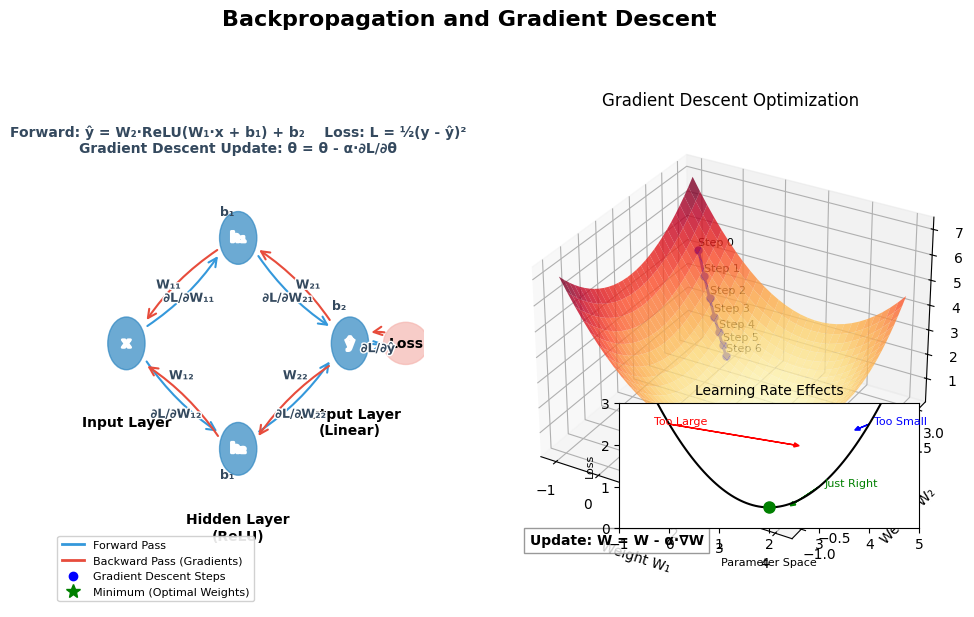

# 9. Backpropagation From Scratch

## Introduction

Backpropagation is the cornerstone algorithm that enables neural networks to learn from data. While modern deep learning frameworks handle this process automatically, understanding backpropagation from first principles is crucial for anyone serious about deep learning. This chapter demystifies the algorithm by implementing it from scratch for a simple regression problem: \\( y = 2x + 1 \\) (y = 2x + 1).

By the end of this chapter, you'll understand:
- The mathematical foundations of backpropagation
- How gradients flow backward through a network
- How to implement the algorithm from scratch in Rust
- How parameters are updated during training
- How to visualize and interpret gradients

## The Learning Problem

Before diving into backpropagation, let's define our learning problem:

1. We have a dataset of \\( (x, y) \\) ((x, y))) pairs generated from the function \\( y = 2x + 1 \\) (y = 2x + 1) with some added noise
2. We want to train a simple neural network to learn this relationship
3. We'll start with random weights and use backpropagation to adjust them

This is a regression problem where we're trying to predict a continuous value \\( y \\) (y) given an input \\( x \\) (x). While simple, it illustrates all the key concepts of backpropagation.

## Neural Network Architecture

For this problem, we'll use a minimal neural network with:
- An input layer with one neuron (for \\( x \\) (x))
- A hidden layer with two neurons
- An output layer with one neuron (for predicted \\( y \\) (y))

This architecture can be represented as:

$$
\hat{\mkern-3mu y} = f_2(W_2 \cdot f_1(W_1 \cdot x + b_1) + b_2)
$$

|  |  |
|--|--|
| | `y_pred = f2(W2 · f1(W1 · x + b1) + b2)` |

Where:
- \\( W_1 \\) (W_1) is the weight matrix connecting input to hidden layer
- \\( b_1 \\) (b_1) is the bias vector for the hidden layer
- \\( W_2 \\) (W_2) is the weight matrix connecting hidden to output layer
- \\( b_2 \\) (b_2) is the bias for the output layer
- \\( f_1 \\) (f_1) and \\( f_2 \\) (f_2) are activation functions

## Forward Pass

The forward pass computes the network's prediction given an input. Here's how it works step by step:

### Step 1: Input to Hidden Layer

For an input \\( x \\) (x), we compute the pre-activation values for the hidden layer:

$$
z_1 = W_1 \cdot x + b_1
$$

|  |  |
|--|--|
| | `z1 = W1 · x + b1` |

Then apply the activation function (we'll use ReLU for the hidden layer):

$$
a_1 = \max(0, z_1)
$$

|  |  |
|--|--|
| | `a1 = max(0, z1)` |

### Step 2: Hidden to Output Layer

Next, we compute the output layer pre-activation:

$$
z_2 = W_2 \cdot a_1 + b_2
$$

|  |  |
|--|--|
| | `z2 = W2 · a1 + b2` |

For regression, we typically use a linear activation for the output layer:

$$
\hat{\mkern-3mu y} = z_2
$$

|  |  |
|--|--|
| | `y_pred = z2` |

### Step 3: Calculate Loss

To measure how far our prediction is from the true value, we use the mean squared error (MSE) loss:

$$
L = \frac{1}{2}(y - \hat{\mkern-3mu y})^2
$$

|  |  |
|--|--|
| | `L = (1/2) * (y - y_pred)^2` |

The \\( \frac{1}{2} \\) ((1)/(2))/(2)) factor simplifies the derivative calculations.

## Backpropagation: The Core Algorithm

Backpropagation is essentially an application of the chain rule from calculus. It computes the gradient of the loss with respect to each parameter by working backward from the output.

### Step 1: Output Layer Gradient

First, we compute how the loss changes with respect to the output:

$$
\frac{\partial L}{\partial \hat{\mkern-3mu y}} = \hat{\mkern-3mu y} - y
$$

|  |  |
|--|--|
| | `dL/dy_pred = y_pred - y` |

Then, we calculate how the output changes with respect to the output layer's pre-activation:

$$
\frac{\partial \hat{\mkern-3mu y}}{\partial z_2} = 1
$$

|  |  |
|--|--|
| | `dy_pred/dz2 = 1` |

Using the chain rule, we get:

$$
\frac{\partial L}{\partial z_2} = \frac{\partial L}{\partial \hat{\mkern-3mu y}} \cdot \frac{\partial \hat{\mkern-3mu y}}{\partial z_2} = \hat{\mkern-3mu y} - y
$$

|  |  |
|--|--|
| | `dL/dz2 = dL/dy_pred * dy_pred/dz2 = y_pred - y` |

### Step 2: Output Layer Parameter Gradients

Now we compute the gradients for the output layer parameters:

$$
\frac{\partial L}{\partial W_2} = \frac{\partial L}{\partial z_2} \cdot \frac{\partial z_2}{\partial W_2} = \frac{\partial L}{\partial z_2} \cdot a_1^T
$$

|  |  |
|--|--|
| | `dL/dW2 = dL/dz2 * dz2/dW2 = dL/dz2 * a1^T` |

$$
\frac{\partial L}{\partial b_2} = \frac{\partial L}{\partial z_2} \cdot \frac{\partial z_2}{\partial b_2} = \frac{\partial L}{\partial z_2}
$$

|  |  |
|--|--|
| | `dL/db2 = dL/dz2 * dz2/db2 = dL/dz2` |

### Step 3: Hidden Layer Gradient

Next, we propagate the gradient back to the hidden layer:

$$
\frac{\partial L}{\partial a_1} = \frac{\partial L}{\partial z_2} \cdot \frac{\partial z_2}{\partial a_1} = W_2^T \cdot \frac{\partial L}{\partial z_2}
$$

|  |  |
|--|--|
| | `dL/da1 = dL/dz2 * dz2/da1 = W2^T * dL/dz2` |

For the ReLU activation, the derivative is:

$$
\frac{\partial a_1}{\partial z_1} = 
\begin{cases} 
1 & \text{if } z_1 > 0 \\
0 & \text{if } z_1 \leq 0
\end{cases}
$$
\begincases 
1 & \textif  z_1 > 0 \\
0 & \textif  z_1 \leq 0
\endcases

|  |  |
|--|--|
| | `da1/dz1 = 1 if z1 > 0, 0 otherwise` |

Using the chain rule again:

$$
\frac{\partial L}{\partial z_1} = \frac{\partial L}{\partial a_1} \cdot \frac{\partial a_1}{\partial z_1}
$$

|  |  |
|--|--|
| | `dL/dz1 = dL/da1 * da1/dz1` |

### Step 4: Hidden Layer Parameter Gradients

Finally, we compute the gradients for the hidden layer parameters:

$$
\frac{\partial L}{\partial W_1} = \frac{\partial L}{\partial z_1} \cdot \frac{\partial z_1}{\partial W_1} = \frac{\partial L}{\partial z_1} \cdot x^T
$$

|  |  |
|--|--|
| | `dL/dW1 = dL/dz1 * dz1/dW1 = dL/dz1 * x^T` |

$$
\frac{\partial L}{\partial b_1} = \frac{\partial L}{\partial z_1}
$$

|  |  |
|--|--|
| | `dL/db1 = dL/dz1` |

## Parameter Updates

Once we have the gradients, we update the parameters using gradient descent:

$$
W_1 = W_1 - \alpha \cdot \frac{\partial L}{\partial W_1}
$$

|  |  |
|--|--|
| | `W1 = W1 - learning_rate * dL/dW1` |

$$
b_1 = b_1 - \alpha \cdot \frac{\partial L}{\partial b_1}
$$

|  |  |
|--|--|
| | `b1 = b1 - learning_rate * dL/db1` |

$$
W_2 = W_2 - \alpha \cdot \frac{\partial L}{\partial W_2}
$$

|  |  |
|--|--|
| | `W2 = W2 - learning_rate * dL/dW2` |

$$
b_2 = b_2 - \alpha \cdot \frac{\partial L}{\partial b_2}
$$

|  |  |
|--|--|
| | `b2 = b2 - learning_rate * dL/db2` |

Where \\( \alpha \\) (\alpha) is the learning rate, a hyperparameter that controls the step size.

The following figure illustrates the backpropagation process and gradient descent optimization:



*Figure: Backpropagation and Gradient Descent. The left side shows the neural network with forward pass (blue) and backward gradient flow (red). The right side visualizes gradient descent optimization on the loss surface, with the trajectory converging toward the minimum. The inset demonstrates how different learning rates affect convergence.*

## Implementation from Scratch

Now let's implement backpropagation from scratch in Rust for our regression problem. We'll use Candle for tensor operations but implement the algorithm ourselves.

### Data Generation

First, we'll generate synthetic data from our target function \\( y = 2x + 1 \\) (y = 2x + 1):

```rust
use anyhow::Result;
use candle_core::{DType, Device, Tensor};
use rand::{rngs::StdRng, SeedableRng, Rng};

fn generate_data(n_samples: usize, device: &Device, rng: &mut StdRng) -> Result<(Tensor, Tensor)> {
    let mut x_data = Vec::with_capacity(n_samples);
    let mut y_data = Vec::with_capacity(n_samples);

    for _ in 0..n_samples {
        let x = rng.gen::<f32>() * 10.0 - 5.0;  // Random value between -5 and 5
        let y = 2.0 * x + 1.0 + (rng.gen::<f32>() - 0.5) * 0.2;  // y = 2x + 1 with small noise

        x_data.push(x);
        y_data.push(y);
    }

    let x = Tensor::from_slice(&x_data, (n_samples, 1), device)?;
    let y = Tensor::from_slice(&y_data, (n_samples, 1), device)?;

    Ok((x, y))
}
```

### Neural Network Implementation

Next, we'll implement our neural network with manual forward and backward passes:

```rust
struct SimpleNN {
    w1: Tensor,
    b1: Tensor,
    w2: Tensor,
    b2: Tensor,
}

impl SimpleNN {
    fn new(device: &Device, rng: &mut StdRng) -> Result<Self> {
        // Initialize weights and biases with small random values
        let w1 = Tensor::rand(-0.1f32, 0.1, (2, 1), device, rng)?;
        let b1 = Tensor::zeros((2, 1), DType::F32, device)?;
        let w2 = Tensor::rand(-0.1f32, 0.1, (1, 2), device, rng)?;
        let b2 = Tensor::zeros((1, 1), DType::F32, device)?;

        Ok(Self { w1, b1, w2, b2 })
    }

    fn forward(&self, x: &Tensor) -> Result<(Tensor, Tensor, Tensor, Tensor)> {
        // Forward pass, saving intermediate values for backpropagation
        let z1 = x.matmul(&self.w1.transpose(0, 1)?)?.add(&self.b1.broadcast_as((x.dim(0)?, 2))?)?;
        let a1 = z1.relu()?;
        let z2 = a1.matmul(&self.w2.transpose(0, 1)?)?.add(&self.b2.broadcast_as((x.dim(0)?, 1))?)?;
        let y_pred = z2;  // Linear activation for output layer

        Ok((z1, a1, z2, y_pred))
    }

    fn backward(&self, x: &Tensor, y: &Tensor, z1: &Tensor, a1: &Tensor, y_pred: &Tensor, 
                learning_rate: f32) -> Result<(Tensor, Tensor, Tensor, Tensor)> {
        let batch_size = x.dim(0)? as f32;

        // Compute gradients for output layer
        let dy = y_pred.sub(y)?;  // dL/dy_pred
        let dw2 = dy.transpose(0, 1)?.matmul(a1)?.div_scalar(batch_size)?;  // dL/dW2
        let db2 = dy.mean(0)?;  // dL/db2

        // Compute gradients for hidden layer
        let da1 = dy.matmul(&self.w2)?;  // dL/da1
        let dz1 = da1.mul(&z1.relu_backward()?)?;  // dL/dz1
        let dw1 = dz1.transpose(0, 1)?.matmul(x)?.div_scalar(batch_size)?;  // dL/dW1
        let db1 = dz1.mean(0)?;  // dL/db1

        // Return gradients
        Ok((dw1, db1, dw2, db2))
    }

    fn update_parameters(&mut self, dw1: &Tensor, db1: &Tensor, dw2: &Tensor, db2: &Tensor, 
                         learning_rate: f32) -> Result<()> {
        // Update weights and biases using gradient descent
        self.w1 = self.w1.sub(&dw1.mul_scalar(learning_rate)?)?;
        self.b1 = self.b1.sub(&db1.mul_scalar(learning_rate)?)?;
        self.w2 = self.w2.sub(&dw2.mul_scalar(learning_rate)?)?;
        self.b2 = self.b2.sub(&db2.mul_scalar(learning_rate)?)?;

        Ok(())
    }

    fn predict(&self, x: &Tensor) -> Result<Tensor> {
        let (_, _, _, y_pred) = self.forward(x)?;
        Ok(y_pred)
    }
}
```

### Training Loop

Now we'll implement the training loop that uses backpropagation to update the model parameters:

```rust
fn train_model(model: &mut SimpleNN, x_train: &Tensor, y_train: &Tensor, 
               learning_rate: f32, epochs: usize) -> Result<Vec<f32>> {
    let mut losses = Vec::with_capacity(epochs);

    for epoch in 0..epochs {
        // Forward pass
        let (z1, a1, _, y_pred) = model.forward(x_train)?;

        // Compute loss
        let loss = y_pred.sub(y_train)?.sqr()?.mean_all()?;
        let loss_val = loss.to_scalar::<f32>()?;
        losses.push(loss_val);

        // Backward pass
        let (dw1, db1, dw2, db2) = model.backward(x_train, y_train, &z1, &a1, &y_pred, learning_rate)?;

        // Update parameters
        model.update_parameters(&dw1, &db1, &dw2, &db2, learning_rate)?;

        if (epoch + 1) % 100 == 0 || epoch == 0 {
            println!("Epoch {}: Loss = {:.6}", epoch + 1, loss_val);
        }
    }

    Ok(losses)
}
```

### Main Function

Finally, let's put everything together in a main function:

```rust
fn main() -> Result<()> {
    // Set up device and RNG
    let device = Device::Cpu;
    let mut rng = StdRng::seed_from_u64(42);

    // Generate data
    let (x_train, y_train) = generate_data(1000, &device, &mut rng)?;

    // Create and train model
    let mut model = SimpleNN::new(&device, &mut rng)?;
    let losses = train_model(&mut model, &x_train, &y_train, 0.01, 1000)?;

    // Test the model
    let test_x = Tensor::from_slice(&[-4.0f32, -2.0, 0.0, 2.0, 4.0], (5, 1), &device)?;
    let predictions = model.predict(&test_x)?;

    println!("\nModel predictions:");
    println!("x = -4, predicted y = {:.4}, actual y = {:.4}", 
             predictions.get(0)?.to_scalar::<f32>()?, 2.0 * -4.0 + 1.0);
    println!("x = -2, predicted y = {:.4}, actual y = {:.4}", 
             predictions.get(1)?.to_scalar::<f32>()?, 2.0 * -2.0 + 1.0);
    println!("x = 0, predicted y = {:.4}, actual y = {:.4}", 
             predictions.get(2)?.to_scalar::<f32>()?, 2.0 * 0.0 + 1.0);
    println!("x = 2, predicted y = {:.4}, actual y = {:.4}", 
             predictions.get(3)?.to_scalar::<f32>()?, 2.0 * 2.0 + 1.0);
    println!("x = 4, predicted y = {:.4}, actual y = {:.4}", 
             predictions.get(4)?.to_scalar::<f32>()?, 2.0 * 4.0 + 1.0);

    // Print final model parameters
    println!("\nLearned model parameters:");
    println!("W1 = {}", model.w1);
    println!("b1 = {}", model.b1);
    println!("W2 = {}", model.w2);
    println!("b2 = {}", model.b2);

    Ok(())
}
```

## Visualizing Gradients and Learning

Understanding how gradients flow through the network is crucial for debugging and optimizing neural networks. Let's visualize the gradients during training:

```rust
fn visualize_gradients(model: &SimpleNN, x: &Tensor, y: &Tensor) -> Result<()> {
    // Forward pass
    let (z1, a1, _, y_pred) = model.forward(x)?;

    // Compute gradients
    let (dw1, db1, dw2, db2) = model.backward(x, y, &z1, &a1, &y_pred, 0.01)?;

    println!("Gradient magnitudes:");
    println!("dW1 magnitude: {:.6}", dw1.sqr()?.sum_all()?.sqrt()?.to_scalar::<f32>()?);
    println!("db1 magnitude: {:.6}", db1.sqr()?.sum_all()?.sqrt()?.to_scalar::<f32>()?);
    println!("dW2 magnitude: {:.6}", dw2.sqr()?.sum_all()?.sqrt()?.to_scalar::<f32>()?);
    println!("db2 magnitude: {:.6}", db2.sqr()?.sum_all()?.sqrt()?.to_scalar::<f32>()?);

    Ok(())
}
```

## Extending to Mini-Batch Gradient Descent

In practice, we often use mini-batch gradient descent instead of processing the entire dataset at once. Here's how to modify our implementation:

```rust
fn train_model_with_batches(model: &mut SimpleNN, x_train: &Tensor, y_train: &Tensor, 
                           batch_size: usize, learning_rate: f32, epochs: usize) -> Result<Vec<f32>> {
    let n_samples = x_train.dim(0)?;
    let n_batches = n_samples / batch_size;
    let mut losses = Vec::with_capacity(epochs);

    for epoch in 0..epochs {
        let mut epoch_loss = 0.0;

        // Shuffle data
        let indices = Tensor::randint(0, n_samples as i64, &[n_samples as i64], &x_train.device())?;
        let x_shuffled = x_train.index_select(&indices, 0)?;
        let y_shuffled = y_train.index_select(&indices, 0)?;

        for batch in 0..n_batches {
            let start = batch * batch_size;
            let end = start + batch_size;

            let x_batch = x_shuffled.narrow(0, start as i64, batch_size as i64)?;
            let y_batch = y_shuffled.narrow(0, start as i64, batch_size as i64)?;

            // Forward pass
            let (z1, a1, _, y_pred) = model.forward(&x_batch)?;

            // Compute loss
            let loss = y_pred.sub(&y_batch)?.sqr()?.mean_all()?;
            epoch_loss += loss.to_scalar::<f32>()?;

            // Backward pass
            let (dw1, db1, dw2, db2) = model.backward(&x_batch, &y_batch, &z1, &a1, &y_pred, learning_rate)?;

            // Update parameters
            model.update_parameters(&dw1, &db1, &dw2, &db2, learning_rate)?;
        }

        epoch_loss /= n_batches as f32;
        losses.push(epoch_loss);

        if (epoch + 1) % 100 == 0 || epoch == 0 {
            println!("Epoch {}: Loss = {:.6}", epoch + 1, epoch_loss);
        }
    }

    Ok(losses)
}
```

## Comparison with Automatic Differentiation

Modern deep learning frameworks like Candle implement automatic differentiation, which computes gradients automatically. Let's compare our manual implementation with Candle's built-in functionality:

```rust
use candle_nn::{Linear, Module, VarBuilder, VarMap, Optimizer};

struct AutogradNN {
    layer1: Linear,
    layer2: Linear,
}

impl AutogradNN {
    fn new(device: &Device) -> Result<(Self, VarMap)> {
        let varmap = VarMap::new();
        let vb = VarBuilder::from_varmap(&varmap, DType::F32, device);

        let layer1 = candle_nn::linear(1, 2, vb.pp("layer1"))?;
        let layer2 = candle_nn::linear(2, 1, vb.pp("layer2"))?;

        Ok((Self { layer1, layer2 }, varmap))
    }
}

impl Module for AutogradNN {
    fn forward(&self, x: &Tensor) -> Result<Tensor> {
        let x = self.layer1.forward(x)?;
        let x = x.relu()?;
        let x = self.layer2.forward(&x)?;
        Ok(x)
    }
}

fn train_with_autograd(device: &Device, x_train: &Tensor, y_train: &Tensor) -> Result<()> {
    let (model, varmap) = AutogradNN::new(device)?;
    let mut optimizer = candle_nn::AdamW::new(varmap.all_vars(), 0.01)?;

    for epoch in 0..1000 {
        // Forward pass
        let y_pred = model.forward(x_train)?;

        // Compute loss
        let loss = candle_nn::loss::mse(&y_pred, y_train)?;

        // Backward pass and optimize
        optimizer.backward_step(&loss)?;

        if (epoch + 1) % 100 == 0 || epoch == 0 {
            println!("Epoch {}: Loss = {:.6}", epoch + 1, loss.to_scalar::<f32>()?);
        }
    }

    Ok(())
}
```

## Conclusion

In this chapter, we've explored backpropagation from first principles, implementing it from scratch for a simple regression problem. We've seen how gradients flow backward through the network and how parameters are updated to minimize the loss function.

Key takeaways:
- Backpropagation is an application of the chain rule from calculus
- The algorithm computes gradients by working backward from the output
- Gradients indicate how to adjust parameters to reduce the loss
- Mini-batch gradient descent improves efficiency and convergence
- Modern frameworks automate this process, but understanding the fundamentals is invaluable

While our example used a simple network and problem, the same principles apply to deep networks with millions of parameters. The beauty of backpropagation is that it scales efficiently to these large models, enabling the remarkable capabilities of modern deep learning systems.

## Further Reading

- "Neural Networks and Deep Learning" by Michael Nielsen - Excellent visual explanations of backpropagation
- "Deep Learning" by Goodfellow, Bengio, and Courville - Comprehensive coverage of backpropagation and optimization
- "Calculus on Computational Graphs: Backpropagation" by Christopher Olah - Intuitive explanation using computational graphs
- "Why Momentum Really Works" by Gabriel Goh - Insights into momentum-based optimization
