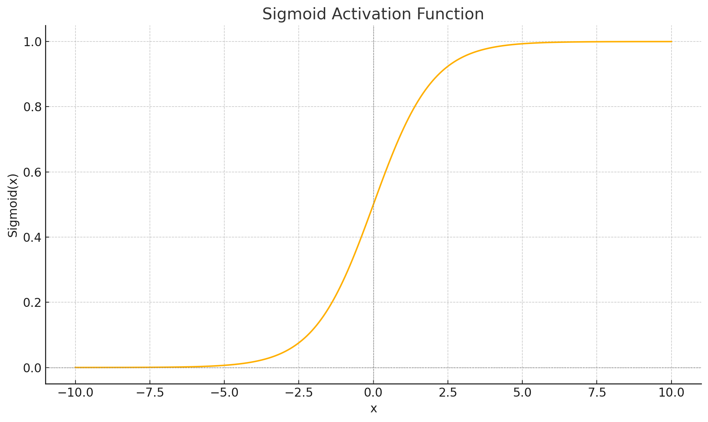
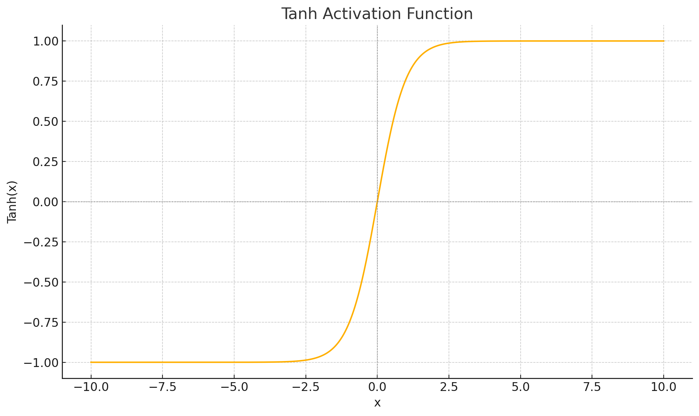
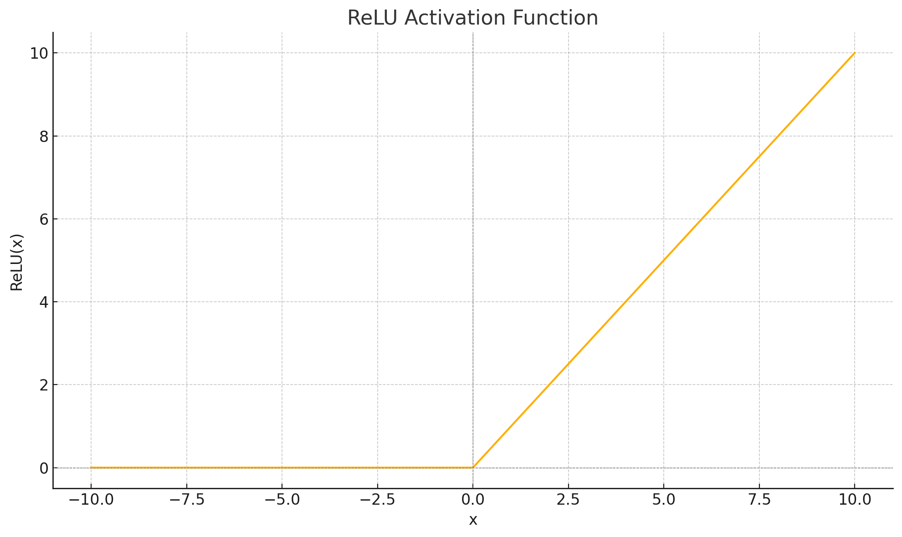
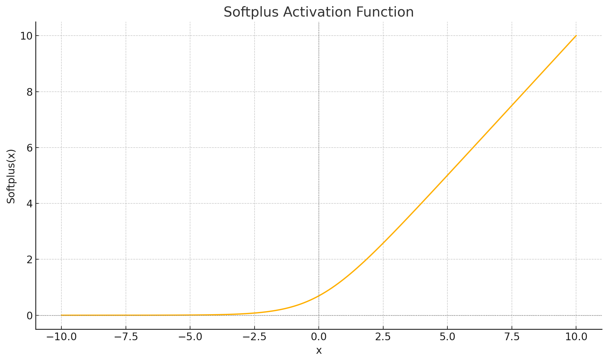

# 10. Activation Functions

## Introduction

 Without activation functions, neural networks would be limited to learning only linear relationships, regardless of their depth. This non-linearity enables neural networks to approximate any function, making them universal function approximators.

This chapter explores:
- The historical development of activation functions
- Mathematical properties of common activation functions
- Implementation in Rust using the Candle library
- Advanced activation functions and their applications
- Best practices for choosing and using activation functions
- Practical considerations like vanishing and exploding gradients

## Historical Development

The history of activation functions parallels the evolution of neural networks themselves:

### Early Beginnings: Threshold Functions

The earliest neural network models, like the McCulloch-Pitts neuron (1943), used simple threshold functions that output either 0 or 1 based on whether the input exceeded a certain threshold. This binary activation mirrored the all-or-nothing firing pattern of biological neurons.

### The Perceptron Era: Step Functions

Frank Rosenblatt's Perceptron (1958) used a step function, which outputs either 0 or 1 depending on whether the weighted sum of inputs is positive or negative:

$$
f(x) = 
\begin{cases}
1 & \text{if } x \geq 0 \\\\
0 & \text{if } x < 0
\end{cases}
$$
\begincases
1 & \textif  x \geq 0 \\\\
0 & \textif  x < 0
\endcases

|  |  |
|--|--|
| | `f(x) = 1 if x >= 0, 0 if x < 0` |

While simple, step functions have a major limitation: their derivative is zero everywhere except at x=0, where it's undefined. This makes them unsuitable for gradient-based learning algorithms.

### The Sigmoid Era: Differentiable Activation

The development of backpropagation in the 1970s and its popularization in the 1980s required differentiable activation functions. The sigmoid function became the standard choice:

$$
\sigma(x) = \frac{1}{1 + e^{-x}}
$$

|  |  |
|--|--|
| | `sigmoid(x) = 1 / (1 + exp(-x))` |

Sigmoid functions are smooth, differentiable, and output values between 0 and 1, making them suitable for gradient-based learning. The hyperbolic tangent (tanh) function, a scaled version of the sigmoid, also became popular during this period.

### The Modern Era: ReLU and Beyond

Despite the success of sigmoid and tanh functions, they suffer from the vanishing gradient problem in deep networks. In 2010, a breakthrough came with the widespread adoption of the Rectified Linear Unit (ReLU):

$$
f(x) = \max(0, x)
$$

|  |  |
|--|--|
| | `f(x) = max(0, x)` |

ReLU's simplicity and effectiveness in mitigating the vanishing gradient problem led to a renaissance in deep learning. Since then, numerous variations and alternatives have been proposed, including Leaky ReLU, ELU, SELU, Swish, and GELU, each addressing specific limitations of the original ReLU function.

## Common Activation Functions

Let's explore the most widely used activation functions, their properties, and implementations in Candle.

### Sigmoid

The sigmoid function squashes input values to the range (0, 1), making it useful for binary classification problems and gates in recurrent neural networks.

#### Mathematical Definition

$$
\sigma(x) = \frac{1}{1 + e^{-x}}
$$

|  |  |
|--|--|
| | `sigmoid(x) = 1 / (1 + exp(-x))` |

#### Derivative

$$
\sigma'(x) = \sigma(x)(1 - \sigma(x))
$$

|  |  |
|--|--|
| | `sigmoid_prime(x) = sigmoid(x) * (1 - sigmoid(x))` |

#### Properties
- Output range: (0, 1)
- Smooth and differentiable everywhere
- Saturates for large positive or negative inputs, leading to vanishing gradients
- Not zero-centered, which can cause zig-zagging dynamics during gradient descent

  

#### Implementation in Candle

```rust
use candle_core::{Tensor, Result};

fn sigmoid(x: &Tensor) -> Result<Tensor> {
    x.sigmoid()
}

// Manual implementation for educational purposes
fn sigmoid_manual(x: &Tensor) -> Result<Tensor> {
    let neg_x = x.neg()?;
    let exp_neg_x = neg_x.exp()?;
    let one_plus_exp_neg_x = exp_neg_x.add_scalar(1.0)?;
    let result = one_plus_exp_neg_x.recip()?;

    Ok(result)
}
```

### Hyperbolic Tangent (tanh)

The tanh function is similar to sigmoid but outputs values in the range (-1, 1), making it zero-centered.

#### Mathematical Definition

$$
\tanh(x) = \frac{e^x - e^{-x}}{e^x + e^{-x}}
$$

|  |  |
|--|--|
| | `tanh(x) = (exp(x) - exp(-x)) / (exp(x) + exp(-x))` |

#### Derivative

$$
\tanh'(x) = 1 - \tanh^2(x)
$$

|  |  |
|--|--|
| | `tanh_prime(x) = 1 - tanh(x)^2` |

#### Properties
- Output range: (-1, 1)
- Zero-centered, which helps with optimization
- Still suffers from vanishing gradients for large inputs
- Generally performs better than sigmoid in practice



#### Implementation in Candle

```rust
fn tanh(x: &Tensor) -> Result<Tensor> {
    x.tanh()
}

// Manual implementation for educational purposes
fn tanh_manual(x: &Tensor) -> Result<Tensor> {
    let exp_x = x.exp()?;
    let exp_neg_x = x.neg()?.exp()?;
    let numerator = exp_x.sub(&exp_neg_x)?;
    let denominator = exp_x.add(&exp_neg_x)?;
    let result = numerator.div(&denominator)?;

    Ok(result)
}
```


### Rectified Linear Unit (ReLU)

ReLU is the most widely used activation function in modern neural networks due to its simplicity and effectiveness.

#### Mathematical Definition

$$
\text{ReLU}(x) = \max(0, x)
$$

|  |  |
|--|--|
| | `relu(x) = max(0, x)` |

#### Derivative

$$
\text{ReLU}'(x) = 
\begin{cases}
1 & \text{if } x > 0 \\\\
0 & \text{if } x \leq 0
\end{cases}
$$
\begincases
1 & \textif  x > 0 \\\\
0 & \textif  x \leq 0
\endcases

|  |  |
|--|--|
| | `relu_prime(x) = 1 if x > 0, 0 otherwise` |

#### Properties
- Output range: [0, ∞)
- Computationally efficient (simple max operation)
- Helps mitigate the vanishing gradient problem
- Sparse activation (many neurons output 0)
- Suffers from "dying ReLU" problem where neurons can get stuck during training



#### Implementation in Candle

```rust
fn relu(x: &Tensor) -> Result<Tensor> {
    x.relu()
}

// Manual implementation for educational purposes
fn relu_manual(x: &Tensor) -> Result<Tensor> {
    let zeros = Tensor::zeros_like(x)?;
    let result = x.maximum(&zeros)?;

    Ok(result)
}
```

### Softplus

Softplus is a smooth approximation of the ReLU function. It provides a differentiable alternative that maintains similar behavior while avoiding the non-differentiability at x=0.

#### Mathematical Definition

$$
\text{Softplus}(x) = \ln(1 + e^x)
$$

|  |  |
|--|--|
| | `softplus(x) = ln(1 + exp(x))` |

#### Derivative

The derivative of Softplus is the sigmoid function:

$$
\text{Softplus}'(x) = \frac{1}{1 + e^{-x}} = \sigma(x)
$$

|  |  |
|--|--|
| | `softplus_prime(x) = 1 / (1 + exp(-x)) = sigmoid(x)` |

#### Properties
- Output range: (0, ∞)
- Smooth approximation of ReLU
- Differentiable everywhere
- Approaches identity function for large positive inputs
- Approaches zero for large negative inputs
- Computationally more expensive than ReLU



#### Implementation in Candle

```rust
fn softplus(x: &Tensor) -> Result<Tensor> {
    // Softplus(x) = ln(1 + exp(x))
    let one = Tensor::ones_like(x)?;
    let exp_x = x.exp()?;
    let one_plus_exp = one.add(&exp_x)?;
    let result = one_plus_exp.log()?;
    
    Ok(result)
}

// Numerically stable implementation for large values
fn softplus_stable(x: &Tensor) -> Result<Tensor> {
    // For large x, softplus(x) ≈ x
    // For numerical stability: softplus(x) = x + ln(1 + exp(-x)) for x > threshold
    let threshold = 20.0;
    let mask = x.ge(threshold)?;
    
    // Standard computation
    let one = Tensor::ones_like(x)?;
    let exp_x = x.exp()?;
    let one_plus_exp = one.add(&exp_x)?;
    let standard = one_plus_exp.log()?;
    
    // Stable computation for large values
    let neg_x = x.neg()?;
    let exp_neg_x = neg_x.exp()?;
    let one_plus_exp_neg = one.add(&exp_neg_x)?;
    let log_term = one_plus_exp_neg.log()?;
    let stable = x.add(&log_term)?;
    
    // Select based on mask
    let result = mask.where_cond(&stable, &standard)?;
    
    Ok(result)
}
```

## Practical Considerations

### Vanishing and Exploding Gradients

One of the most significant challenges in training deep neural networks is the vanishing or exploding gradient problem. These issues can severely impede the training process and limit the depth of networks that can be effectively trained.

#### Understanding the Problem

During backpropagation, gradients flow backward through the network, with each layer's weights updated based on these gradients. Two problematic scenarios can emerge:

- **Vanishing gradients**: Gradients become exponentially small as they propagate backward through the network, effectively preventing earlier layers from learning.
- **Exploding gradients**: Gradients become exponentially large, causing unstable updates, numerical overflow, and erratic training behavior.

#### Mathematical Explanation

To understand why these problems occur, let's consider a simple deep neural network with L layers. During backpropagation, the gradient of the loss function L with respect to the weights in layer i is:

$$
\frac{\partial L}{\partial W_i} = \frac{\partial L}{\partial y_L} \cdot \frac{\partial y_L}{\partial y_{L-1}} \cdot ... \cdot \frac{\partial y_{i+1}}{\partial y_i} \cdot \frac{\partial y_i}{\partial W_i}
$$

|  |  |
|--|--|
| | `dL/dW_i = dL/dy_L * dy_L/dy_{L-1} * ... * dy_{i+1}/dy_i * dy_i/dW_i` |

Where:
- \\( y_i \\) (y_i) is the output of layer i
- \\( W_i \\) (W_i) is the weight matrix of layer i

For each layer transition, we multiply by the derivative of the activation function \\( f'(z) \\) (f'(z))) where \\( z \\) (z) is the pre-activation value. This leads to:

1. **Vanishing gradient problem**:
   - If \\( f'(z) < 1 \\) (f'(z) < 1) < 1) for most values (as with sigmoid and tanh), repeated multiplication makes the gradient exponentially smaller
   - For sigmoid: \\( \sigma'(x) = \sigma(x)(1-\sigma(x)) \\) (\sigma'(x) = \sigma(x)(1-\sigma(x))) = \sigma(x)(1-\sigma(x))) has a maximum value of 0.25
   - For tanh: \\( \tanh'(x) = 1 - \tanh^2(x) \\) (\tanh'(x) = 1 - \tanh^2(x)) = 1 - \tanh^2(x)) has a maximum value of 1

2. **Exploding gradient problem**:
   - If \\( f'(z) > 1 \\) (f'(z) > 1) > 1) or if weights are large, repeated multiplication makes the gradient exponentially larger
   - Can also occur with ReLU if weights are initialized poorly

#### Visual Illustration

For a sigmoid activation function, the derivative looks like:

$$
\sigma'(x) = \sigma(x)(1-\sigma(x))
$$

|  |  |
|--|--|
| | `sigmoid_prime(x) = sigmoid(x) * (1 - sigmoid(x))` |

This function has these properties:
- Maximum value of 0.25 at x = 0
- Approaches 0 as |x| increases

In a 10-layer network using sigmoid activations, even if each layer's derivative is at its maximum (0.25), the gradient would be reduced by a factor of \\( 0.25^{10} \approx 9.5 \times 10^{-7} \\) (0.25^10 \approx 9.5 \times 10^-7) by the time it reaches the first layer!

#### Impact on Training

The consequences of these problems include:

- **With vanishing gradients**:
  - Early layers learn very slowly or not at all
  - Network becomes biased toward later layers
  - Effective depth of the network is reduced
  - Long-range dependencies become impossible to learn

- **With exploding gradients**:
  - Weight updates become too large
  - Training becomes unstable
  - Loss function may oscillate or diverge
  - NaN values may appear due to numerical overflow

#### Role of Activation Functions

Different activation functions have varying impacts on gradient flow:

1. **Sigmoid and tanh**:
   - Derivatives are bounded between 0 and 1 (tanh) or 0 and 0.25 (sigmoid)
   - Saturate for large positive or negative inputs, producing near-zero gradients
   - Major contributors to the vanishing gradient problem

2. **ReLU and variants**:
   - Derivative is exactly 1 for positive inputs, preventing gradient decay
   - Derivative is 0 for negative inputs, which can cause "dying ReLU" problem
   - Helps with vanishing gradients but doesn't solve exploding gradients

3. **Leaky ReLU, ELU, and SELU**:
   - Allow small gradients for negative inputs, preventing dying neurons
   - SELU is designed to self-normalize, helping maintain gradient scale

4. **GELU, Swish, and Mish**:
   - Smooth, non-monotonic functions with better gradient properties
   - Often perform better in very deep networks


#### Practical Recommendations

When designing deep neural networks, consider these best practices:

1. **For shallow networks** (1-3 layers):
   - Almost any activation function works well
   - Sigmoid/tanh are acceptable choices

2. **For moderately deep networks** (4-10 layers):
   - Use ReLU or Leaky ReLU with He initialization
   - Consider adding batch normalization

3. **For very deep networks** (10+ layers):
   - Use residual connections
   - Consider advanced activations like GELU or Swish
   - Combine with normalization techniques
   - Monitor gradient norms during training

4. **For recurrent networks**:
   - Use gradient clipping
   - Consider LSTM or GRU units which are designed to mitigate gradient issues
   - Layer normalization often works better than batch normalization

### Choosing the Right Activation Function

The choice of activation function depends on the specific task and network architecture:

1. **For hidden layers**:
   - ReLU is a good default choice for most feedforward networks
   - Leaky ReLU or ELU can help if dying neurons are an issue
   - GELU or Swish often work well in transformer models
   - tanh is still common in recurrent networks

2. **For output layers**:
   - Linear activation for regression problems
   - Sigmoid for binary classification
   - Softmax for multi-class classification

3. **Considerations**:
   - Computational efficiency (ReLU is faster than ELU or Swish)
   - Network depth (deeper networks may benefit from more sophisticated activations)
   - Task complexity (more complex tasks might require more expressive activations)

### Implementation in Neural Networks

Here's how to implement different activation functions in a simple neural network using Candle:

```rust
use candle_core::{DType, Device, Result, Tensor};
use candle_nn::{Linear, Module, VarBuilder};

struct SimpleNN {
    layer1: Linear,
    layer2: Linear,
    activation: String,  // Activation function to use
}

impl SimpleNN {
    fn new(in_dim: usize, hidden_dim: usize, out_dim: usize, 
           activation: &str, vb: VarBuilder) -> Result<Self> {
        let layer1 = candle_nn::linear(in_dim, hidden_dim, vb.pp("layer1"))?;
        let layer2 = candle_nn::linear(hidden_dim, out_dim, vb.pp("layer2"))?;

        Ok(Self { 
            layer1, 
            layer2, 
            activation: activation.to_string() 
        })
    }

    fn apply_activation(&self, x: &Tensor) -> Result<Tensor> {
        match self.activation.as_str() {
            "relu" => x.relu(),
            "leaky_relu" => x.leaky_relu(0.01),
            "sigmoid" => x.sigmoid(),
            "tanh" => x.tanh(),
            "elu" => x.elu(1.0),
            "gelu" => x.gelu(),
            "silu" => x.silu(),
            _ => Err(candle_core::Error::Msg(format!("Unknown activation: {}", self.activation))),
        }
    }
}

impl Module for SimpleNN {
    fn forward(&self, x: &Tensor) -> Result<Tensor> {
        let hidden = self.layer1.forward(x)?;
        let activated = self.apply_activation(&hidden)?;
        let output = self.layer2.forward(&activated)?;

        Ok(output)
    }
}
```

## Best Practices

### Initialization with Activation Functions

Different activation functions work best with specific weight initialization strategies:

- **ReLU and variants**: He initialization (scaled by sqrt(2/n))
- **Sigmoid and tanh**: Xavier/Glorot initialization (scaled by sqrt(2/(n_in + n_out)))

```rust
fn he_init(shape: &[usize], device: &Device) -> Result<Tensor> {
    let fan_in = shape[0] as f64;
    let std = (2.0 / fan_in).sqrt();
    Tensor::randn(0.0, std, shape, device)
}

fn xavier_init(shape: &[usize], device: &Device) -> Result<Tensor> {
    let fan_in = shape[0] as f64;
    let fan_out = shape[1] as f64;
    let std = (2.0 / (fan_in + fan_out)).sqrt();
    Tensor::randn(0.0, std, shape, device)
}
```

### Monitoring Activations

During training, it's useful to monitor the distribution of activations to detect issues:

- **Dead neurons**: ReLU units that always output zero
- **Saturation**: Sigmoid/tanh units that are consistently in the flat regions
- **Exploding activations**: Unusually large activation values

### Combining with Normalization Techniques

Activation functions often work best when combined with normalization techniques:

- **Batch Normalization**: Normalizes the inputs to each layer, helping with training stability
- **Layer Normalization**: Useful for recurrent networks and transformers
- **Weight Normalization**: Decouples the magnitude of weights from their direction

## Conclusion

Activation functions are a critical component of neural networks, enabling them to learn complex, non-linear relationships in data. From the early threshold functions to modern adaptive activations, their evolution reflects our growing understanding of neural network optimization.

In this chapter, we've explored:
- The historical development of activation functions
- Mathematical properties and implementations of common activations
- Advanced activation functions for specific use cases
- Best practices for choosing and using activations
- Practical considerations for addressing challenges like vanishing gradients

Understanding activation functions and their properties allows you to make informed decisions when designing neural networks, potentially leading to faster convergence and better performance.

## Further Reading

- "Deep Learning" by Goodfellow, Bengio, and Courville - Comprehensive coverage of activation functions
- "Delving Deep into Rectifiers" by He et al. - Paper introducing the He initialization for ReLU networks
- "GELU: Gaussian Error Linear Units" by Hendrycks and Gimpel - Original GELU paper
- "Searching for Activation Functions" by Ramachandran et al. - Research on Swish and other activations
- "Mish: A Self Regularized Non-Monotonic Activation Function" by Misra - Original Mish paper
