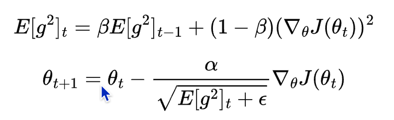
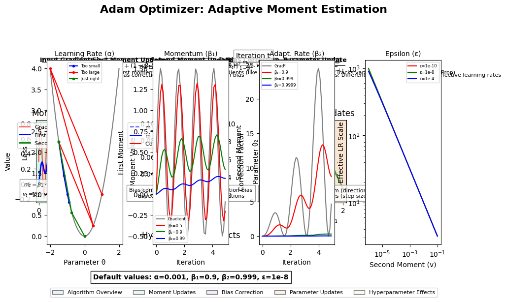

# 11.  The Learning Rate

## Introduction

The learning rate is one of the most critical hyperparameters in neural network training. It controls how much the model's parameters are updated during optimization, directly influencing both the speed of convergence and the quality of the final model. Despite its apparent simplicity, the learning rate has profound effects on training dynamics and can mean the difference between the newest model and one that fails to learn at all.

This chapter explores:
- The mathematical foundations of learning rate in gradient descent
- How learning rate affects training dynamics
- Common learning rate schedules and when to use them
- Adaptive learning rate methods
- Advanced techniques like learning rate warmup and cyclical learning rates
- Implementation examples in Rust using the Candle library
- Best practices for setting and tuning learning rates
- Practical considerations and troubleshooting

## Mathematical Foundations

### Learning Rate in Gradient Descent

At its core, the learning rate (often denoted as α or η) is a scalar that controls the step size during parameter updates in gradient-based optimization algorithms. In standard gradient descent, the parameter update rule is:

$$
\theta_{t+1} = \theta_t - \alpha \nabla_\theta J(\theta_t)
$$

Where:
- \\( \theta_t \\) is the parameter vector at step \\( t \\) (t)
- \\( \alpha \\)  is the learning rate
- \\( \nabla_\theta J(\theta_t) \\)  is the gradient of the loss function with respect to the parameters

This simple update rule forms the foundation of most optimization algorithms used in deep learning. The learning rate directly scales the gradient, determining how far we move in the direction of steepest descent.

### The Goldilocks Problem

Choosing the right learning rate presents a classic "Goldilocks problem" - it needs to be just right:

- **Too small**: Training progresses very slowly, potentially getting stuck in local minima or plateaus
- **Too large**: Training becomes unstable, potentially diverging or oscillating around the minimum

This sensitivity to the learning rate value creates a narrow window of effective values that varies across different models, datasets, and even training stages.

## Impact of Learning Rate on Training

### Too Small: Slow Convergence

When the learning rate is too small, the model makes tiny steps toward the minimum of the loss function. This leads to:

- Extremely slow convergence
- Higher likelihood of getting trapped in poor local minima
- Wasted computational resources
- Potentially never reaching convergence within a reasonable time frame

```rust
// Example of training with a very small learning rate
fn train_with_small_lr(model: &mut impl Module, x: &Tensor, y: &Tensor) -> Result<()> {
    let mut varmap = VarMap::new();
    let vars = varmap.all_vars();
    
    // Very small learning rate
    let learning_rate = 0.0001;
    let mut optimizer = candle_nn::SGD::new(vars, learning_rate)?;
    
    // Training will progress very slowly
    let predictions = model.forward(x)?;
    let loss = candle_nn::loss::mse(&predictions, y)?;
    optimizer.backward_step(&loss)?;
    
    Ok(())
}
```

### Too Large: Instability and Divergence

When the learning rate is too large, the model takes steps that are too big, potentially:

- Overshooting the minimum
- Causing the loss to increase rather than decrease
- Leading to oscillations or divergence
- Producing NaN values due to numerical instability

```rust
// Example of training with a very large learning rate
fn train_with_large_lr(model: &mut impl Module, x: &Tensor, y: &Tensor) -> Result<()> {
    let mut varmap = VarMap::new();
    let vars = varmap.all_vars();
    
    // Very large learning rate
    let learning_rate = 10.0;
    let mut optimizer = candle_nn::SGD::new(vars, learning_rate)?;
    
    // Training will likely become unstable
    let predictions = model.forward(x)?;
    let loss = candle_nn::loss::mse(&predictions, y)?;
    optimizer.backward_step(&loss)?;
    
    Ok(())
}
```

### Just Right: Optimal Convergence

An optimal learning rate allows the model to:

- Converge quickly to a good solution
- Escape poor local minima
- Maintain stability throughout training
- Achieve the best possible performance

Finding this "just right" value often requires experimentation, but techniques like learning rate finders can help automate this process.

## Learning Rate Schedules

In practice, using a single fixed learning rate throughout training is rarely optimal. Learning rate schedules adjust the learning rate during training, typically reducing it over time. This allows for larger steps in the beginning when we're far from the minimum and smaller, more precise steps as we get closer.

### Constant Schedule

The simplest schedule is no schedule at all—using a constant learning rate throughout training. While rarely optimal, it serves as a baseline:

```rust
fn constant_lr_schedule(initial_lr: f64, _epoch: usize) -> f64 {
    initial_lr
}
```

### Step Decay

Step decay reduces the learning rate by a factor after a fixed number of epochs:

$$
\alpha_t = \alpha_0 \times \gamma^{\lfloor \frac{t}{s} \rfloor}
$$

Where:
- \\( \alpha_0 \\) is the initial learning rate
- \\( \gamma \\) is the decay factor (e.g., 0.1 or 0.5)
- \\( s \\)  is the step size (number of epochs between decays)
- \\( t \\)is the current epoch

```rust
fn step_decay_schedule(initial_lr: f64, epoch: usize, step_size: usize, gamma: f64) -> f64 {
    initial_lr * gamma.powi((epoch / step_size) as i32)
}
```

### Exponential Decay

Exponential decay continuously reduces the learning rate by a factor each epoch:

$$
\alpha_t = \alpha_0 \times \gamma^t
$$

Where \\( \gamma \\)is a decay factor slightly less than 1 (e.g., 0.95 or 0.99).

```rust
fn exponential_decay_schedule(initial_lr: f64, epoch: usize, gamma: f64) -> f64 {
    initial_lr * gamma.powi(epoch as i32)
}
```


## Adaptive Learning Rate Methods

Adaptive learning rate methods automatically adjust the learning rate for each parameter based on the history of gradients. These methods can significantly improve training by adapting to the geometry of the loss landscape.

### AdaGrad

AdaGrad adapts the learning rate for each parameter by dividing it by the square root of the sum of squared historical gradients:

$$
\theta_{t+1} = \theta_t - \frac{\alpha}{\sqrt{G_t + \epsilon}} \odot \nabla_\theta J(\theta_t)
$$

Where:
- \\( G_t \\)  is the sum of squared gradients up to time \\( t \\) (t)
- \\( \epsilon \\)  is a small constant for numerical stability
- \\( \odot \\) represents element-wise multiplication

AdaGrad works well for sparse features but can reduce the learning rate too aggressively for deep learning.

### RMSProp (Root Mean Square Propagation)

RMSProp was developed by Geoffrey Hinton in 2012 as an improvement to AdaGrad. While AdaGrad's accumulation of all past squared gradients can cause the learning rate to decay too aggressively (eventually reaching zero), RMSProp solves this problem by using an exponentially weighted moving average of squared gradients instead.

#### The Problem with AdaGrad

AdaGrad's main limitation is that its denominator \\( G_t \\) keeps growing throughout training:

$$G_t = G_{t-1} + (\nabla_\theta J(\theta_t))^2$$

This causes the effective learning rate \\( \frac{\alpha}{\sqrt{G_t + \epsilon}} \\) to continuously decrease, eventually becoming so small that learning effectively stops.

#### RMSProp's Solution

RMSProp addresses this by replacing the cumulative sum with an exponentially decaying average



Where:
- \\( E[g^2]_t \\) is the exponentially weighted moving average of squared gradients
- \\( \beta \\) is the decay factor (typically 0.9)
- \\( \alpha \\) is the learning rate (typically 0.001)
- \\( \epsilon \\) is a small constant for numerical stability (typically 1e-6)

#### Understanding the Algorithm

1. **Moving Average**: Instead of accumulating all past gradients, RMSProp maintains a moving average that gives more weight to recent gradients while gradually forgetting older ones.

2. **Decay Factor**: The parameter \\( \beta \\) controls how much history to retain:
    - \\( \beta = 0.9 \\) means roughly the last 10 gradients have significant influence
    - Higher \\( \beta \\) values (closer to 1) retain more history
    - Lower \\( \beta \\) values adapt more quickly to recent changes

3. **Adaptive Learning Rate**: Each parameter gets its own effective learning rate based on the magnitude of its recent gradients:
    - Parameters with large gradients get smaller effective learning rates
    - Parameters with small gradients get larger effective learning rates

#### Key Advantages

1. **Prevents Learning Rate Decay**: Unlike AdaGrad, the learning rate doesn't monotonically decrease to zero
2. **Parameter-Specific Adaptation**: Each parameter adapts its learning rate independently
3. **Handles Non-Stationary Objectives**: Works well when the optimization landscape changes over time
4. **Computational Efficiency**: Simple to implement and computationally lightweight

#### When to Use RMSProp

RMSProp works particularly well for:
- **Recurrent Neural Networks**: Originally designed for RNN training
- **Non-stationary problems**: When the optimization landscape changes during training
- **Online learning**: When processing streaming data
- **Problems with sparse gradients**: Handles varying gradient magnitudes well

#### Historical Context

RMSProp was introduced by Geoffrey Hinton in his Coursera course "Neural Networks for Machine Learning" (2012) as an unpublished method. Despite not having a formal paper initially, it quickly became popular in the deep learning community, especially for training recurrent neural networks. It served as a crucial stepping stone toward the development of Adam, which combines RMSProp's adaptive learning rates with momentum.

The algorithm's simplicity and effectiveness made it a favorite among practitioners, and it remains a solid choice for many optimization problems, particularly when Adam's momentum component might be unnecessary or problematic.

### Adam (Adaptive Moment Estimation)

Adam was introduced by Diederik Kingma and Jimmy Ba in their 2014 paper "Adam: A Method for Stochastic Optimization" and has since become one of the most widely used optimization algorithms in deep learning. Adam combines the best aspects of two other optimization methods: AdaGrad's adaptive learning rates and RMSProp's exponential moving averages, while also incorporating momentum-like behavior.

#### The Evolution from RMSProp to Adam

While RMSProp solved AdaGrad's aggressive learning rate decay problem, it still lacked the momentum component that had proven so effective in SGD. Adam addresses this by maintaining two exponentially decaying averages:
1. The gradient (first moment) - similar to momentum
2. The squared gradient (second moment) - similar to RMSProp

#### Adam's Key Innovations

Adam addresses several fundamental challenges in neural network optimization:

1. **Adaptive Learning Rates**: Different parameters often require different learning rates. Adam automatically adapts the learning rate for each parameter based on historical gradient information.

2. **Momentum with Adaptation**: Unlike SGD with momentum, Adam's momentum is adaptive - it considers both the direction and magnitude of recent gradients.

3. **Bias Correction**: Adam corrects for the bias introduced by initializing the moment estimates to zero, which is crucial for proper convergence, especially in early training steps.

4. **Robustness**: Adam works well across a wide variety of problems with minimal hyperparameter tuning, making it an excellent default choice.

#### The Adam Algorithm

Adam maintains two exponentially decaying averages for each parameter:

$$m_t = \beta_1 m_{t-1} + (1 - \beta_1) \nabla_\theta J(\theta_t)$$

$$v_t = \beta_2 v_{t-1} + (1 - \beta_2) (\nabla_\theta J(\theta_t))^2$$

$$\hat{m}_t = \frac{m_t}{1 - \beta_1^t}$$

$$\hat{v}_t = \frac{v_t}{1 - \beta_2^t}$$

$$\theta_{t+1} = \theta_t - \frac{\alpha \hat{m}_t}{\sqrt{\hat{v}_t} + \epsilon}$$

Where:
- \\( m_t \\) is the first moment estimate (exponential moving average of gradients)
- \\( v_t \\) is the second moment estimate (exponential moving average of squared gradients)
- \\( \beta_1 \\) is the decay rate for first moment (typically 0.9)
- \\( \beta_2 \\) is the decay rate for second moment (typically 0.999)
- \\( \hat{m}_t \\) and \\( \hat{v}_t \\) are bias-corrected moment estimates
- \\( \alpha \\) is the learning rate (typically 0.001)
- \\( \epsilon \\) is a small constant for numerical stability (typically 1e-8)



#### Understanding Each Component

1. **First Moment (m_t)**: This exponential moving average of gradients provides momentum-like behavior, helping to:
    - Smooth out noisy gradients
    - Accelerate convergence in consistent directions
    - Navigate past small local minima

2. **Second Moment (v_t)**: This exponential moving average of squared gradients enables adaptive learning rates by:
    - Tracking the magnitude of recent gradients
    - Providing larger effective learning rates for parameters with small gradients
    - Providing smaller effective learning rates for parameters with large gradients

3. **Bias Correction**: The terms \\( \hat{m}_t \\) and \\( \hat{v}_t \\) correct for initialization bias because:
    - Both \\( m_t \\) and \\( v_t \\) start at zero
    - Without correction, they would be biased toward zero, especially early in training
    - The correction factor \\( \frac{1}{1 - \beta^t} \\) becomes smaller as \\( t \\) increases

4. **Adaptive Step Size**: The final update combines bias-corrected momentum with adaptive scaling, creating parameter-specific learning rates that automatically adjust based on gradient history.

#### Default Hyperparameters

The original Adam paper suggests these default values, which work remarkably well across diverse problems:

- \\( \alpha = 0.001 \\) (learning rate)
- \\( \beta_1 = 0.9 \\) (exponential decay rate for first moment)
- \\( \beta_2 = 0.999 \\) (exponential decay rate for second moment)
- \\( \epsilon = 10^{-8} \\) (small constant for numerical stability)

These defaults are so robust that many practitioners use them without modification.

#### When to Use Adam

Adam excels in many scenarios:

- **General Deep Learning**: Excellent default choice for most neural network architectures
- **Computer Vision**: Works well for CNNs, though SGD with momentum sometimes achieves better final performance
- **Natural Language Processing**: Particularly effective for transformer models and RNNs
- **Sparse Gradients**: Handles problems with sparse or noisy gradients effectively
- **Non-stationary Objectives**: Adapts well when the optimization landscape changes during training
- **Limited Tuning Time**: Requires minimal hyperparameter adjustment

#### Hyperparameter Guidelines

**Learning Rate (α)**:
- **0.001**: Excellent starting point for most problems
- **0.01**: For simpler problems or when using very large batch sizes
- **0.0001**: For complex problems, fine-tuning, or when gradients are large
- **0.003**: Sometimes works better than 0.001 for transformer models

**Beta1 (β₁)**:
- **0.9**: Standard value providing good momentum
- **0.95**: For problems requiring more momentum
- **0.8**: For rapidly changing objectives

**Beta2 (β₂)**:
- **0.999**: Standard value for most problems
- **0.99**: For problems with very noisy gradients
- **0.9999**: For problems requiring longer gradient history

**Epsilon (ε)**:
- **1e-8**: Standard value
- **1e-7**: If encountering numerical instability
- **1e-4**: Sometimes used in NLP applications

#### Implementation in Candle

```rust
use candle_core::{Result, Tensor};
use candle_nn::{Module, VarMap};

fn train_with_adam(
    model: &mut impl Module, 
    x: &Tensor, 
    y: &Tensor, 
    learning_rate: f64
) -> Result<()> {
    let mut varmap = VarMap::new();
    let vars = varmap.all_vars();
    
    // Create Adam optimizer with default parameters
    // Note: Candle uses AdamW by default, which includes weight decay
    let mut optimizer = candle_nn::AdamW::new(vars, learning_rate)?;
    
    // Forward pass
    let predictions = model.forward(x)?;
    let loss = candle_nn::loss::mse(&predictions, y)?;
    
    // Backward pass and optimize
    optimizer.backward_step(&loss)?;
    
    Ok(())
}

// For more control over Adam parameters
fn train_with_custom_adam(
    model: &mut impl Module,
    x: &Tensor,
    y: &Tensor,
    learning_rate: f64,
    beta1: f64,
    beta2: f64,
    epsilon: f64
) -> Result<()> {
    let mut varmap = VarMap::new();
    let vars = varmap.all_vars();
    
    // Create Adam optimizer with custom parameters
    let mut optimizer = candle_nn::AdamW::new_lr(vars, learning_rate)?
        .with_beta1(beta1)
        .with_beta2(beta2)
        .with_eps(epsilon);
    
    let predictions = model.forward(x)?;
    let loss = candle_nn::loss::mse(&predictions, y)?;
    optimizer.backward_step(&loss)?;
    
    Ok(())
}

// Training loop with Adam
fn train_model_with_adam(
    model: &mut impl Module,
    train_data: &[(Tensor, Tensor)],
    epochs: usize,
    learning_rate: f64
) -> Result<Vec<f32>> {
    let mut varmap = VarMap::new();
    let vars = varmap.all_vars();
    let mut optimizer = candle_nn::AdamW::new(vars, learning_rate)?;
    
    let mut losses = Vec::new();
    
    for epoch in 0..epochs {
        let mut epoch_loss = 0.0;
        
        for (x, y) in train_data {
            let predictions = model.forward(x)?;
            let loss = candle_nn::loss::mse(&predictions, y)?;
            
            epoch_loss += loss.to_scalar::<f32>()?;
            optimizer.backward_step(&loss)?;
        }
        
        let avg_loss = epoch_loss / train_data.len() as f32;
        losses.push(avg_loss);
        
        if epoch % 100 == 0 {
            println!("Epoch {}: Loss = {:.6}", epoch, avg_loss);
        }
    }
    
    Ok(losses)
}
```

#### Adam Variants

Several important variants of Adam have been developed:

1. **AdamW**: Decouples weight decay from gradient updates, often achieving better generalization
2. **AdaMax**: Uses the infinity norm instead of L2 norm, sometimes more stable
3. **Nadam**: Combines Adam with Nesterov momentum
4. **RAdam**: Adds a rectification term to address convergence issues in early training

#### Advantages and Limitations

**Advantages**:
- Excellent general-purpose optimizer
- Minimal hyperparameter tuning required
- Handles sparse gradients well
- Computationally efficient
- Good convergence properties across diverse problems

**Limitations**:
- May not achieve the absolute best performance on some specific problems
- Can sometimes converge to suboptimal solutions compared to well-tuned SGD
- Memory overhead (stores two moment estimates per parameter)
- May exhibit poor generalization in some cases without proper regularization

#### Comparison with Other Optimizers

| Optimizer | Momentum | Adaptive LR | Bias Correction | Memory Overhead | Best For |
|-----------|----------|-------------|-----------------|-----------------|----------|
| SGD | ❌ | ❌ | ❌ | Low | Simple problems, fine-tuning |
| SGD + Momentum | ✅ | ❌ | ❌ | Low | Computer vision, established architectures |
| AdaGrad | ❌ | ✅ | ❌ | Medium | Sparse features, early stopping |
| RMSProp | ❌ | ✅ | ❌ | Medium | RNNs, non-stationary problems |
| **Adam** | ✅ | ✅ | ✅ | **High** | **General purpose, most deep learning** |

#### Historical Impact and Legacy

Adam's introduction marked a turning point in deep learning optimization. Its combination of adaptive learning rates, momentum, and bias correction created an optimizer that "just works" for most problems. This reliability accelerated deep learning research by reducing the time researchers spent tuning optimizers, allowing them to focus on architecture and other aspects of their models.

The algorithm's success led to widespread adoption across the deep learning community and influenced the development of numerous variants and improvements. Today, Adam and its variants (particularly AdamW) are the default choice for training most state-of-the-art models, from computer vision networks to large language models.

#### Practical Tips

1. **Start with defaults**: Adam's default hyperparameters work well for most problems
2. **Learning rate is key**: If Adam isn't working well, try adjusting the learning rate first
3. **Consider AdamW**: For better generalization, especially in computer vision
4. **Monitor convergence**: Adam can sometimes appear to converge but continue improving with more training
5. **Compare with SGD**: For final model training, compare Adam results with well-tuned SGD + momentum
6. **Gradient clipping**: Combine with gradient clipping for very deep networks or RNNs


## Learning Rate Finder

Finding the optimal learning rate can be challenging. The learning rate finder technique, popularized by Leslie Smith and implemented in the fastai library, helps automate this process:

1. Start with a very small learning rate
2. Train for one batch at a time, increasing the learning rate exponentially
3. Plot the loss against the learning rate
4. Choose a learning rate that is one order of magnitude lower than the point where the loss starts to increase rapidly

```rust
fn learning_rate_finder(
    model: &mut impl Module,
    x: &Tensor,
    y: &Tensor,
    min_lr: f64,
    max_lr: f64,
    num_steps: usize,
) -> Result<Vec<(f64, f32)>> {
    let mut varmap = VarMap::new();
    let vars = varmap.all_vars();
    
    let mut results = Vec::with_capacity(num_steps);
    let lr_multiplier = (max_lr / min_lr).powf(1.0 / (num_steps as f64 - 1.0));
    
    let mut current_lr = min_lr;
    
    for _ in 0..num_steps {
        // Create optimizer with current learning rate
        let mut optimizer = candle_nn::SGD::new(vars, current_lr)?;
        
        // Forward pass
        let predictions = model.forward(x)?;
        let loss = candle_nn::loss::mse(&predictions, y)?;
        
        // Record learning rate and loss
        results.push((current_lr, loss.to_scalar::<f32>()?));
        
        // Backward pass and optimize
        optimizer.backward_step(&loss)?;
        
        // Increase learning rate
        current_lr *= lr_multiplier;
        
        // Check for divergence
        if !loss.to_scalar::<f32>()?.is_finite() {
            break;
        }
    }
    
    Ok(results)
}
```

## Implementation Examples

### Basic Learning Rate Schedule

Here's a complete example of training a simple neural network with a step decay learning rate schedule:

```rust
use anyhow::Result;
use candle_core::{DType, Device, Tensor};
use candle_nn::{Linear, Module, VarBuilder, VarMap, Optimizer};

struct SimpleNN {
    layer1: Linear,
    layer2: Linear,
}

impl SimpleNN {
    fn new(in_dim: usize, hidden_dim: usize, out_dim: usize, vb: VarBuilder) -> Result<Self> {
        let layer1 = candle_nn::linear(in_dim, hidden_dim, vb.pp("layer1"))?;
        let layer2 = candle_nn::linear(hidden_dim, out_dim, vb.pp("layer2"))?;
        
        Ok(Self { layer1, layer2 })
    }
}

impl Module for SimpleNN {
    fn forward(&self, x: &Tensor) -> Result<Tensor> {
        let hidden = self.layer1.forward(x)?;
        let hidden = hidden.relu()?;
        let output = self.layer2.forward(&hidden)?;
        
        Ok(output)
    }
}

fn step_decay(initial_lr: f64, epoch: usize, step_size: usize, gamma: f64) -> f64 {
    initial_lr * gamma.powi((epoch / step_size) as i32)
}

fn main() -> Result<()> {
    // Set up device
    let device = Device::cuda_if_available(0)?;
    
    // Generate synthetic data
    let x_data: Vec<f32> = (0..100).map(|i| i as f32 / 10.0).collect();
    let y_data: Vec<f32> = x_data.iter()
        .map(|&x| 2.0 * x + 1.0 + (rand::random::<f32>() - 0.5) * 0.2)
        .collect();
    
    let x = Tensor::from_slice(&x_data, (100, 1), &device)?;
    let y = Tensor::from_slice(&y_data, (100, 1), &device)?;
    
    // Create model
    let mut varmap = VarMap::new();
    let vb = VarBuilder::from_varmap(&varmap, DType::F32, &device);
    let model = SimpleNN::new(1, 10, 1, vb)?;
    
    // Training parameters
    let initial_lr = 0.1;
    let epochs = 100;
    let step_size = 30;
    let gamma = 0.1;
    
    // Training loop with step decay
    for epoch in 0..epochs {
        // Calculate learning rate for this epoch
        let lr = step_decay(initial_lr, epoch, step_size, gamma);
        
        // Create optimizer with current learning rate
        let mut optimizer = candle_nn::SGD::new(varmap.all_vars(), lr)?;
        
        // Forward pass
        let predictions = model.forward(&x)?;
        
        // Compute loss
        let loss = candle_nn::loss::mse(&predictions, &y)?;
        
        // Backward pass and optimize
        optimizer.backward_step(&loss)?;
        
        if (epoch + 1) % 10 == 0 {
            println!("Epoch {}: Loss = {:.6}, LR = {:.6}", epoch + 1, loss.to_scalar::<f32>()?, lr);
        }
    }
    
    Ok(())
}
```


## Best Practices

### Setting Initial Learning Rate

1. **Use a learning rate finder**: Automate the process of finding a good initial learning rate
2. **Rule of thumb**: Start with 0.1 for SGD with momentum, 0.001 for Adam
3. **Grid search**: If resources allow, try multiple learning rates (e.g., 1e-4, 1e-3, 1e-2, 1e-1)
4. **Monitor early training**: If loss spikes or becomes NaN, reduce the learning rate

### Choosing a Learning Rate Schedule

1. **Step decay**: Good general-purpose schedule, especially for computer vision tasks
2. **Cosine annealing**: Often works well for NLP tasks and when training for many epochs
3. **One-cycle policy**: Can lead to faster convergence and better generalization
4. **Adaptive methods**: Consider using Adam with a constant or simple decay schedule

### Tuning Learning Rate Schedules

1. **Step decay**: Tune the step size (when to decay) and decay factor (how much to decay)
2. **Warmup**: Use 5-10% of total training steps for warmup
3. **Cyclical learning rates**: Set the maximum learning rate using a learning rate finder
4. **One-cycle policy**: Set the maximum learning rate slightly higher than the optimal learning rate

### Monitoring and Debugging

1. **Track learning rate**: Always log the learning rate alongside the loss
2. **Watch for plateaus**: If the loss plateaus, consider increasing the learning rate or changing the schedule
3. **Check for divergence**: If the loss increases dramatically or becomes NaN, the learning rate is likely too high
4. **Visualize training**: Plot loss curves to identify issues with the learning rate

## Practical Considerations

### Learning Rate and Batch Size

The learning rate and batch size are closely related. When increasing the batch size, you should generally increase the learning rate proportionally:

$$
\alpha_{new} = \alpha_{old} \times \frac{batch\_size_{new}}{batch\_size_{old}}
$$

This relationship comes from the fact that larger batch sizes provide more stable gradient estimates, allowing for larger learning rates.

### Learning Rate and Optimizer

Different optimizers work best with different learning rate ranges:

1. **SGD**: Typically uses larger learning rates (0.01-0.1)
2. **SGD with momentum**: Similar to SGD but converges faster
3. **Adam**: Typically uses smaller learning rates (0.0001-0.001)
4. **RMSProp**: Similar to Adam in learning rate range

### Learning Rate and Model Architecture

The optimal learning rate can depend on the model architecture:

1. **Deeper networks**: Often require smaller learning rates or careful initialization
2. **Residual networks (ResNets)**: Can handle larger learning rates due to better gradient flow
3. **Transformers**: Often benefit from learning rate warmup and decay
4. **RNNs**: May require gradient clipping in addition to learning rate tuning


## Conclusion

The learning rate is a critical hyperparameter that significantly impacts neural network training. While it may seem like a simple scalar value, its effects on optimization dynamics are profound and complex.

In this chapter, we've explored:
- The mathematical foundations of learning rate in gradient descent
- How learning rate affects training dynamics
- Various learning rate schedules and when to use them
- Adaptive learning rate methods that adjust rates automatically
- Advanced techniques like warmup and cyclical learning rates
- Implementation examples in Rust using Candle
- Best practices for setting and tuning learning rates

Understanding and properly tuning the learning rate is essential for training effective neural networks. By applying the techniques and best practices covered in this chapter, you'll be better equipped to train models that converge faster and achieve better performance.

## Further Reading

- "Cyclical Learning Rates for Training Neural Networks" by Leslie Smith
- "Super-Convergence: Very Fast Training of Neural Networks Using Large Learning Rates" by Leslie Smith
- "Accurate, Large Minibatch SGD: Training ImageNet in 1 Hour" by Goyal et al.
- "Adam: A Method for Stochastic Optimization" by Kingma and Ba
- "On the Convergence of Adam and Beyond" by Reddi et al.
- "Fixing Weight Decay Regularization in Adam" by Loshchilov and Hutter