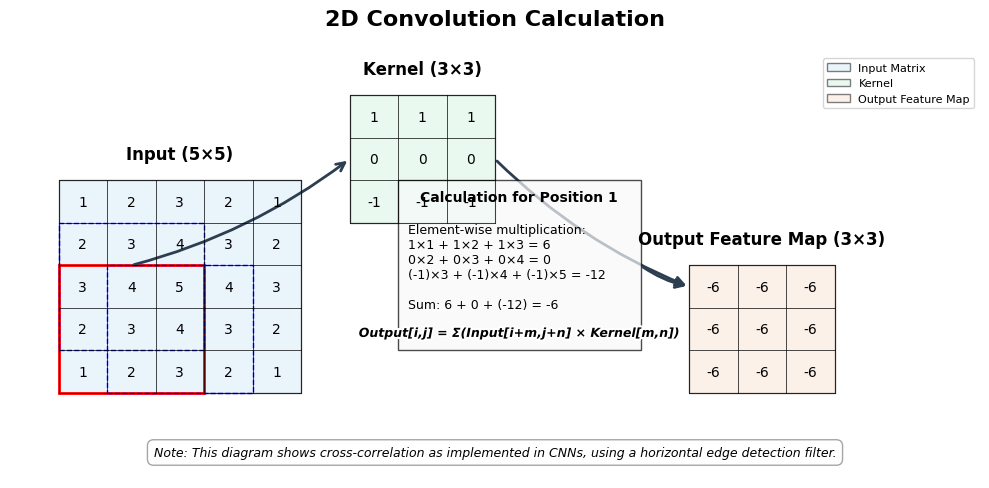

# 12. Convolutional Neural Networks

## Introduction to Convolution

Convolution is a mathematical operation used in Convolutional Neural Networks
(CNNs). It is a type of linear operation that involves the element-wise
multiplication of two arrays, followed by a sum. 
In the context of neural networks, convolution is used to extract features from input data, particularly images,
by applying filters (also called kernels) that detect specific patterns such as
edges, textures, or more complex structures.

The power of convolution lies in three key properties:

- **Sparse interactions**: Unlike fully connected layers, each output value
  depends only on a small local region of the input.
- **Parameter sharing**: The same filter is applied across the entire input,
  significantly reducing the number of parameters.
- **Equivariance to translation**: A pattern shifted in the input will produce
  the same feature shifted in the output.

These properties make CNNs effective for processing data with
grid-like topology, such as time-series data (1D grid) and images (2D grid).

## Mathematical Foundation of Convolution

### Convolution in Signal Processing

In signal processing, the convolution of two functions f and g is defined as:

$$
(f * g)(t) = \int f(\tau) g(t - \tau) d\tau
$$

For discrete functions, this becomes:

$$
(f * g)[n] = \sum_m f[m] g[n - m]
$$

This operation is commutative, meaning (f * g) = (g * f).


### Convolution in CNNs

In CNNs, we typically use a slightly different operation called "
cross-correlation," which is similar to convolution but without flipping the
kernel:

$$
(f * g)[i, j] = \sum_m \sum_n f[m, n] g[i+m, j+n]
$$

For a 2D image I and a 2D kernel K, the discrete convolution is:

$$
(I * K)[i, j] = \sum_m \sum_n I[i+m, j+n] K[m, n]
$$

In practice, deep learning libraries often implement cross-correlation but call
it convolution, as the distinction is not critical for learning since the
kernels are learned parameters.

## Convolution in Image Processing vs. CNNs

### Image Processing Convolution

In traditional image processing, convolution is used with predefined kernels to
perform specific operations:

1. **Edge Detection**: Kernels like Sobel or Prewitt operators highlight edges
   in images.
2. **Blurring**: Gaussian kernels average nearby pixels to create a blurring
   effect.
3. **Sharpening**: Specific kernels enhance edges to make images appear sharper.

These kernels are manually designed based on mathematical principles and the
desired effect.

### CNN Convolution

In CNNs, the key difference is that the kernels are not predefined but learned
during training:

1. **Learned Filters**: The network learns the optimal filter values to extract
   relevant features.
2. **Hierarchical Feature Extraction**: Early layers learn simple features (
   edges, colors), while deeper layers learn more complex patterns.
3. **Multiple Channels**: CNNs handle multi-channel inputs (like RGB images) and
   produce multi-channel outputs.
4. **Non-linearity**: Convolution operations are typically followed by
   non-linear activation functions.

This learning capability makes CNNs much more powerful and adaptable than
traditional image processing techniques.

## Convolution Operations in CNNs

### Basic Components

A convolutional layer in a CNN consists of several key components:

1. **Filters/Kernels**: Small matrices of weights that are learned during
   training.
2. **Stride**: The step size for moving the filter across the input.
3. **Padding**: Adding zeros around the input to control the output size.
4. **Channels**: Both input and output can have multiple channels.

### Forward Pass Computation

The forward pass of a convolutional layer involves:

1. Sliding the filter across the input
2. Computing the element-wise product at each position
3. Summing these products to get a single output value
4. Repeating for all filters to create the output feature map

The following figure illustrates the convolution calculation process, showing how a 3x3 kernel is applied to a 5x5 input to produce a 3x3 output feature map:



*Figure: 2D Convolution Calculation. The kernel slides across the input, performing element-wise multiplication and summation at each position to produce the output feature map.*

### Dimensions and Shapes

For an input of shape \\( (N, C_{in}, H_{in}, W_{in}) \\) ] and a 
convolutional layer with \\( C_{out} \\) 
filters of size \\( (C_{in}, K_h, K_w) \\),
the output shape will be \\( (N, C_{out}, H_{out}, W_{out}) \\) 
, where:

$$
H_{out} = \frac{H_{in} + 2 \times padding - kernel\_size}{stride} + 1 \\
W_{out} = \frac{W_{in} + 2 \times padding - kernel\_size}{stride} + 1
$$

## Implementation in Candle

Let's examine how convolution is implemented in the Candle library by looking at
a simple CNN example.

### Convolutional Layer Implementation

The `Conv2d` struct in Candle represents a 2D convolutional layer:

```rust
struct Conv2d {
    weight: Tensor,
    bias: Tensor,
    stride: usize,
    padding: usize,
}
```

The implementation includes:

1. **Initialization**: Creating weight and bias tensors with appropriate shapes.
2. **Forward Pass**: Applying padding, performing convolution, and adding bias.

Here's how a convolutional layer is initialized:

```rust
fn new(
    in_channels: usize,
    out_channels: usize,
    kernel_size: usize,
    stride: usize,
    padding: usize,
    vb: VarBuilder,
) -> Result<Self> {
    let weight_shape = Shape::from((out_channels, in_channels, kernel_size, kernel_size));
    let weight = vb.get(weight_shape, "weight")?.to_owned();
    let bias_shape = Shape::from((out_channels,));
    let bias = vb.get(bias_shape, "bias")?.to_owned();

    Ok(Self {
        weight,
        bias,
        stride,
        padding,
    })
}
```

And here's the forward pass implementation:

```rust
// Forward pass implementation
fn forward(x: &Tensor) -> Result<Tensor> {
    let (_batch_size, _channels, _height, _width) = x.dims4()?;

    // Apply padding if needed
    let x = if padding > 0 {
        x.pad_with_zeros(2, padding, padding)?
            .pad_with_zeros(3, padding, padding)?
    } else {
        x.clone()
    };

    // Perform convolution operation
    let x = x.conv2d(&weight, stride, padding, 1, 1)?;

    // Add bias
    let bias = bias.reshape((1, bias.dim(0)?, 1, 1))?;
    let x = x.broadcast_add(&bias)?;

    Ok(x)
}
```

### Building a Complete CNN

A complete CNN combines convolutional layers with other components like pooling
and fully connected layers:

```rust
struct SimpleCNN {
    conv1: Conv2d,
    pool1: MaxPool2d,
    conv2: Conv2d,
    pool2: MaxPool2d,
    fc1: candle_nn::Linear,
    fc2: candle_nn::Linear,
}
```

The forward pass of the CNN processes the input through these layers
sequentially:

```rust
// Forward pass implementation for the CNN
fn forward(x: &Tensor) -> Result<Tensor> {
    // First convolutional block
    let x = conv1.forward(x)?;
    let x = x.relu()?;
    let x = pool1.forward(&x)?;

    // Second convolutional block
    let x = conv2.forward(&x)?;
    let x = x.relu()?;
    let x = pool2.forward(&x)?;

    // Flatten the output
    let batch_size = x.dim(0)?;
    let features = x.dim(1)? * x.dim(2)? * x.dim(3)?;
    let x = x.reshape((batch_size, features))?;

    // Fully connected layers
    let x = fc1.forward(&x)?;
    let x = x.relu()?;
    let x = fc2.forward(&x)?;

    Ok(x)
}
```

## Advanced Convolution Concepts

### Different Types of Convolution

1. **Standard Convolution**: The basic operation described above.
2. **Dilated Convolution**: Introduces gaps between kernel elements to increase
   the receptive field without increasing parameters.
3. **Transposed Convolution**: Also known as deconvolution, used for upsampling
   in tasks like segmentation.
4. **Depthwise Separable Convolution**: Splits the standard convolution into
   depthwise and pointwise convolutions to reduce parameters.
5. **1x1 Convolution**: Used for channel-wise dimensionality reduction.

### Receptive Field

The receptive field refers to the region in the input space that influences a
particular output unit. As we go deeper in a CNN, the receptive field grows,
allowing deeper layers to capture more global patterns.

For a network with layers using kernels of size \\( k \\) (k), stride \\(
s \\) (s), and dilation \\( d \\) (d), the receptive field size \\( r \\) (r)
after \\( n \\) (n) layers is:

$$
r = 1 + \sum_{i=1}^{n} ((k_i - 1) \times d_i)
$$

### Feature Maps and Channels

Each convolutional filter produces a feature map, highlighting where specific
patterns appear in the input. Multiple filters create multiple feature maps,
forming the channels of the output. This allows the network to detect various
features simultaneously.

## Common Misconceptions About Convolution in CNNs

### Misconception 1: Convolution and Cross-Correlation Are the Same

While mathematically distinct (convolution involves flipping the kernel), in
deep learning, we typically use cross-correlation but call it convolution. This
distinction is not critical since the kernels are learned parameters.

### Misconception 2: Larger Kernels Are Always Better

Larger kernels capture more context but require more parameters and computation.
Modern architectures often use multiple smaller kernels in sequence instead of a
single large kernel to achieve a similar receptive field with fewer parameters.

### Misconception 3: Convolution Only Works for Images

While CNNs are most commonly associated with image processing, convolution is
effective for any data with grid-like topology, including time series (1D),
audio (1D), and video (3D).

### Misconception 4: Pooling Is Part of Convolution

Pooling (e.g., max pooling) is a separate operation that reduces spatial
dimensions. While often used together with convolution, they serve different
purposes: convolution extracts features, while pooling provides spatial
invariance and reduces computation.

### Misconception 5: CNNs Automatically Handle Different Input Sizes

Standard CNNs require fixed-size inputs due to the fully connected layers.
Techniques like Global Average Pooling or Fully Convolutional Networks are
needed to handle variable-sized inputs.

## Candle-Specific Implementation Details

### Tensor Dimensions and Layout

Candle uses the NCHW format for tensors, where:

- N: Batch size
- C: Channels
- H: Height
- W: Width

This is important to remember when implementing convolution operations.

### Efficient Convolution Implementation

Candle's convolution implementation is optimized for performance:

1. **Memory Layout**: Careful management of tensor memory layout for efficient
   computation.
2. **BLAS Integration**: Using optimized Basic Linear Algebra Subprograms for
   matrix operations.
3. **Device Support**: Support for CPU, CUDA, and Metal backends for hardware
   acceleration.

### Custom Convolution Operations

Candle allows for custom convolution operations through its tensor API:

```
// Example of using Candle's tensor API for convolution:
// Standard 2D convolution
output = input.conv2d(&weight, stride, padding, dilation, groups);

// Other variants are also available
```

## Conclusion

Convolution is a powerful operation that enables CNNs to automatically learn
hierarchical features from data with grid-like topology. By applying the same
learned filters across the entire input, CNNs achieve parameter efficiency and
translation equivariance, making them particularly effective for tasks like
image classification, object detection, and segmentation.


