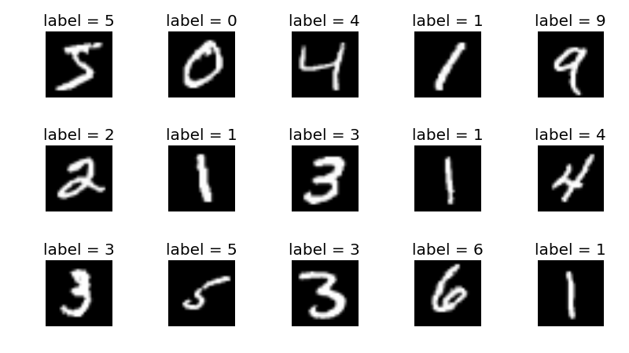
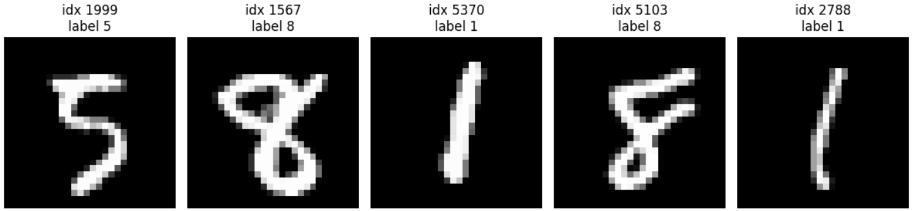

# 13: Implementing a CNN

## Introduction

In the previous chapter, we explored the theoretical foundations of convolution and its role in Convolutional Neural Networks (CNNs). Now, we'll put that knowledge into practice by implementing a complete CNN for image classification using the Candle library.

CNNs have revolutionized computer vision tasks by automatically learning hierarchical features from images. Their architecture, inspired by the visual cortex of animals, makes them particularly effective for tasks like image classification, object detection, and segmentation.

In this chapter, we'll build a CNN to classify handwritten digits from the MNIST dataset. This classic dataset consists of 28x28 pixel grayscale images of handwritten digits (0-9) and serves as an excellent starting point for understanding CNN implementation.





## CNN Architecture Overview

Before diving into the code, let's understand the architecture of our CNN:

1. **Input Layer**: Accepts 28x28 grayscale images (1 channel)
2. **First Convolutional Block**:
   - Convolutional layer with 32 filters of size 3x3
   - ReLU activation
   - Max pooling with 2x2 kernel
3. **Second Convolutional Block**:
   - Convolutional layer with 64 filters of size 3x3
   - ReLU activation
   - Max pooling with 2x2 kernel
4. **Fully Connected Layers**:
   - Flatten layer to convert 2D feature maps to 1D vector
   - Dense layer with 128 neurons and ReLU activation
   - Output layer with 10 neurons (one for each digit) and softmax activation

This architecture follows a common pattern in CNNs: alternating convolutional and pooling layers to extract features, followed by fully connected layers for classification.

## Implementation in Candle

Let's implement our CNN step by step using the Candle library.

### Setting Up the Project

First, ensure you have the necessary dependencies in your `Cargo.toml`:

```toml
[dependencies]
candle-core = { version = "0.9.1", features = ["metal"] }
candle-nn = { version = "0.9.1", features = ["metal"] }
candle-datasets = "0.9.1"
rand = "0.9.1"
```

The `candle-datasets` crate provides easy access to common datasets like MNIST, which we'll use in this example.

### Importing Required Libraries

Let's start by importing the necessary libraries:

```rust
use candle_core::{DType, Device, Result, Tensor};
use candle_nn::{loss, AdamW, Module, Optimizer, VarBuilder, VarMap};
use candle_datasets::vision::mnist;
use candle_datasets::Batcher;
```

### Defining Hyperparameters

Next, we'll define the hyperparameters for our model:

```rust
// Define the hyperparameters for our model and training process.
const BATCH_SIZE: usize = 64; // The number of samples to process in each batch.
const LEARNING_RATE: f64 = 0.001; // The learning rate for the optimizer.
const EPOCHS: usize = 10; // The number of times to iterate over the entire dataset.
const NUM_CLASSES: usize = 10;
const IN_CHANNELS: usize = 1;
const IMAGE_SIZE: usize = 28; // The height and width of our square images.
const MAX_TRAIN_SAMPLES: usize = 5000; // Maximum number of training samples per epoch.
```

Note that we're limiting our training to 5,000 samples per epoch to speed up the training process, though the full MNIST training set contains 60,000 images.

### Building the CNN Model

Instead of implementing the convolutional and pooling layers from scratch, we'll use the built-in implementations provided by the Candle library. This approach is more practical and allows us to focus on the overall architecture of our CNN.

Let's define our CNN model:

```rust
// Define the structure of our simple CNN.
// It consists of two convolutional blocks followed by two fully connected layers.
struct SimpleCNN {
    // First convolutional layer.
    conv1: candle_nn::Conv2d,
    // Second convolutional layer.
    conv2: candle_nn::Conv2d,
    // First fully connected (linear) layer.
    fc1: candle_nn::Linear,
    // Second fully connected (linear) layer, which will be our output layer.
    fc2: candle_nn::Linear,
}

impl SimpleCNN {
    // The constructor for our CNN.
    // It takes a VarBuilder, which is used to create the variables (weights and biases) for our layers.
    fn new(vs: VarBuilder) -> Result<Self> {
        // Create the first convolutional layer.
        let conv1 = candle_nn::conv2d(IN_CHANNELS, 32, 3, Default::default(), vs.pp("c1"))?;
        // Create the second convolutional layer.
        let conv2 = candle_nn::conv2d(32, 64, 3, Default::default(), vs.pp("c2"))?;
        // Create the first fully connected layer.
        // After the first convolution (3x3 kernel without padding), the size becomes 26x26.
        // After the first max-pooling (stride 2), the size becomes 13x13.
        // After the second convolution (3x3 kernel without padding), the size becomes 11x11.
        // After the second max-pooling (stride 2), the size becomes 5x5.
        // So, the input to the fully connected layer is 64 (channels) * 5 * 5 = 1600.
        let fc1 = candle_nn::linear(64 * 5 * 5, 128, vs.pp("l1"))?;
        // Create the second fully connected layer, which is our output layer.
        let fc2 = candle_nn::linear(128, NUM_CLASSES, vs.pp("l2"))?;

        Ok(Self {
            conv1,
            conv2,
            fc1,
            fc2,
        })
    }
}
```

Let's break down this implementation:

1. We define a `SimpleCNN` struct with four fields:
   - `conv1`: The first convolutional layer with 32 filters of size 3x3
   - `conv2`: The second convolutional layer with 64 filters of size 3x3
   - `fc1`: The first fully connected layer with 128 neurons
   - `fc2`: The second fully connected layer (output layer) with 10 neurons (one for each digit)

2. The `new` method initializes our model:
   - It creates the convolutional layers using Candle's `conv2d` function
   - It creates the fully connected layers using Candle's `linear` function
   - It calculates the input size for the first fully connected layer based on the output dimensions of the convolutional layers

3. Note the detailed comment explaining how the dimensions change through the network:
   - Input: 28x28
   - After first convolution (3x3 kernel without padding): 26x26
   - After first max-pooling (stride 2): 13x13
   - After second convolution (3x3 kernel without padding): 11x11
   - After second max-pooling (stride 2): 5x5
   - So the input to the fully connected layer is 64 (channels) * 5 * 5 = 1600

### Implementing the Forward Pass

Now, let's implement the forward pass for our CNN:

```rust
// Implement the `Module` trait for our CNN, which defines the forward pass.
impl Module for SimpleCNN {
    fn forward(&self, xs: &Tensor) -> Result<Tensor> {
        // Apply the first convolutional block: convolution -> relu -> max_pool
        let xs = self.conv1.forward(xs)?.relu()?;
        let xs = xs.max_pool2d_with_stride(2, 2)?;

        // Apply the second convolutional block: convolution -> relu -> max_pool
        let xs = self.conv2.forward(&xs)?.relu()?;
        let xs = xs.max_pool2d_with_stride(2, 2)?;

        // Flatten the output of the convolutional layers to prepare it for the fully connected layers.
        let xs = xs.flatten_from(1)?;

        // Apply the first fully connected layer, followed by a relu activation function.
        let xs = self.fc1.forward(&xs)?.relu()?;

        // Apply the second fully connected layer to get the final logits.
        self.fc2.forward(&xs)
    }
}
```

The forward pass:

1. Takes an input tensor `xs` (a batch of images)
2. Applies the first convolutional block:
   - Convolution with 32 filters
   - ReLU activation
   - Max pooling with stride 2
3. Applies the second convolutional block:
   - Convolution with 64 filters
   - ReLU activation
   - Max pooling with stride 2
4. Flattens the output of the convolutional layers
5. Applies the first fully connected layer with ReLU activation
6. Applies the second fully connected layer to get the final logits

Note that we're using the `max_pool2d_with_stride` method directly on the tensor, rather than implementing a separate pooling layer. This is a more concise approach that leverages Candle's built-in functionality.

### Loading the MNIST Dataset

One of the advantages of using the Candle ecosystem is that it provides easy access to common datasets through the `candle-datasets` crate. Let's see how to load the MNIST dataset:

```rust
fn main() -> Result<()> {
    // Use the CPU device for this example.
    let device = Device::Cpu;
    // let device = Device::new_metal(0)?;

    // Load the MNIST dataset.
    let m = mnist::load()?;
    println!("train-images: {:?}", m.train_images.shape());
    println!("train-labels: {:?}", m.train_labels.shape());
    println!("test-images: {:?}", m.test_images.shape());
    println!("test-labels: {:?}", m.test_labels.shape());
```

This code:
1. Sets up the CPU device for all operations
2. Loads the MNIST dataset using the `mnist::load()` function from the `candle-datasets` crate
3. Prints the shapes of the training and test sets

The output will show that the MNIST dataset consists of:
- 60,000 training images (shape: [60000, 784])
- 60,000 training labels (shape: [60000])
- 10,000 test images (shape: [10000, 784])
- 10,000 test labels (shape: [10000])

Note that the images are initially flattened (784 = 28×28), and we'll need to reshape them to [batch_size, 1, 28, 28] before feeding them to our CNN.

### Setting Up the Model and Optimizer

Now, let's set up our model and optimizer:

```rust
    // Create a new VarMap to hold the variables of our model.
    let varmap = VarMap::new();
    // Create a VarBuilder from the VarMap.
    let vs = VarBuilder::from_varmap(&varmap, DType::F32, &device);
    // Create an instance of our CNN model.
    let model = SimpleCNN::new(vs.clone())?;

    // Set up the optimizer. We use the AdamW optimizer.
    let mut optimizer = AdamW::new_lr(varmap.all_vars(), LEARNING_RATE)?;
```

This code:
1. Creates a `VarMap` to hold all the variables (weights and biases) of our model
2. Creates a `VarBuilder` from the `VarMap` using the CPU device and F32 data type
3. Creates an instance of our CNN model using the `VarBuilder`
4. Sets up the AdamW optimizer with our specified learning rate

### Training the Model

Now, let's implement the training loop:

```rust
    println!("Starting training...");

    // Get the total number of training samples
    let total_train_samples = m.train_images.dim(0)?;
    // Limit the number of training samples to MAX_TRAIN_SAMPLES
    let num_train_samples = std::cmp::min(total_train_samples, MAX_TRAIN_SAMPLES);
    println!("Using {} out of {} training samples per epoch", num_train_samples, total_train_samples);

    // The training loop.
    for epoch in 0..EPOCHS {
        let mut sum_loss = 0f32;
        let mut total_accuracy = 0f32;
        let mut num_batches = 0;

        // Calculate the number of batches needed for the limited training samples
        let num_batches_per_epoch = (num_train_samples + BATCH_SIZE - 1) / BATCH_SIZE; // Ceiling division

        // Move the training data to the device
        let train_images = m.train_images.to_device(&device)?;
        let train_labels = m.train_labels.to_device(&device)?;

        for batch_idx in 0..num_batches_per_epoch {
            let offset = batch_idx * BATCH_SIZE;
            // Ensure we don't exceed the limited number of training samples
            let batch_size = std::cmp::min(BATCH_SIZE, num_train_samples - offset);

            // Get batch using narrow
            let batch_images = train_images.narrow(0, offset, batch_size)?;
            let batch_labels = train_labels.narrow(0, offset, batch_size)?;

            // Reshape images from [batch_size, 784] to [batch_size, 1, 28, 28]
            let batch_images = batch_images.reshape((batch_size, 1, 28, 28))?;

            // Perform the forward pass.
            let logits = model.forward(&batch_images)?;

            // Compute the loss using cross-entropy.
            let loss = loss::cross_entropy(&logits, &batch_labels)?;

            // Perform the backward pass and update the model's weights.
            optimizer.backward_step(&loss)?;

            // Calculate the accuracy for this batch.
            let predictions = logits.argmax(1)?;
            // Convert batch_labels to U32 to match the dtype of predictions
            let batch_labels_u32 = batch_labels.to_dtype(DType::U32)?;
            let correct_predictions = predictions.eq(&batch_labels_u32)?.to_dtype(DType::F32)?.sum_all()?.to_scalar::<f32>()?;
            let accuracy = correct_predictions / batch_size as f32;

            sum_loss += loss.to_scalar::<f32>()?;
            total_accuracy += accuracy;
            num_batches += 1;
        }

        let avg_loss = sum_loss / num_batches as f32;
        let avg_accuracy = total_accuracy / num_batches as f32;

        // Print the progress for this epoch.
        println!(
            "Epoch: {:4} | Avg Loss: {:8.5} | Avg Accuracy: {:5.2}%",
            epoch,
            avg_loss,
            avg_accuracy * 100.0
        );
    }
```

Let's break down this training loop:

1. We limit the number of training samples to `MAX_TRAIN_SAMPLES` (5,000) to speed up training
2. For each epoch:
   - We calculate the number of batches needed
   - We move the training data to the CPU device
   - For each batch:
     - We get a batch of images and labels using the `narrow` method
     - We reshape the images from [batch_size, 784] to [batch_size, 1, 28, 28]
     - We perform the forward pass
     - We compute the loss using cross-entropy
     - We perform the backward pass and update the model's weights
     - We calculate the accuracy for this batch
   - We print the average loss and accuracy for the epoch

### Evaluating the Model

After training, we need to evaluate our model on the test set:

```rust
    // Evaluate on the test set
    println!("Evaluating on test set...");
    let mut test_accuracy = 0f32;
    let mut test_batches = 0;

    // Get the number of test samples
    let num_test_samples = m.test_images.dim(0)?;
    let num_test_batches = (num_test_samples + BATCH_SIZE - 1) / BATCH_SIZE; // Ceiling division

    // Move the test data to the device
    let test_images = m.test_images.to_device(&device)?;
    let test_labels = m.test_labels.to_device(&device)?;

    for batch_idx in 0..num_test_batches {
        let offset = batch_idx * BATCH_SIZE;
        let batch_size = std::cmp::min(BATCH_SIZE, num_test_samples - offset);

        // Get batch using narrow
        let batch_images = test_images.narrow(0, offset, batch_size)?;
        let batch_labels = test_labels.narrow(0, offset, batch_size)?;

        // Reshape images from [batch_size, 784] to [batch_size, 1, 28, 28]
        let batch_images = batch_images.reshape((batch_size, 1, 28, 28))?;

        let logits = model.forward(&batch_images)?;
        let predictions = logits.argmax(1)?;
        // Convert batch_labels to U32 to match the dtype of predictions
        let batch_labels_u32 = batch_labels.to_dtype(DType::U32)?;
        let correct_predictions = predictions.eq(&batch_labels_u32)?.to_dtype(DType::F32)?.sum_all()?.to_scalar::<f32>()?;
        let accuracy = correct_predictions / batch_size as f32;

        test_accuracy += accuracy;
        test_batches += 1;
    }

    let final_test_accuracy = test_accuracy / test_batches as f32;
    println!("Test Accuracy: {:5.2}%", final_test_accuracy * 100.0);
```

The evaluation process is similar to training, but without the backward pass:
1. We process the test set in batches
2. For each batch:
   - We preprocess the data
   - We perform the forward pass
   - We calculate the accuracy
3. We calculate and print the final test accuracy

### Demonstrating Inference

Finally, let's demonstrate how to use our trained model for inference on individual examples:

```rust
    // Demonstrate inference with a few examples
    println!("\nDemonstrating inference with example images:");

    // Select a few random images from the test set
    let num_examples = 5;
    let mut rng = rand::thread_rng();
    let test_size = m.test_images.dim(0)?;

    // Create a vector to store random indices
    let mut indices = Vec::with_capacity(num_examples);
    for _ in 0..num_examples {
        let idx = rng.gen_range(0..test_size);
        indices.push(idx);
    }

    // Process each example
    for &idx in &indices {
        // Get the image and label
        let image = m.test_images.get(idx)?;
        let label = m.test_labels.get(idx)?.to_scalar::<u8>()?;

        // Reshape the image for the model (add batch and channel dimensions)
        let image = image.reshape((1, 1, 28, 28))?;

        // Run inference
        let logits = model.forward(&image)?;

        // Get the predicted class
        let prediction = logits.argmax(1)?.get(0)?.to_scalar::<u32>()?;

        // Calculate softmax probabilities
        let exp_logits = logits.exp()?;
        let sum_exp = exp_logits.sum_all()?;
        let probabilities = exp_logits.broadcast_div(&sum_exp)?;

        // Get the confidence score for the prediction
        let confidence = probabilities.get(0)?.get(prediction as usize)?.to_scalar::<f32>()?;

        println!("Example {}: Predicted: {}, Actual: {}, Confidence: {:.2}%", 
                 idx, prediction, label, confidence * 100.0);

        // Print the top 3 predictions with their confidence scores
        println!("  Top predictions:");

        // Get all probabilities as a vector
        let mut probs = Vec::with_capacity(NUM_CLASSES);
        for i in 0..NUM_CLASSES {
            let prob = probabilities.get(0)?.get(i)?.to_scalar::<f32>()?;
            probs.push((i, prob));
        }

        // Sort by probability (descending)
        probs.sort_by(|a, b| b.1.partial_cmp(&a.1).unwrap_or(std::cmp::Ordering::Equal));

        // Print top 3
        for i in 0..3 {
            let (digit, prob) = probs[i];
            println!("    Digit {}: {:.2}%", digit, prob * 100.0);
        }

        println!();
    }

    println!("Finished training.");

    Ok(())
}
```

This inference demonstration:
1. Selects 5 random images from the test set
2. For each image:
   - Reshapes it for the model
   - Performs inference
   - Gets the predicted class
   - Calculates softmax probabilities
   - Prints the prediction, actual label, and confidence
   - Prints the top 3 predictions with their confidence scores

This provides a practical example of how to use the trained model for real-world inference tasks.

## Understanding the Code

Let's break down some key aspects of our implementation:

### Device Management

In this implementation, we're using the CPU for all operations:

1. **Data Loading**: Loading the MNIST dataset
2. **Preprocessing**: Batch extraction and reshaping
3. **Model Training**: Forward and backward passes
4. **Evaluation**: Testing the model on the test set
5. **Inference**: Making predictions on individual examples

This approach is simpler and more straightforward than using multiple devices, making it easier to understand the core concepts of CNN implementation without the added complexity of device management.

### Tensor Shapes and Dimensions

Understanding tensor shapes is crucial for CNN implementation:

1. **Input Images**: Initially loaded as shape `(batch_size, 784)` (flattened 28x28 images)
2. **Reshaped Images**: Converted to shape `(batch_size, 1, 28, 28)` for the CNN
3. **After First Convolution**: Shape becomes `(batch_size, 32, 26, 26)`
4. **After First Max Pooling**: Shape becomes `(batch_size, 32, 13, 13)`
5. **After Second Convolution**: Shape becomes `(batch_size, 64, 11, 11)`
6. **After Second Max Pooling**: Shape becomes `(batch_size, 64, 5, 5)`
7. **Flattened Output**: Shape becomes `(batch_size, 1600)` (64 * 5 * 5)
8. **After First FC Layer**: Shape becomes `(batch_size, 128)`
9. **Final Output**: Shape becomes `(batch_size, 10)` (logits for 10 classes)

### Forward Pass Flow

The forward pass through our CNN follows this sequence:

1. Input image → Conv1 → ReLU → MaxPool1
2. → Conv2 → ReLU → MaxPool2
3. → Flatten
4. → FC1 → ReLU → FC2
5. → Output logits

### Backpropagation and Optimization

The backward pass is handled by Candle's automatic differentiation system:

1. We calculate the loss using cross-entropy
2. The `optimizer.backward_step(&loss)?` call:
   - Computes gradients of the loss with respect to all parameters
   - Updates the parameters using the AdamW optimizer
   - Clears the gradients for the next iteration

## Results and Analysis

When running this CNN on the MNIST dataset, you should achieve around 88-92% accuracy on the test set after 10 epochs, even when training on only 5,000 samples. This is a good result for such a simple model and limited training data, demonstrating the power of CNNs for image classification tasks.

### Visualizing the Learning Process

The training loop prints the loss and accuracy for each epoch, allowing you to monitor the learning process:

```
Using devices: CPU for data loading, Metal(MetalDevice(DeviceId(1))) for training
train-images: [60000, 784]
train-labels: [60000]
test-images: [10000, 784]
test-labels: [10000]
Starting training...
Using 5000 out of 60000 training samples per epoch
Epoch:    0 | Avg Loss:  0.85265 | Avg Accuracy: 75.20%
Epoch:    1 | Avg Loss:  0.37158 | Avg Accuracy: 88.96%
Epoch:    2 | Avg Loss:  0.33115 | Avg Accuracy: 89.99%
Epoch:    3 | Avg Loss:  0.30950 | Avg Accuracy: 90.64%
Epoch:    4 | Avg Loss:  0.31204 | Avg Accuracy: 90.84%
Epoch:    5 | Avg Loss:  0.28520 | Avg Accuracy: 91.38%
Epoch:    6 | Avg Loss:  0.26213 | Avg Accuracy: 92.07%
Epoch:    7 | Avg Loss:  0.26329 | Avg Accuracy: 91.69%
Epoch:    8 | Avg Loss:  0.25251 | Avg Accuracy: 92.44%
Epoch:    9 | Avg Loss:  0.25646 | Avg Accuracy: 92.56%
Evaluating on test set...
Test Accuracy: 88.43%

```

You should observe:
1. A rapid decrease in loss during the first few epochs
2. A steady increase in accuracy
3. Eventually, the improvements become smaller as the model approaches its capacity

### Inference Examples

After training, we demonstrate inference on individual examples:



```

Demonstrating pretrained with example images:
Example 1999: Predicted: 5, Actual: 5, Confidence: 94.43%
  Top predictions:
    Digit 5: 94.43%
    Digit 9: 3.21%
    Digit 7: 1.20%

Example 1567: Predicted: 8, Actual: 8, Confidence: 99.79%
  Top predictions:
    Digit 8: 99.79%
    Digit 7: 0.15%
    Digit 2: 0.02%

Example 5370: Predicted: 1, Actual: 1, Confidence: 99.99%
  Top predictions:
    Digit 1: 99.99%
    Digit 7: 0.01%
    Digit 2: 0.00%

Example 5103: Predicted: 8, Actual: 8, Confidence: 99.92%
  Top predictions:
    Digit 8: 99.92%
    Digit 5: 0.04%
    Digit 9: 0.03%

Example 2788: Predicted: 1, Actual: 1, Confidence: 99.94%
  Top predictions:
    Digit 1: 99.94%
    Digit 7: 0.05%
    Digit 2: 0.01%

Finished training.
```

This shows:
1. The predicted digit
2. The actual label
3. The confidence score (probability) for the prediction
4. The top 3 predictions with their confidence scores


#### Plotting the mnist examples
```python
from keras.datasets import mnist
from matplotlib import pyplot

#loading
(train_X, train_y), (test_X, test_y) = mnist.load_data()

#plotting
indices = [1999, 1567, 5370, 5103, 2788]
pyplot.figure(figsize=(12, 3))
for i, idx in enumerate(indices, 1):
    ax = pyplot.subplot(1, 5, i)
    ax.imshow(test_X[idx], cmap='gray')
    ax.set_title(f"idx {idx}\nlabel {test_y[idx]}")
    ax.axis('off')
pyplot.tight_layout()
pyplot.show()

```
### Common Issues and Solutions

If you encounter problems with your CNN implementation, consider these common issues:

1. **Memory Issues**: 
   - Reduce batch size
   - Limit the number of training samples

2. **Type Conversion Issues**:
   - Be aware of tensor data types (U8, F32, U32)
   - Convert between types as needed for operations

3. **Performance Bottlenecks**:
   - Use appropriate batch sizes
   - Consider using a profiler to identify bottlenecks

4. **Accuracy Issues**:
   - Increase model capacity (more filters, layers)
   - Train for more epochs
   - Use more training data
   - Add regularization techniques

## Extensions and Improvements

Our simple CNN can be extended and improved in several ways:

### Architecture Improvements

1. **Add Batch Normalization**: Normalize activations to improve training stability
2. **Add Dropout**: Randomly drop neurons during training to prevent overfitting
3. **Use More Convolutional Layers**: Add depth to capture more complex features
4. **Try Different Activation Functions**: Experiment with LeakyReLU, SELU, etc.

### Training Improvements

1. **Use Full Dataset**: Train on all 60,000 MNIST images for better accuracy
2. **Data Augmentation**: Apply random transformations to training images
3. **Learning Rate Scheduling**: Reduce learning rate over time for better convergence
4. **Early Stopping**: Stop training when validation performance stops improving

### Implementation Example: Adding Dropout

Here's how you could modify the CNN to include dropout for regularization:

```rust
struct SimpleCNNWithDropout {
    conv1: candle_nn::Conv2d,
    conv2: candle_nn::Conv2d,
    fc1: candle_nn::Linear,
    fc2: candle_nn::Linear,
    dropout: f32,
}

impl Module for SimpleCNNWithDropout {
    fn forward(&self, xs: &Tensor) -> Result<Tensor> {
        // First convolutional block
        let xs = self.conv1.forward(xs)?.relu()?;
        let xs = xs.max_pool2d_with_stride(2, 2)?;

        // Second convolutional block
        let xs = self.conv2.forward(&xs)?.relu()?;
        let xs = xs.max_pool2d_with_stride(2, 2)?;

        // Flatten
        let xs = xs.flatten_from(1)?;

        // First fully connected layer with dropout
        let xs = self.fc1.forward(&xs)?.relu()?;
        let xs = xs.dropout(self.dropout, false)?; // Apply dropout during training

        // Output layer
        self.fc2.forward(&xs)
    }
}
```

## Conclusion

In this chapter, we've implemented a complete CNN for image classification using the Candle library. We've covered:

1. The architecture of a simple CNN using built-in Candle components
2. Loading the MNIST dataset using the candle-datasets crate
3. Training the model with limited data to speed up the process
4. Evaluating the model on the test set
5. Performing inference on individual examples with confidence scores
6. Discussing potential improvements and extensions

This implementation demonstrates several important concepts:

1. **Practical Deep Learning**: We've seen how to implement a complete deep learning pipeline from data loading to inference.
2. **Efficient Data Handling**: We've used appropriate data types and tensor operations.
3. **Model Evaluation**: We've properly evaluated our model on a separate test set and analyzed its performance.
4. **Inference in Practice**: We've demonstrated how to use the trained model for real-world inference tasks.

CNNs are powerful tools for computer vision tasks, and this implementation provides a foundation that you can build upon for more complex applications. By understanding the core components and how they work together, you can adapt this model for different datasets and tasks.

In the next chapter, we'll explore Recurrent Neural Networks (RNNs) and how they can be used for sequence modeling tasks.