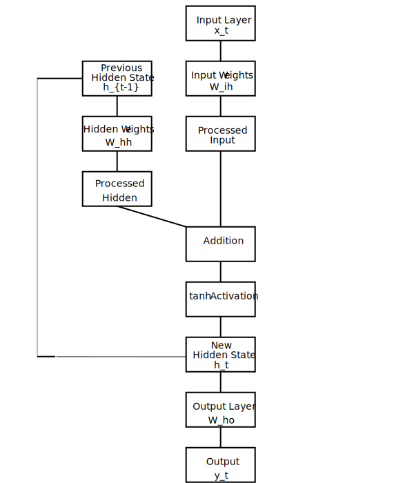

# 14. Recurrent Neural Networks

## Introduction to Elman Recurrent Neural Networks

The Elman Recurrent Neural Network (Elman RNN) is one of the earliest and most fundamental RNN architectures, introduced by Jeffrey Elman in 1990. It represents a significant milestone in the development of neural networks capable of processing sequential data. While more advanced architectures like LSTM and GRU have become popular for handling complex sequential tasks, understanding the Elman RNN provides valuable insights into the core principles of recurrent networks.

The key innovation in Elman's architecture was the introduction of a **context layer** (also called the hidden layer) that maintains a copy of the previous hidden state. This simple feedback mechanism allows the network to maintain a form of memory about previous inputs, enabling it to learn temporal patterns in sequential data.

## Elman RNN Architecture

### Core Components

The Elman RNN consists of three primary components:

1. **Input Layer**: Processes the current input and passes it to the hidden layer
2. **Hidden Layer (Context Layer)**: Combines the processed input with its own previous state
3. **Output Layer**: Generates predictions based on the current hidden state



The defining characteristic of the Elman RNN is the recurrent connection from the hidden layer back to itself. This connection allows the network to maintain information about previous inputs, creating a form of short-term memory.

### Mathematical Formulation

The Elman RNN can be described mathematically as follows:

```
h_t = tanh(W_ih * x_t + W_hh * h_{t-1} + b_h)
y_t = W_ho * h_t + b_o
```

Where:
- `x_t` is the input at time step t
- `h_t` is the hidden state at time step t
- `h_{t-1}` is the hidden state from the previous time step
- `y_t` is the output at time step t
- `W_ih` is the weight matrix from input to hidden layer
- `W_hh` is the weight matrix from hidden to hidden layer (recurrent weights)
- `W_ho` is the weight matrix from hidden to output layer
- `b_h` and `b_o` are bias vectors
- `tanh` is the hyperbolic tangent activation function

This formulation shows how the hidden state at each time step depends on both the current input and the previous hidden state, creating the recurrent behavior that allows the network to process sequential data.

## Implementation in Candle

Let's examine a practical implementation of an Elman RNN using the Candle library in Rust. The following code demonstrates a simple Elman RNN for predicting the next number in a sequence.

### Model Definition

```rust
// Define the Elman RNN model
struct ElmanRnn {
    input_layer: candle_nn::Linear,
    hidden_layer: candle_nn::Linear,
    output_layer: candle_nn::Linear,
}
```

This struct defines the three main components of our Elman RNN:
- `input_layer`: A linear layer that processes the input
- `hidden_layer`: A linear layer that processes the hidden state
- `output_layer`: A linear layer that produces the final output

### Model Initialization

```rust
impl ElmanRnn {
    fn new(vs: VarBuilder) -> Result<Self> {
        let input_layer = candle_nn::linear(1, 10, vs.pp("input"))?;
        let hidden_layer = candle_nn::linear(10, 10, vs.pp("hidden"))?;
        let output_layer = candle_nn::linear(10, 1, vs.pp("output"))?;
        Ok(Self {
            input_layer,
            hidden_layer,
            output_layer,
        })
    }
}
```

In the initialization function:
- We create an `input_layer` that maps from input dimension (1) to hidden dimension (10)
- We create a `hidden_layer` that maps from hidden dimension (10) to hidden dimension (10)
- We create an `output_layer` that maps from hidden dimension (10) to output dimension (1)

The dimensions are specific to this example, where we're working with scalar inputs and outputs. In practice, these dimensions would be adjusted based on the specific task.

## The Forward Pass: Inner Workings of Input, Hidden, and Output Layers

The heart of the Elman RNN is its forward pass, which processes inputs sequentially while maintaining a hidden state. Let's examine this process in detail:

```rust
fn forward(&self, x: &Tensor, hidden_state: &Tensor) -> Result<(Tensor, Tensor)> {
    let x = self.input_layer.forward(x)?;
    let hidden_state = (self.hidden_layer.forward(&hidden_state)? + x)?.tanh()?;
    let output = self.output_layer.forward(&hidden_state)?;
    Ok((output, hidden_state))
}
```

This forward function takes two inputs:
- `x`: The current input tensor
- `hidden_state`: The previous hidden state tensor

And returns two outputs:
- The current output
- The updated hidden state (to be used in the next time step)

Let's break down each step of the forward pass:

### 1. Input Layer Processing

```rust
let x = self.input_layer.forward(x)?;
```

In this step:
- The current input `x` is passed through the input layer
- The input layer applies a linear transformation: `W_ih * x + b_ih`
- This transforms the input from its original dimension to the hidden dimension
- The result is a processed input that's ready to be combined with the hidden state

### 2. Hidden Layer Processing

```rust
let hidden_state = (self.hidden_layer.forward(&hidden_state)? + x)?.tanh()?;
```

This is the most crucial step in the Elman RNN, where:
- The previous hidden state is passed through the hidden layer: `W_hh * h_{t-1} + b_hh`
- The result is added to the processed input from step 1
- The hyperbolic tangent (tanh) activation function is applied to the sum
- This creates the new hidden state that combines information from both the current input and the previous hidden state

The addition operation (`+`) is key here - it combines the information from the current input with the information from the previous time steps stored in the hidden state. The tanh activation function squashes the values between -1 and 1, helping to prevent the hidden state values from growing too large over time.

### 3. Output Layer Processing

```rust
let output = self.output_layer.forward(&hidden_state)?;
```

In the final step:
- The new hidden state is passed through the output layer
- The output layer applies a linear transformation: `W_ho * h_t + b_ho`
- This transforms the hidden state to the output dimension
- The result is the network's prediction for the current time step

### 4. Return Values

```rust
Ok((output, hidden_state))
```

The function returns both:
- The current output (prediction)
- The updated hidden state, which will be passed back into the function at the next time step

This return structure is crucial for maintaining the recurrent nature of the network across time steps.


### Calculation Flow Diagram


This diagram illustrates how the input vector and previous hidden state are processed through their respective weight matrices and biases, then combined and passed through the tanh activation function to produce the new hidden state. The new hidden state is then used to generate the output and is also passed to the next time step.

The numerical values shown correspond to our example calculation, demonstrating exactly how the values flow through the network and are transformed at each step.

This example demonstrates how the Elman RNN combines information from the current input and the previous hidden state to create a new hidden state that captures temporal dependencies in the data.

## Information Flow in the Elman RNN

To better understand how information flows through an Elman RNN, let's trace the path of a single input through the network:

1. The input enters the network and is transformed by the input layer
2. This transformed input is combined with information from previous time steps via the hidden state
3. The combined information is processed through a non-linear activation function (tanh)
4. The resulting hidden state contains a mixture of information from the current input and previous inputs
5. The hidden state is used to generate the current output
6. The hidden state is also stored and passed to the next time step

This process creates a form of memory that allows the network to consider not just the current input, but also the context provided by previous inputs. However, this memory is limited - as new inputs are processed, information from older inputs gradually fades away, a phenomenon known as the "vanishing gradient problem" that led to the development of more advanced architectures like LSTM and GRU.


## Numerical Example: Calculating the Hidden State

To make the forward pass more concrete, let's walk through a numerical example of calculating the hidden state in one step. We'll use simplified dimensions and made-up weights to illustrate the process.

### Setup

For this example, let's assume:
- Input dimension: 2 (a 2-dimensional input vector)
- Hidden dimension: 3 (a 3-dimensional hidden state)
- Input at time step t: x_t = [0.5, -0.3]
- Previous hidden state: h_{t-1} = [0.1, 0.2, -0.1]

Let's define our weight matrices and bias vectors:

**Input Layer Weights (W_ih):**
```
W_ih = [
    [0.1, 0.2],
    [-0.3, 0.4],
    [0.5, 0.6]
]
```

**Input Layer Bias (b_ih):**
```
b_ih = [0.01, 0.02, 0.03]
```

**Hidden Layer Weights (W_hh):**
```
W_hh = [
    [0.7, -0.2, 0.3],
    [0.4, 0.5, -0.6],
    [-0.1, 0.8, 0.9]
]
```

**Hidden Layer Bias (b_hh):**
```
b_hh = [0.04, 0.05, 0.06]
```

### Step-by-Step Calculation

#### 1. Input Layer Processing

First, we process the input through the input layer:
```
processed_input = W_ih * x_t + b_ih
```

Let's calculate this:
```
processed_input[0] = (0.1 * 0.5) + (0.2 * -0.3) + 0.01 = 0.05 + (-0.06) + 0.01 = 0.00
processed_input[1] = (-0.3 * 0.5) + (0.4 * -0.3) + 0.02 = -0.15 + (-0.12) + 0.02 = -0.25
processed_input[2] = (0.5 * 0.5) + (0.6 * -0.3) + 0.03 = 0.25 + (-0.18) + 0.03 = 0.10
```

So, `processed_input = [0.00, -0.25, 0.10]`

#### 2. Hidden Layer Processing

Next, we process the previous hidden state through the hidden layer:
```
processed_hidden = W_hh * h_{t-1} + b_hh
```

Let's calculate this:
```
processed_hidden[0] = (0.7 * 0.1) + (-0.2 * 0.2) + (0.3 * -0.1) + 0.04 = 0.07 + (-0.04) + (-0.03) + 0.04 = 0.04
processed_hidden[1] = (0.4 * 0.1) + (0.5 * 0.2) + (-0.6 * -0.1) + 0.05 = 0.04 + 0.10 + 0.06 + 0.05 = 0.25
processed_hidden[2] = (-0.1 * 0.1) + (0.8 * 0.2) + (0.9 * -0.1) + 0.06 = -0.01 + 0.16 + (-0.09) + 0.06 = 0.12
```

So, `processed_hidden = [0.04, 0.25, 0.12]`

#### 3. Combining and Applying Activation

Now, we add the processed input and processed hidden state, then apply the tanh activation function:
```
combined = processed_input + processed_hidden
new_hidden_state = tanh(combined)
```

Let's calculate this:
```
combined[0] = 0.00 + 0.04 = 0.04
combined[1] = -0.25 + 0.25 = 0.00
combined[2] = 0.10 + 0.12 = 0.22

new_hidden_state[0] = tanh(0.04) ≈ 0.04
new_hidden_state[1] = tanh(0.00) = 0.00
new_hidden_state[2] = tanh(0.22) ≈ 0.22
```

So, our new hidden state is approximately `[0.04, 0.00, 0.22]`.

### Visualization

Let's visualize this process:

1. **Input Processing:**
   ```
   x_t [0.5, -0.3] → W_ih → processed_input [0.00, -0.25, 0.10]
   ```

2. **Hidden State Processing:**
   ```
   h_{t-1} [0.1, 0.2, -0.1] → W_hh → processed_hidden [0.04, 0.25, 0.12]
   ```

3. **Combination and Activation:**
   ```
   processed_input [0.00, -0.25, 0.10]
   +
   processed_hidden [0.04, 0.25, 0.12]
   =
   combined [0.04, 0.00, 0.22]
   →
   tanh
   →
   new_hidden_state [0.04, 0.00, 0.22]
   ```


## Training and Using an Elman RNN

Let's examine how to train and use an Elman RNN with a practical example from our implementation:

```rust
// Training loop
for epoch in 0..1000 {
    let mut total_loss = 0.0;
    let mut hidden_state = Tensor::zeros(&[1, 10], candle_core::DType::F32, &dev)?;

    for (x, y) in xs.iter().zip(ys.iter()) {
        let (output, new_hidden_state) = model.forward(x, &hidden_state)?;
        let loss = loss::mse(&output, y)?;
        sgd.backward_step(&loss)?;
        total_loss += loss.to_scalar::<f32>()?;
        hidden_state = new_hidden_state.detach();
    }

    if epoch % 100 == 0 {
        println!("Epoch: {}, Loss: {}", epoch, total_loss);
    }
}
```

In this training loop:

1. We initialize the hidden state to zeros at the beginning of each epoch
2. For each input-target pair in our sequence:
   - We perform a forward pass, getting the output and new hidden state
   - We calculate the loss between the output and the target
   - We perform backpropagation and update the model parameters
   - We update the hidden state for the next time step
3. We periodically print the total loss to monitor training progress

A key detail is the `detach()` call on the hidden state. This detaches the hidden state from the computation graph, preventing backpropagation through time from extending beyond the current time step. This is a simplified approach; full backpropagation through time would maintain the computation graph across all time steps.

## Testing the Trained Model

After training, we can use the model to make predictions:

```rust
// Test the model
let mut hidden_state = Tensor::zeros(&[1, 10], candle_core::DType::F32, &dev)?;
println!("\nPredictions:");
for x_val in data.iter() {
    let input = Tensor::new(&[[*x_val]], &dev)?;
    let (output, new_hidden_state) = model.forward(&input, &hidden_state)?;
    println!("Input: {}, Prediction: {}", x_val, output.get(0)?.squeeze(0)?.to_scalar::<f32>()?);
    hidden_state = new_hidden_state;
}
```

In this testing phase:
1. We again initialize the hidden state to zeros
2. For each input value:
   - We perform a forward pass to get the prediction and new hidden state
   - We print the input and prediction
   - We update the hidden state for the next prediction

This demonstrates how the Elman RNN maintains state across a sequence, allowing it to make predictions that consider the context of previous inputs.

## Advantages and Limitations of Elman RNNs

### Advantages

1. **Simplicity**: The Elman RNN has a straightforward architecture that is easy to understand and implement
2. **Efficiency**: With fewer parameters than more complex RNN variants, Elman RNNs are computationally efficient
3. **Memory Capability**: The recurrent connection allows the network to maintain information about previous inputs

### Limitations

1. **Short Memory**: Elman RNNs struggle to capture long-range dependencies due to the vanishing gradient problem
2. **Training Difficulty**: They can be difficult to train effectively, especially for complex sequences
3. **Limited Capacity**: Their simple structure limits their capacity to model complex patterns compared to more advanced architectures

## Comparison with Advanced RNN Architectures

While the Elman RNN provides a foundation for understanding recurrent networks, more advanced architectures like LSTM and GRU have been developed to address its limitations:

| Feature | Elman RNN | LSTM | GRU |
|---------|-----------|------|-----|
| Memory Capacity | Limited | Strong | Strong |
| Parameter Count | Low | High | Medium |
| Vanishing Gradient | Vulnerable | Resistant | Resistant |
| Computational Efficiency | High | Low | Medium |
| Implementation Complexity | Low | High | Medium |

The Elman RNN's simplicity makes it an excellent starting point for understanding recurrent networks, even if more complex architectures are typically used in practice for challenging tasks.

## Conclusion

The Elman RNN represents a fundamental milestone in the development of recurrent neural networks. Its simple yet powerful architecture introduced the concept of maintaining state across time steps, enabling neural networks to process sequential data effectively for the first time.

While modern deep learning typically employs more advanced architectures like LSTM and GRU, understanding the Elman RNN provides valuable insights into the core principles of recurrent networks. The inner workings of the input, hidden, and output layers in the forward function demonstrate how information flows through the network and how the network maintains memory of previous inputs.

By implementing an Elman RNN in Candle, we've seen how these theoretical concepts translate into practical code, providing a foundation for understanding more complex recurrent architectures.
