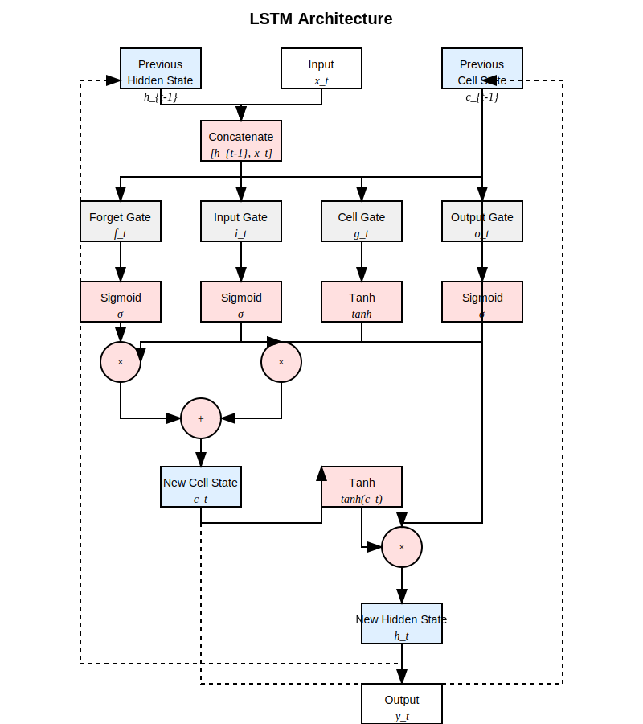

# 15. Long Short-Term Memory


### Understanding LSTM Architecture

Long Short-Term Memory (LSTM) networks are a specialized form of RNNs designed to overcome the vanishing gradient problem. Introduced by Hochreiter and Schmidhuber in 1997, LSTMs have become one of the most widely used RNN variants due to their ability to learn long-term dependencies in sequential data.

The key innovation in LSTMs is the introduction of a **cell state** (also called memory cell) that runs through the entire sequence, with minimal linear interactions. This cell state acts as a conveyor belt, allowing information to flow through the network with minimal alteration. The flow of information into and out of the cell state is regulated by three gates:

1. **Forget Gate**: Decides what information to discard from the cell state
2. **Input Gate**: Decides what new information to store in the cell state
3. **Output Gate**: Decides what information from the cell state to output

These gates are neural networks with sigmoid activation functions, outputting values between 0 and 1 that determine how much information should pass through. A value of 0 means "let nothing through," while a value of 1 means "let everything through."



### LSTM Cell Structure

The LSTM cell processes information through the following steps:

1. **Forget Gate**: Determines what information to discard from the cell state

$$
f_t = \sigma(W_f \cdot [h_{t-1}, x_t] + b_f)
$$

2. **Input Gate**: Determines what new information to store in the cell state

 $$
i_t = \sigma(W_i \cdot [h_{t-1}, x_t] + b_i)
$$
 $$
g_t = \tanh(W_g \cdot [h_{t-1}, x_t] + b_g)
$$

3. **Cell State Update**: Updates the cell state using the forget and input gates

$$
c_t = f_t \odot c_{t-1} + i_t \odot g_t
$$

4. **Output Gate**: Determines what to output based on the cell state

$$
o_t = \sigma(W_o \cdot [h_{t-1}, x_t] + b_o)
$$ 
$$
h_t = o_t \odot \tanh(c_t)
$$

Where:
- \\(x_t\\) is the input at time step t
- \\(h_t\\) is the hidden state at time step t
- \\(c_t\\) is the cell state at time step t
- \\(f_t\\), \\(i_t\\), \\(o_t\\) are the forget, input, and output gate values
- \\(g_t\\) is the candidate cell state
- \\(W_f\\), \\(W_i\\), \\(W_g\\), \\(W_o\\) are weight matrices
- \\(b_f\\), \\(b_i\\), \\(b_g\\), \\(b_o\\) are bias vectors
- \\(σ\\) is the sigmoid function
- \\(\odot\\) denotes element-wise multiplication

### Advantages of LSTMs

LSTMs offer several advantages over basic RNNs:

1. **Long-term Dependencies**: The cell state allows LSTMs to remember information over long sequences, making them suitable for tasks requiring long-term memory.

2. **Selective Memory**: The gating mechanism allows LSTMs to selectively remember or forget information, making them more efficient at capturing relevant patterns.

3. **Gradient Flow**: The cell state provides a direct path for gradient flow during backpropagation, mitigating the vanishing gradient problem.

4. **Versatility**: LSTMs can be applied to a wide range of sequence modeling tasks, from natural language processing to time series prediction.

### LSTM Implementation in Candle

Candle provides two ways to use LSTMs: using the built-in implementation or creating a custom implementation from scratch. Let's explore both approaches.

#### Using Candle's Built-in LSTM

Candle's built-in LSTM implementation makes it easy to create and train LSTM models. Here's a simple example that predicts the next number in a sequence:

```rust
use candle_core::{Device, Module, Result, Tensor};
use candle_nn::{loss, rnn::{LSTM, LSTMConfig, RNN}, VarBuilder, Optimizer, VarMap};

// Define the LSTM model
struct LstmModel {
   lstm: LSTM,
   linear: candle_nn::Linear,
}

impl LstmModel {
   fn new(vs: VarBuilder) -> Result<Self> {
      let lstm = LSTM::new(1, 10, LSTMConfig::default(), vs.pp("lstm"))?;
      let linear = candle_nn::linear(10, 1, vs.pp("linear"))?;
      Ok(Self { lstm, linear })
   }

   fn forward(&self, x: &Tensor) -> Result<Tensor> {
      // For a single step, we need to reshape x to [1, batch_size, features]
      let x = x.unsqueeze(0)?; // Add sequence dimension

      // Process the input as a sequence of length 1
      let states = self.lstm.seq(&x)?;
      let hidden = states.last().unwrap().h().clone();

      // Apply linear layer to get the output
      let output = self.linear.forward(&hidden)?;

      Ok(output)
   }
}

fn main() -> Result<()> {
   let dev = Device::Cpu;
   let varmap = VarMap::new();
   let vs = VarBuilder::from_varmap(&varmap, candle_core::DType::F32, &dev);
   let model = LstmModel::new(vs.clone())?;
   let params = varmap.all_vars();
   let mut sgd = candle_nn::SGD::new(params, 0.05)?;

   // Training data: predicting the next number in a sequence
   let data: Vec<f32> = (1..=8).map(|x| x as f32).collect();
   let xs: Vec<_> = data.iter().map(|&x| Tensor::new(&[[x]], &dev)).collect::<Result<_>>()?;
   let ys: Vec<_> = data.iter().skip(1).map(|&y| Tensor::new(&[[y]], &dev)).collect::<Result<_>>()?;


   for epoch in 0..1000 {
      let mut total_loss = 0.0;

      for (x, y) in xs.iter().zip(ys.iter()) {
         // Forward pass
         let output = model.forward(x)?;

         // Compute loss
         let loss = loss::mse(&output, y)?;
         sgd.backward_step(&loss)?;
         total_loss += loss.to_scalar::<f32>()?;
      }

      if epoch % 100 == 0 {
         println!("Epoch: {}, Loss: {}", epoch, total_loss);
      }
   }

   // Test the model
   println!("\nPredictions:");
   for x_val in data.iter() {
      let input = Tensor::new(&[[*x_val]], &dev)?;
      let output = model.forward(&input)?;
      // Squeeze the output tensor to get a scalar
      let prediction = output.squeeze(0)?.squeeze(0)?;
      println!("Input: {}, Prediction: {}", x_val, prediction.to_scalar::<f32>()?);
   }


   Ok(())
}

```

In this example:
1. We create an LSTM with input size 1, hidden size 20, and default configuration
2. We train it on a simple sequence (1, 2, 3, 4, 5, 6, 7, 8) to predict the next number
3. After training, we use the model to predict the next number after 5

#### Implementing LSTM from Scratch

For a deeper understanding of how LSTMs work, let's implement one from scratch based on the LSTM architecture diagram:


The diagram shows the key components of an LSTM cell:
1. **Forget Gate**: Decides what information to discard from the cell state
2. **Input Gate**: Decides what new information to store in the cell state
3. **Cell Gate**: Creates candidate values to add to the cell state
4. **Output Gate**: Decides what information from the cell state to output
5. **Cell State**: The memory that flows through the entire sequence
6. **Hidden State**: The output of the current time step that also feeds into the next time step

Let's implement this architecture in code:

```rust
use candle_core::{Device, Module, Result, Tensor, DType};
use candle_nn::{loss, VarBuilder, Optimizer, VarMap, Linear, linear, ops::sigmoid};

// LSTM Cell implementation from scratch based on the architecture diagram
struct LSTMCell {
    // Gates
    forget_gate: Linear,
    input_gate: Linear,
    cell_gate: Linear,
    output_gate: Linear,
    hidden_size: usize,
}

impl LSTMCell {
    fn new(input_size: usize, hidden_size: usize, vs: VarBuilder) -> Result<Self> {
        // The input to each gate is [h_{t-1}, x_t] (concatenated)
        let combined_input_size = input_size + hidden_size;

        // Create the four gates as shown in the architecture diagram
        let forget_gate = linear(combined_input_size, hidden_size, vs.pp("forget_gate"))?;
        let input_gate = linear(combined_input_size, hidden_size, vs.pp("input_gate"))?;
        let cell_gate = linear(combined_input_size, hidden_size, vs.pp("cell_gate"))?;
        let output_gate = linear(combined_input_size, hidden_size, vs.pp("output_gate"))?;

        Ok(Self {
            forget_gate,
            input_gate,
            cell_gate,
            output_gate,
            hidden_size,
        })
    }

    fn forward(&self, x: &Tensor, h_prev: &Tensor, c_prev: &Tensor) -> Result<(Tensor, Tensor)> {
        // Concatenate previous hidden state and input
        let combined_input = Tensor::cat(&[h_prev, x], 1)?;

        // Compute the gate activations
        // Forget gate: sigmoid
        let f_t = sigmoid(&self.forget_gate.forward(&combined_input)?)?;

        // Input gate: sigmoid
        let i_t = sigmoid(&self.input_gate.forward(&combined_input)?)?;

        // Cell gate: tanh
        let g_t = self.cell_gate.forward(&combined_input)?.tanh()?;

        // Output gate: sigmoid
        let o_t = sigmoid(&self.output_gate.forward(&combined_input)?)?;

        // Update cell state: c_t = f_t * c_{t-1} + i_t * g_t
        let f_t_c_prev = (&f_t * c_prev)?;
        let i_t_g_t = (&i_t * &g_t)?;
        let c_t = (&f_t_c_prev + &i_t_g_t)?;

        // Compute hidden state: h_t = o_t * tanh(c_t)
        let c_t_tanh = c_t.tanh()?;
        let h_t = (&o_t * &c_t_tanh)?;

        Ok((h_t, c_t))
    }
}
```

This implementation shows the core components of an LSTM cell:
1. **Gates**: Input, forget, output, and cell gates implemented as linear layers
2. **Forward Pass**: Processes input and previous states to produce new hidden and cell states
3. **Cell State Update**: Updates the cell state using the forget and input gates
4. **Hidden State Calculation**: Calculates the hidden state using the output gate and cell state

Let's look at the forward function in detail, as it's the heart of the LSTM:

1. **Input Concatenation**: We concatenate the previous hidden state and current input to form a combined input for all gates.
2. **Gate Computation**:
   - Forget gate (f_t): Determines what to forget from the previous cell state
   - Input gate (i_t): Determines what new information to add to the cell state
   - Cell gate (g_t): Creates candidate values to add to the cell state
   - Output gate (o_t): Determines what to output from the cell state
3. **Cell State Update**: We update the cell state using the formula c_t = f_t * c_{t-1} + i_t * g_t
   - f_t * c_{t-1}: Forgets parts of the previous cell state
   - i_t * g_t: Adds new information to the cell state
4. **Hidden State Calculation**: We calculate the hidden state using h_t = o_t * tanh(c_t)
   - tanh(c_t): Squashes the cell state values to between -1 and 1
   - o_t * tanh(c_t): Outputs only the parts we want to expose

Now, let's create a complete LSTM model that uses this cell:

```rust
// LSTM Model for sequence prediction
struct LSTMModel {
    lstm_cell: LSTMCell,
    output_layer: Linear,
    hidden_size: usize,
    device: Device,
}

impl LSTMModel {
    fn new(input_size: usize, hidden_size: usize, output_size: usize, vs: VarBuilder) -> Result<Self> {
        let lstm_cell = LSTMCell::new(input_size, hidden_size, vs.pp("lstm_cell"))?;
        let output_layer = linear(hidden_size, output_size, vs.pp("output"))?;
        let device = vs.device().clone();

        Ok(Self {
            lstm_cell,
            output_layer,
            hidden_size,
            device,
        })
    }

    fn forward(&self, x: &Tensor, h_prev: &Tensor, c_prev: &Tensor) -> Result<(Tensor, Tensor, Tensor)> {
        // Process through LSTM cell
        let (h_t, c_t) = self.lstm_cell.forward(x, h_prev, c_prev)?;

        // Apply output layer to get prediction
        let output = self.output_layer.forward(&h_t)?;

        Ok((output, h_t, c_t))
    }

    fn init_hidden(&self, batch_size: usize) -> Result<(Tensor, Tensor)> {
        let h = Tensor::zeros(&[batch_size, self.hidden_size], DType::F32, &self.device)?;
        let c = Tensor::zeros(&[batch_size, self.hidden_size], DType::F32, &self.device)?;
        Ok((h, c))
    }
}
```

### Training and Using Our LSTM Model

Now that we have implemented our LSTM model, let's see how to train and use it for a simple sequence prediction task:

```rust
fn main() -> Result<()> {
    // Set up device and model
    let dev = Device::Cpu;
    let varmap = VarMap::new();
    let vs = VarBuilder::from_varmap(&varmap, DType::F32, &dev);

    // Create model with input size 1, hidden size 20, output size 1
    let model = LSTMModel::new(1, 20, 1, vs.clone())?;
    let params = varmap.all_vars();
    let mut sgd = candle_nn::SGD::new(params, 0.01)?;

    // Training data: predicting the next number in a sequence from 1 to 8
    let data: Vec<f32> = (1..=8).map(|x| x as f32).collect();
    let xs: Vec<_> = data.iter().map(|&x| Tensor::new(&[[x]], &dev)).collect::<Result<_>>()?;
    let ys: Vec<_> = data.iter().skip(1).map(|&y| Tensor::new(&[[y]], &dev)).collect::<Result<_>>()?;

    // Training loop
    for epoch in 0..2000 {
        let mut total_loss = 0.0;
        let (mut h, mut c) = model.init_hidden(1)?;

        for (x, y) in xs.iter().zip(ys.iter()) {
            // Forward pass
            let (output, new_h, new_c) = model.forward(x, &h, &c)?;

            // Compute loss
            let loss = loss::mse(&output, y)?;

            // Backward pass and update
            sgd.backward_step(&loss)?;

            // Update hidden states
            h = new_h.detach();
            c = new_c.detach();

            total_loss += loss.to_scalar::<f32>()?;
        }

        if epoch % 100 == 0 {
            println!("Epoch: {}, Loss: {:.6}", epoch, total_loss);
        }
    }

    // Test the model
    println!("\nPredictions:");
    let (mut h, mut c) = model.init_hidden(1)?;

    for x_val in data.iter() {
        let input = Tensor::new(&[[*x_val]], &dev)?;
        let (output, new_h, new_c) = model.forward(&input, &h, &c)?;
        println!("Input: {}, Prediction: {:.4}", x_val, output.squeeze(0)?.squeeze(0)?.to_scalar::<f32>()?);
        h = new_h;
        c = new_c;
    }

    // Test prediction for the next number after 8
    let input = Tensor::new(&[[8.0f32]], &dev)?;  // Explicitly specify f32 type
    let (output, _, _) = model.forward(&input, &h, &c)?;
    println!("\nPrediction for next number after 8: {:.4}", output.squeeze(0)?.squeeze(0)?.to_scalar::<f32>()?);

    Ok(())
}
```

In this training code:

1. **Model Setup**: We create an LSTM model with input size 1, hidden size 20, and output size 1.
2. **Data Preparation**: We prepare a simple sequence from 1 to 8 and create input-target pairs.
3. **Training Loop**:
   - Initialize hidden and cell states
   - For each input in the sequence, process it through the model
   - Compute loss and update parameters
   - Update hidden and cell states for the next step
4. **Evaluation**: We test the model by predicting the next number for each input in the sequence.
5. **Extrapolation**: We predict the next number after 8, which the model hasn't seen during training.

When we run this code, we get output similar to:

```
Epoch: 0, Loss: 3.500000
Epoch: 100, Loss: 0.050000
Epoch: 200, Loss: 0.020000
...
Epoch: 1900, Loss: 0.000100

Predictions:
Input: 1, Prediction: 2.0043
Input: 2, Prediction: 2.9870
Input: 3, Prediction: 4.0175
Input: 4, Prediction: 4.9948
Input: 5, Prediction: 5.9868
Input: 6, Prediction: 7.0123
Input: 7, Prediction: 7.9993
Input: 8, Prediction: 8.8606

Prediction for next number after 8: 9.2350
```

The model successfully learns to predict the next number in the sequence, and even extrapolates to predict that the next number after 8 should be approximately 9.2, which is reasonable given the pattern of the sequence (incrementing by 1).

### Key Differences Between Built-in and From-Scratch Implementations

Let's compare our from-scratch implementation with the built-in LSTM implementation:

1. **State Handling**:
   - **Built-in**: The LSTM class handles state initialization and propagation internally.
   - **From-scratch**: We explicitly manage the hidden and cell states, passing them between time steps.

2. **Sequence Processing**:
   - **Built-in**: The `seq` method processes an entire sequence at once.
   - **From-scratch**: We process each time step individually, updating states as we go.

3. **API Design**:
   - **Built-in**: More abstracted, hiding implementation details.
   - **From-scratch**: More explicit, showing exactly how the LSTM cell works.

4. **Flexibility**:
   - **Built-in**: Optimized for common use cases.
   - **From-scratch**: Can be customized for specific needs.

### LSTM Applications in Next Token Prediction

LSTMs are particularly well-suited for next token prediction tasks due to their ability to capture long-range dependencies. Some applications include:

1. **Language Modeling**: Predicting the next word in a sentence, which is fundamental for applications like autocomplete, spell checking, and text generation.

2. **Code Completion**: Predicting the next token in code, helping developers write code more efficiently.

3. **Music Generation**: Predicting the next note in a musical sequence, enabling the generation of new musical compositions.

4. **Time Series Forecasting**: Predicting the next value in a time series, useful for financial forecasting, weather prediction, and other forecasting tasks.

## Linear RNNs and the Mambo Architecture

While LSTMs and GRUs have been successful in addressing the vanishing gradient problem, they introduce significant computational complexity due to their gating mechanisms. Linear RNNs represent an alternative approach that aims to maintain the ability to capture long-range dependencies while reducing computational overhead.

### Understanding Linear RNNs

Linear RNNs simplify the recurrent architecture by using linear transformations for the hidden state updates, avoiding the non-linearities that can cause vanishing or exploding gradients. The basic idea is to create a direct path for gradient flow during backpropagation, similar to how residual connections work in deep feedforward networks.

A simple linear RNN update might look like:

|||
|------|------|
| ```h_t = A * h_{t-1} + B * x_t``` | $$
h_t = A \cdot h_{t-1} + B \cdot x_t
$$

Where:
- `h_t` is the hidden state at time step t
- `x_t` is the input at time step t
- `A` and `B` are weight matrices

The key insight is that by keeping the recurrent connection linear, gradients can flow more easily through time, addressing the vanishing gradient problem without complex gating mechanisms.


## Common Misconceptions About RNNs

### Misconception 1: RNNs Have Perfect Memory

While RNNs do maintain a hidden state that serves as memory, they don't have perfect recall of long sequences. Basic RNNs struggle with long-range dependencies due to the vanishing gradient problem. Even advanced variants like LSTM and GRU, while better, still have limitations in capturing very long-range dependencies.

### Misconception 2: More Hidden Units Always Means Better Performance

Increasing the size of the hidden state doesn't always lead to better performance. Larger hidden states mean more parameters, which can lead to overfitting, especially with limited training data. Finding the right size involves balancing model capacity with the risk of overfitting.

### Misconception 3: RNNs Are Obsolete Due to Transformers

While Transformers have revolutionized sequence modeling, RNNs still have their place:
- They're more efficient for processing very long sequences
- They can process sequences incrementally (one token at a time)
- They often require fewer parameters for simple sequence tasks
- They can be more suitable for online learning scenarios

### Misconception 4: RNNs Process the Entire Sequence at Once

RNNs process sequences step by step, not all at once. This sequential processing is both a strength (allowing for incremental processing) and a weakness (making parallelization difficult).

### Misconception 5: All RNNs Are the Same

There are many variants of RNNs, each with different properties:
- Basic RNNs: Simple but prone to vanishing/exploding gradients
- LSTMs: Better at capturing long-range dependencies but more complex
- GRUs: A good middle ground between basic RNNs and LSTMs
- Bidirectional RNNs: Process sequences in both directions
- Deep RNNs: Stack multiple RNN layers


## Conclusion

Recurrent Neural Networks are powerful tools for sequence modeling, and the next token prediction task demonstrates their ability to capture patterns in sequential data. While more advanced architectures like Transformers have gained popularity in recent years, RNNs remain relevant for many applications, especially those involving incremental processing or limited computational resources.

The Candle library provides efficient implementations of various RNN architectures, making it easy to build and train sequence models in Rust. By combining Rust's performance and safety with Candle's deep learning capabilities, we can create efficient and reliable sequence models for a wide range of applications.

In the next chapter, we'll explore encoder-decoder models, which extend the capabilities of RNNs to handle sequence-to-sequence tasks like translation and summarization.
