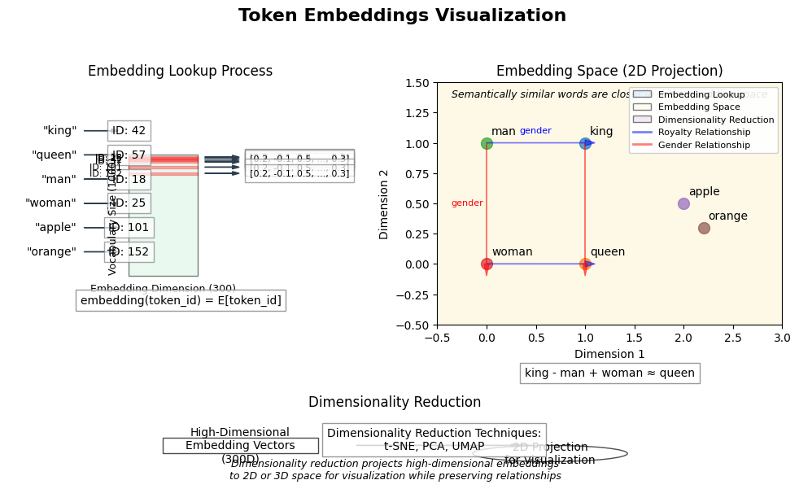

# 17. Embeddings

## Embeddings

In the previous chapter, we explored tokenizers, which convert text into sequences of token IDs. However, neural networks don't operate directly on these discrete token IDs. Instead, they require continuous vector representations. This is where embeddings come in.

An embedding is a learned mapping from discrete objects (like tokens) to vectors of continuous numbers in a lower-dimensional space. In the context of natural language processing, token embeddings convert token IDs into dense vector representations that capture semantic relationships between tokens.

### Why Do We Need Embeddings?

Token IDs are arbitrary numerical identifiers that don't encode any meaningful relationships between tokens. For example, the tokens "king" and "queen" might have IDs 42 and 1024, but these numbers don't reflect their semantic relationship.

Embeddings solve this problem by:

1. **Creating dense vector representations**: Each token is represented by a vector of floating-point numbers
2. **Capturing semantic relationships**: Similar tokens have similar vector representations
3. **Reducing dimensionality**: Converting from a high-dimensional one-hot encoding to a lower-dimensional dense representation
4. **Enabling neural networks to process language**: Providing a continuous representation that neural networks can operate on

### The Mathematics of Embeddings

At its core, an embedding layer is simply a lookup table or matrix E of shape (vocabulary_size, embedding_dimension), where:
- vocabulary_size is the number of unique tokens in our vocabulary
- embedding_dimension is the size of the vector representation for each token

For a token with ID i, its embedding vector is the i-th row of the embedding matrix E:

$$
\text{embedding}(\text{token\_id}) = E[\text{token\_id}]
$$

For a sequence of token IDs, we perform this lookup for each token, resulting in a sequence of embedding vectors.

## Types of Embeddings

There are several types of embeddings used in natural language processing and deep learning:

### 1. Token Embeddings

Token embeddings map individual tokens to vector representations. These are the most basic form of embeddings and are used in virtually all NLP models.

**Examples:**
- Word embeddings (Word2Vec, GloVe)
- Subword embeddings (used in BERT, GPT)
- Character embeddings

### 2. Positional Embeddings

Positional embeddings encode the position of tokens in a sequence. They are crucial for transformer models, which otherwise have no inherent notion of token order.

**Types of positional embeddings:**

#### Learned Positional Embeddings

Learned positional embeddings are trainable parameters that are learned during model training. Each position in the sequence gets its own embedding vector.

#### Sinusoidal Positional Embeddings

Sinusoidal positional encodings use sine and cosine functions to create unique patterns for each position. These are fixed (not learned) and have the advantage of being able to extrapolate to sequence lengths not seen during training.

### 3. Segment/Token Type Embeddings

Segment embeddings are used to distinguish between different parts of the input, such as separating the question from the context in question-answering tasks, or distinguishing between two sentences in a sentence-pair task.

### 4. Combined Embeddings

Modern transformer models often combine multiple types of embeddings by adding them together:

$$
\text{final\_embedding} = \text{token\_embedding} + \text{positional\_embedding} + \text{segment\_embedding}
$$

This combined embedding provides the model with information about the token identity, its position, and its segment.

## Embeddings in Candle

Candle provides a straightforward way to create and use embeddings through the `candle_nn::embedding` function. This function creates an embedding layer that maps token IDs to dense vector representations.

### Basic Token Embedding

To create a basic token embedding in Candle, you need to specify:
1. The vocabulary size (number of unique tokens)
2. The embedding dimension (size of the vector representation)
3. A variable builder for initializing the embedding weights

The embedding layer can then be used to convert token IDs to embeddings.

### Token Embedding with Positional Encoding

For transformer models, we typically combine token embeddings with positional encodings. This can be implemented as a custom module that:
1. Performs the token embedding lookup
2. Adds positional encodings to the embeddings
3. Returns the combined embeddings

The positional encodings can be either learned or fixed (sinusoidal).

## Embedding Visualization

One of the fascinating aspects of embeddings is that they capture semantic relationships between tokens. Similar tokens end up close to each other in the embedding space. We can visualize these relationships using dimensionality reduction techniques like t-SNE or PCA.

*Figure: Token Embeddings Visualization. The left side shows the embedding lookup process, where tokens are mapped to IDs and then to embedding vectors. The right side displays the embedding space where semantically similar words are positioned closer together, demonstrating relationships like "king - man + woman ≈ queen". The bottom section illustrates how high-dimensional embeddings are projected to 2D space for visualization using techniques like t-SNE and PCA.*

While Candle doesn't have built-in visualization tools, you can export your embeddings and visualize them using Python libraries like matplotlib or TensorBoard.

## Training Embeddings

Embeddings are learned during the training process. There are two main approaches:

### 1. Joint Training

The most common approach is to train the embeddings jointly with the rest of the model. The embedding weights are initialized randomly and updated through backpropagation along with other model parameters.

### 2. Pre-trained Embeddings

Alternatively, you can use pre-trained embeddings like Word2Vec, GloVe, or FastText. These embeddings are trained on large corpora and capture general semantic relationships.

## Embedding Tricks and Techniques

### Weight Tying

In language models, a common technique is to tie the weights of the embedding layer and the output layer. This reduces the number of parameters and often improves performance.

### Embedding Dropout

Applying dropout to embeddings can help prevent overfitting.

### Embedding Normalization

Normalizing embeddings can improve training stability.

## Conclusion

Token embeddings are a fundamental component of modern NLP models, converting discrete token IDs into continuous vector representations that capture semantic relationships. In this chapter, we've explored:

1. What embeddings are and why they're important
2. Different types of embeddings (token, positional, segment)
3. How to implement embeddings in Candle
4. Techniques for training and using embeddings effectively

In the next chapters, we'll continue building our transformer model, exploring attention mechanisms and the full transformer architecture.

## Further Reading

- [Word2Vec: Efficient Estimation of Word Representations in Vector Space](https://arxiv.org/abs/1301.3781)
- [GloVe: Global Vectors for Word Representation](https://nlp.stanford.edu/projects/glove/)
- [Attention Is All You Need](https://arxiv.org/abs/1706.03762) (Original Transformer paper with details on positional encodings)
- [BERT: Pre-training of Deep Bidirectional Transformers for Language Understanding](https://arxiv.org/abs/1810.04805)
