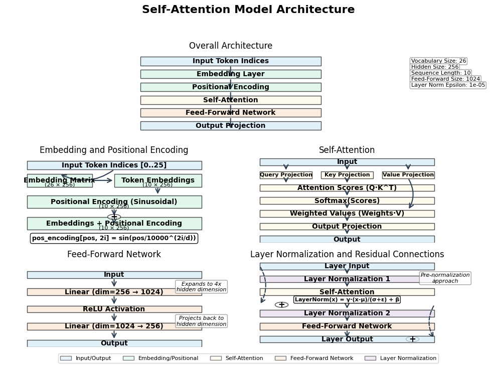

# 7: Building a Neural Network

In this chapter, we'll build a neural network from scratch using the Candle framework. We'll implement a self-attention model to solve a specific problem: decrypting Caesar shift ciphers. This is a classic encryption technique where each letter in the plaintext is shifted a certain number of positions down the alphabet.

## 1. Imports and Setup

### Required Libraries

Let's start by importing the necessary libraries:

```rust
use anyhow::Result;
use candle_core::{DType, Device, Tensor, IndexOp};
use candle_nn::{VarBuilder, VarMap, Module, Optimizer};
use rand::{rngs::StdRng, SeedableRng};
use rand::Rng;
use tqdm::tqdm;
use std::env;
```

These imports provide:
- Error handling with `anyhow`
- Tensor operations with `candle_core`
- Neural network components with `candle_nn`
- Random number generation with `rand`
- Progress tracking with `tqdm`
- Command-line argument parsing with `std::env`

### Constants and Hyperparameters

Next, we define the constants and hyperparameters for our model:

```rust
// Define vocabulary size and other hyperparameters
const VOCAB_SIZE: usize = 26; // Using letters A-Z
const HIDDEN_SIZE: usize = 256; // Size of hidden layers
const BATCH_SIZE: usize = 32; // Number of samples per batch
const SEQ_LENGTH: usize = 10; // Length of input/output sequences
const LEARNING_RATE: f64 = 0.001; // Learning rate for optimizer
const EPOCHS: usize = 50; // Number of training epochs
const PRINT_EVERY: usize = 5; // Print progress every N epochs
```

These hyperparameters control:
- The size of our vocabulary (26 letters of the alphabet)
- The dimensionality of our hidden representations
- The batch size for training
- The sequence length for our inputs and outputs
- The learning rate for optimization
- The number of training epochs
- How often to print progress during training

## 2. Model Definition

Our model architecture is based on the self-attention mechanism, which has proven effective for sequence-to-sequence tasks. We'll build several components:

### Self-Attention Mechanism

The self-attention mechanism allows the model to weigh the importance of different positions in the input sequence:

```rust
// Self-Attention mechanism
struct SelfAttention {
    query_proj: candle_nn::Linear,
    key_proj: candle_nn::Linear,
    value_proj: candle_nn::Linear,
    output_proj: candle_nn::Linear,
}

impl SelfAttention {
    fn new(hidden_size: usize, vb: VarBuilder) -> Result<Self> {
        let query_proj = candle_nn::linear(hidden_size, hidden_size, vb.pp("query_proj"))?;
        let key_proj = candle_nn::linear(hidden_size, hidden_size, vb.pp("key_proj"))?;
        let value_proj = candle_nn::linear(hidden_size, hidden_size, vb.pp("value_proj"))?;
        let output_proj = candle_nn::linear(hidden_size, hidden_size, vb.pp("output_proj"))?;

        Ok(Self {
            query_proj,
            key_proj,
            value_proj,
            output_proj,
        })
    }

    fn forward(&self, x: &Tensor) -> Result<Tensor> {
        // Input shape: [batch_size, seq_length, hidden_size]
        let batch_size = x.dim(0)?;
        let seq_length = x.dim(1)?;
        let hidden_size = x.dim(2)?;

        // Reshape for projection
        let x_reshaped = x.reshape((batch_size * seq_length, hidden_size))?;

        // Project to queries, keys, and values
        let queries = self.query_proj.forward(&x_reshaped)?;
        let keys = self.key_proj.forward(&x_reshaped)?;
        let values = self.value_proj.forward(&x_reshaped)?;

        // Reshape back to [batch_size, seq_length, hidden_size]
        let queries = queries.reshape((batch_size, seq_length, hidden_size))?;
        let keys = keys.reshape((batch_size, seq_length, hidden_size))?;
        let values = values.reshape((batch_size, seq_length, hidden_size))?;

        // Calculate attention scores
        let scores = queries.matmul(&keys.transpose(1, 2)?)?;

        // Apply softmax to get attention weights
        let weights = candle_nn::ops::softmax(&scores, 2)?; // [batch_size, seq_length, seq_length]

        // Apply attention weights to values
        let context = weights.matmul(&values)?;

        // Apply output projection
        let context_reshaped = context.reshape((batch_size * seq_length, hidden_size))?;
        let output = self.output_proj.forward(&context_reshaped)?;
        let output = output.reshape((batch_size, seq_length, hidden_size))?;

        Ok(output)
    }
}
```

### Positional Encoding

Since self-attention has no inherent notion of position, we add positional encodings to the input embeddings:

```rust
// Positional Encoding
struct PositionalEncoding {
    encoding: Tensor,
}

impl PositionalEncoding {
    fn new(max_seq_length: usize, hidden_size: usize, device: &Device) -> Result<Self> {
        let mut encoding = vec![0.0; max_seq_length * hidden_size];

        for pos in 0..max_seq_length {
            for i in 0..hidden_size {
                let div_term = 10000.0_f32.powf(2.0 * (i / 2) as f32 / hidden_size as f32);
                if i % 2 == 0 {
                    encoding[pos * hidden_size + i] = (pos as f32 / div_term).sin();
                } else {
                    encoding[pos * hidden_size + i] = (pos as f32 / div_term).cos();
                }
            }
        }

        let encoding = Tensor::from_vec(encoding, (max_seq_length, hidden_size), device)?;

        Ok(Self { encoding })
    }

    fn forward(&self, x: &Tensor) -> Result<Tensor> {
        // x shape: [batch_size, seq_length, hidden_size]
        let batch_size = x.dim(0)?;
        let seq_length = x.dim(1)?;

        // Get positional encodings for this sequence length
        let pos_encoding = self.encoding.narrow(0, 0, seq_length)?;

        // Expand to match batch size
        let pos_encoding = pos_encoding.unsqueeze(0)?.expand((batch_size, seq_length, HIDDEN_SIZE))?;

        // Add to input embeddings
        let x_with_pos = x.add(&pos_encoding)?;

        Ok(x_with_pos)
    }
}
```

### Feed-Forward Network

Each layer in our model includes a feed-forward network:

```rust
// Feed-Forward Network
struct FeedForward {
    linear1: candle_nn::Linear,
    linear2: candle_nn::Linear,
}

impl FeedForward {
    fn new(hidden_size: usize, ff_size: usize, vb: VarBuilder) -> Result<Self> {
        let linear1 = candle_nn::linear(hidden_size, ff_size, vb.pp("linear1"))?;
        let linear2 = candle_nn::linear(ff_size, hidden_size, vb.pp("linear2"))?;

        Ok(Self {
            linear1,
            linear2,
        })
    }

    fn forward(&self, x: &Tensor) -> Result<Tensor> {
        let x = self.linear1.forward(x)?;
        let x = x.relu()?;
        let x = self.linear2.forward(&x)?;

        Ok(x)
    }
}
```

### Complete Model Architecture

Now we combine these components into our full model:

```rust
// Self-Attention Model
struct SelfAttentionModel {
    device: Device,
    embedding: candle_nn::Embedding,
    positional_encoding: PositionalEncoding,
    self_attention: SelfAttention,
    feed_forward: FeedForward,
    layer_norm1: candle_nn::LayerNorm,
    layer_norm2: candle_nn::LayerNorm,
    output_proj: candle_nn::Linear,
}

impl SelfAttentionModel {
    fn new(device: &Device, vb: VarBuilder) -> Result<Self> {
        let embedding = candle_nn::embedding(VOCAB_SIZE, HIDDEN_SIZE, vb.pp("embedding"))?;
        let positional_encoding = PositionalEncoding::new(SEQ_LENGTH * 2, HIDDEN_SIZE, device)?;
        let self_attention = SelfAttention::new(HIDDEN_SIZE, vb.pp("self_attention"))?;

        // Feed-forward network with 4x hidden size
        let feed_forward = FeedForward::new(HIDDEN_SIZE, HIDDEN_SIZE * 4, vb.pp("feed_forward"))?;

        // Layer normalization
        let layer_norm1 = candle_nn::layer_norm(HIDDEN_SIZE, 1e-5, vb.pp("layer_norm1"))?;
        let layer_norm2 = candle_nn::layer_norm(HIDDEN_SIZE, 1e-5, vb.pp("layer_norm2"))?;

        let output_proj = candle_nn::linear(HIDDEN_SIZE, VOCAB_SIZE, vb.pp("output_proj"))?;

        Ok(Self {
            device: device.clone(),
            embedding,
            positional_encoding,
            self_attention,
            feed_forward,
            layer_norm1,
            layer_norm2,
            output_proj,
        })
    }

    fn forward(&self, x: &Tensor) -> Result<Tensor> {
        let batch_size = x.dim(0)?;
        let seq_length = x.dim(1)?;

        // Embed the input
        let embedded = self.embedding.forward(x)?;

        // Add positional encoding
        let embedded_with_pos = self.positional_encoding.forward(&embedded)?;

        // Apply layer normalization before self-attention
        let norm1 = self.layer_norm1.forward(&embedded_with_pos)?;

        // Apply self-attention with residual connection
        let attn_output = self.self_attention.forward(&norm1)?;
        let residual1 = embedded_with_pos.add(&attn_output)?;

        // Apply layer normalization before feed-forward
        let norm2 = self.layer_norm2.forward(&residual1)?;

        // Reshape for feed-forward network
        let batch_seq_size = batch_size * seq_length;
        let norm2_reshaped = norm2.reshape((batch_seq_size, HIDDEN_SIZE))?;

        // Apply feed-forward network
        let ff_output = self.feed_forward.forward(&norm2_reshaped)?;
        let ff_output = ff_output.reshape((batch_size, seq_length, HIDDEN_SIZE))?;

        // Add residual connection
        let residual2 = residual1.add(&ff_output)?;

        // Project to vocabulary size
        let output_reshaped = residual2.reshape((batch_size * seq_length, HIDDEN_SIZE))?;
        let logits = self.output_proj.forward(&output_reshaped)?;
        let logits = logits.reshape((batch_size, seq_length, VOCAB_SIZE))?;

        Ok(logits)
    }
}
```



*Figure: Self-Attention Model Architecture. This visualization shows the overall architecture (top), the embedding and positional encoding components (middle-left), the self-attention mechanism (middle-right), the feed-forward network (bottom-left), and the layer normalization with residual connections (bottom-right). The model uses a vocabulary size of 26, hidden size of 256, and a feed-forward dimension of 1024.*

This model architecture includes:
- An embedding layer to convert input tokens to vectors
- Positional encoding to provide position information
- A self-attention mechanism to capture relationships between positions
- A feed-forward network for additional processing
- Layer normalization for training stability
- Residual connections to help with gradient flow
- An output projection to convert back to vocabulary space

## 3. Data Preparation

For our task of learning to decrypt Caesar shift ciphers, we need to generate training data. We'll create pairs of ciphertext (input) and plaintext (target):

```rust
// Generate a batch of random plaintext sequences and their Caesar-shifted ciphertexts
fn generate_batch(batch_size: usize, seq_length: usize, device: &Device, rng: &mut StdRng, shift: u8) -> Result<(Tensor, Tensor)> {
    // Generate plaintext and apply a Caesar shift to create ciphertext
    let mut plaintext = Vec::with_capacity(batch_size * seq_length);
    let mut ciphertext = Vec::with_capacity(batch_size * seq_length);

    for _ in 0..batch_size {
        // Generate a random sequence of letters (0..25)
        for _ in 0..seq_length {
            let p = rng.random_range(0..(VOCAB_SIZE as u8));
            plaintext.push(p as u32);
            // Apply shift for ciphertext
            let c = (p + shift) % (VOCAB_SIZE as u8);
            ciphertext.push(c as u32);
        }
    }

    // Create tensors: input=ciphertext, target=plaintext
    let input = Tensor::from_slice(&ciphertext, (batch_size, seq_length), device)?;
    let target = Tensor::from_slice(&plaintext, (batch_size, seq_length), device)?;
    Ok((input, target))
}
```

This function:
1. Generates random plaintext sequences (represented as indices 0-25 for A-Z)
2. Applies a Caesar shift to create the corresponding ciphertext
3. Returns tensors for both the input (ciphertext) and target (plaintext)

We also need functions to convert model outputs to predictions and calculate accuracy:

```rust
// Convert logits to predicted indices
fn logits_to_predictions(logits: &Tensor) -> Result<Vec<Vec<u8>>> {
    let batch_size = logits.dim(0)?;
    let seq_length = logits.dim(1)?;

    let mut predictions = Vec::with_capacity(batch_size);

    for b in 0..batch_size {
        let mut seq_pred = Vec::with_capacity(seq_length);
        for s in 0..seq_length {
            let logits_s = logits.i((b, s))?;
            let argmax = logits_s.argmax(0)?;
            let idx = argmax.to_scalar::<u32>()? as u8;
            seq_pred.push(idx);
        }
        predictions.push(seq_pred);
    }

    Ok(predictions)
}

// Calculate accuracy metrics
struct AccuracyMetrics {
    sequence_accuracy: f32,
    character_accuracy: f32,
}

fn calculate_accuracy(predictions: &[Vec<u8>], targets: &Tensor) -> Result<AccuracyMetrics> {
    let batch_size = targets.dim(0)?;
    let seq_length = targets.dim(1)?;

    let mut correct_seqs = 0;
    let mut correct_chars = 0;
    let total_chars = batch_size * seq_length;

    for b in 0..batch_size {
        let mut seq_correct = true;
        for s in 0..seq_length {
            let target_idx = targets.i((b, s))?.to_scalar::<u32>()? as u8;
            if predictions[b][s] == target_idx {
                correct_chars += 1;
            } else {
                seq_correct = false;
            }
        }
        if seq_correct {
            correct_seqs += 1;
        }
    }

    Ok(AccuracyMetrics {
        sequence_accuracy: correct_seqs as f32 / batch_size as f32,
        character_accuracy: correct_chars as f32 / total_chars as f32,
    })
}
```

## 4. Training

Now we can set up the training process. Here's the main function that handles training:

```rust
fn main() -> Result<()> {
    // Parse command line arguments for shift value
    let args: Vec<String> = env::args().collect();
    let shift = if args.len() > 1 {
        args[1].parse::<u8>().unwrap_or(3) % (VOCAB_SIZE as u8)
    } else {
        3 // Default shift value
    };

    println!("Using Caesar shift value: {}", shift);

    // Set up device
    let device = Device::new_metal(0).unwrap_or_else(|_| {
        println!("Metal device not available, falling back to CPU");
        Device::Cpu
    });
    println!("Using device: {:?}", device);

    // Create model
    let varmap = VarMap::new();
    let vb = VarBuilder::from_varmap(&varmap, DType::F32, &device);
    let model = SelfAttentionModel::new(&device, vb)?;

    // Set up optimizer
    let mut optimizer = candle_nn::AdamW::new_lr(varmap.all_vars(), LEARNING_RATE)?;

    // Set up RNG for reproducibility
    let mut rng = StdRng::seed_from_u64(42);

    // Training loop
    let mut best_char_accuracy = 0.0;
    let mut no_improvement_count = 0;
    let patience = 10; // Early stopping patience
    let num_batches = 50; // Batches per epoch

    println!("Starting training with {} batches per epoch, {} epochs", num_batches, EPOCHS);
    println!("Learning rate: {}", LEARNING_RATE);
    println!("Hidden size: {}", HIDDEN_SIZE);
    println!("Caesar shift: {}", shift);

    for epoch in tqdm(0..EPOCHS) {
        let mut epoch_loss = 0.0;
        let mut epoch_seq_accuracy = 0.0;
        let mut epoch_char_accuracy = 0.0;

        for batch_idx in 0..num_batches {
            // Generate batch
            let (src, tgt) = generate_batch(BATCH_SIZE, SEQ_LENGTH, &device, &mut rng, shift)?;

            // Forward pass
            let logits = model.forward(&src)?;

            // Calculate loss (cross-entropy)
            let batch_size = tgt.dim(0)?;
            let seq_len = tgt.dim(1)?;

            // Reshape logits for loss calculation
            let logits_flat = logits.reshape((batch_size * seq_len, VOCAB_SIZE))?;
            let tgt_flat = tgt.reshape((batch_size * seq_len,))?;

            // Use cross_entropy with the target indices
            let loss = candle_nn::loss::cross_entropy(&logits_flat, &tgt_flat)?;

            // Backward pass and optimize
            optimizer.backward_step(&loss)?;

            // Calculate accuracy
            let predictions = logits_to_predictions(&logits)?;
            let metrics = calculate_accuracy(&predictions, &tgt)?;

            epoch_loss += loss.to_scalar::<f32>()?;
            epoch_seq_accuracy += metrics.sequence_accuracy;
            epoch_char_accuracy += metrics.character_accuracy;

            // Print detailed batch progress occasionally
            if batch_idx == 0 && (epoch % PRINT_EVERY == 0 || epoch == EPOCHS - 1) {
                println!("  Batch {}: Loss = {:.4}, Seq Acc = {:.4}, Char Acc = {:.4}",
                         batch_idx, loss.to_scalar::<f32>()?, 
                         metrics.sequence_accuracy, metrics.character_accuracy);

                // Print a sample prediction
                if !predictions.is_empty() {
                    let sample_idx = 0; // First sample in batch
                    let input_seq = src.i(sample_idx)?.to_vec1::<u32>()?;
                    let target_seq = tgt.i(sample_idx)?.to_vec1::<u32>()?;
                    let pred_seq = &predictions[sample_idx];

                    println!("    Input:     {:?}", input_seq);
                    println!("    Target:    {:?}", target_seq);
                    println!("    Predicted: {:?}", pred_seq);
                }
            }
        }

        epoch_loss /= num_batches as f32;
        epoch_seq_accuracy /= num_batches as f32;
        epoch_char_accuracy /= num_batches as f32;

        // Print epoch summary
        if epoch % PRINT_EVERY == 0 || epoch == EPOCHS - 1 {
            println!("Epoch {}/{}: Loss = {:.4}, Seq Acc = {:.4}, Char Acc = {:.4}",
                     epoch + 1, EPOCHS, epoch_loss, epoch_seq_accuracy, epoch_char_accuracy);
        }

        // Early stopping check based on character accuracy
        if epoch_char_accuracy > best_char_accuracy {
            best_char_accuracy = epoch_char_accuracy;
            no_improvement_count = 0;
            println!("  New best character accuracy: {:.4}", best_char_accuracy);
        } else {
            no_improvement_count += 1;
            if no_improvement_count >= patience && best_char_accuracy > 0.5 {
                println!("Early stopping at epoch {} with best character accuracy: {:.4}", 
                         epoch + 1, best_char_accuracy);
                break;
            }
        }
    }
```

Our training process includes:
1. Setting up the device (Metal or CPU)
2. Creating the model and optimizer
3. Initializing a random number generator
4. Implementing a training loop with:
   - Batch generation
   - Forward pass
   - Loss calculation
   - Backward pass and optimization
   - Accuracy calculation
   - Progress tracking
5. Early stopping based on validation performance

## 5. Inference

Finally, we evaluate our trained model on test data:

```rust
    // Test the model
    let test_size = 20; // Test batch size
    let (test_src, test_tgt) = generate_batch(test_size, SEQ_LENGTH, &device, &mut rng, shift)?;
    let test_logits = model.forward(&test_src)?;
    let test_predictions = logits_to_predictions(&test_logits)?;

    // Calculate test accuracy
    let test_metrics = calculate_accuracy(&test_predictions, &test_tgt)?;

    println!("\nTest Results:");
    println!("Sequence Accuracy: {:.4}", test_metrics.sequence_accuracy);
    println!("Character Accuracy: {:.4}", test_metrics.character_accuracy);

    // Print some examples
    println!("\nTest examples (with shift = {}):", shift);
    for i in 0..5 {
        // Get source sequence indices
        let src_indices = test_src.i(i)?.to_vec1::<u32>()?;
        let src_indices: Vec<u8> = src_indices.iter().map(|&x| x as u8).collect();

        // Get target sequence indices
        let tgt_indices = test_tgt.i(i)?.to_vec1::<u32>()?;
        let tgt_indices: Vec<u8> = tgt_indices.iter().map(|&x| x as u8).collect();

        let src_text: String = src_indices.iter()
            .map(|&c| (b'A' + c) as char)
            .collect();
        let tgt_text: String = tgt_indices.iter()
            .map(|&c| (b'A' + c) as char)
            .collect();
        let pred_text: String = test_predictions[i].iter()
            .map(|&c| (b'A' + c) as char)
            .collect();

        println!("Ciphertext: {}", src_text);
        println!("Plaintext:  {}", tgt_text);
        println!("Predicted:  {}", pred_text);

        // Show character-by-character comparison
        println!("Comparison: ");
        for (j, (t, p)) in tgt_text.chars().zip(pred_text.chars()).enumerate() {
            let match_status = if t == p { "✓" } else { "✗" };
            println!("  Pos {}: {} -> {} {}", j, t, p, match_status);
        }
        println!();
    }

    // Print a simple explanation of the Caesar shift
    println!("Caesar Shift Explanation:");
    println!("A Caesar shift of {} means each letter in the plaintext is shifted {} positions forward in the alphabet.", shift, shift);
    println!("For example, with a shift of {}:", shift);
    for i in 0..5 {
        let letter = (b'A' + i as u8) as char;
        let shifted = (b'A' + ((i as u8 + shift) % (VOCAB_SIZE as u8))) as char;
        println!("  {} -> {}", letter, shifted);
    }
    println!("To decrypt, shift each letter {} positions backward.", shift);

    Ok(())
}
```

```text
Using Caesar shift value: 3
Using device: Metal(MetalDevice(DeviceId(1)))
Starting training with 50 batches per epoch, 50 epochs
Learning rate: 0.001
Hidden size: 256
Caesar shift: 3
  2%|██▊   | 1/50 [00:00<?, ?it/s]  Batch 0: Loss = 8.0249, Seq Acc = 0.0000, Char Acc = 0.0562
    Input:     [6, 16, 9, 17, 25, 19, 2, 13, 2, 3]
    Target:    [3, 13, 6, 14, 22, 16, 25, 10, 25, 0]
    Predicted: [16, 25, 4, 17, 25, 19, 13, 25, 20, 20]
Epoch 1/50: Loss = 0.5081, Seq Acc = 0.7931, Char Acc = 0.9130
  New best character accuracy: 0.9130
  4%|█████                                                                                                                          | 2/50 [00:08<06:32, 0.12it/s]  New best character accuracy: 0.9999
  6%|███████▋                                                                                                                       | 3/50 [00:16<06:21, 0.12it/s]  New best character accuracy: 1.0000
 12%|███████████████▎                                                                                                               | 6/50 [00:40<05:54, 0.12it/s]  Batch 0: Loss = 0.0000, Seq Acc = 1.0000, Char Acc = 1.0000
    Input:     [6, 18, 15, 23, 0, 13, 22, 16, 5, 22]
    Target:    [3, 15, 12, 20, 23, 10, 19, 13, 2, 19]
    Predicted: [3, 15, 12, 20, 23, 10, 19, 13, 2, 19]
Epoch 6/50: Loss = 0.0000, Seq Acc = 1.0000, Char Acc = 1.0000
 22%|███████████████████████████▊                                                                                                  | 11/50 [01:20<05:11, 0.13it/s]  Batch 0: Loss = 0.0000, Seq Acc = 1.0000, Char Acc = 1.0000
    Input:     [8, 12, 25, 0, 2, 12, 11, 4, 14, 15]
    Target:    [5, 9, 22, 23, 25, 9, 8, 1, 11, 12]
    Predicted: [5, 9, 22, 23, 25, 9, 8, 1, 11, 12]
Epoch 11/50: Loss = 0.0000, Seq Acc = 1.0000, Char Acc = 1.0000
 26%|████████████████████████████████▊                                                                                             | 13/50 [01:35<04:49, 0.13it/s]Early stopping at epoch 13 with best character accuracy: 1.0000
 26%|████████████████████████████████▊                                                                                             | 13/50 [01:43<06:53, 0.09it/s]

Test Results:
Sequence Accuracy: 1.0000
Character Accuracy: 1.0000

Test examples (with shift = 3):
Ciphertext: SMEGAQJGUE
Plaintext:  PJBDXNGDRB
Predicted:  PJBDXNGDRB
Comparison: 
  Pos 0: P -> P ✓
  Pos 1: J -> J ✓
  Pos 2: B -> B ✓
  Pos 3: D -> D ✓
  Pos 4: X -> X ✓
  Pos 5: N -> N ✓
  Pos 6: G -> G ✓
  Pos 7: D -> D ✓
  Pos 8: R -> R ✓
  Pos 9: B -> B ✓

Ciphertext: GKOTSSRFZC
Plaintext:  DHLQPPOCWZ
Predicted:  DHLQPPOCWZ
Comparison: 
  Pos 0: D -> D ✓
  Pos 1: H -> H ✓
  Pos 2: L -> L ✓
  Pos 3: Q -> Q ✓
  Pos 4: P -> P ✓
  Pos 5: P -> P ✓
  Pos 6: O -> O ✓
  Pos 7: C -> C ✓
  Pos 8: W -> W ✓
  Pos 9: Z -> Z ✓

Ciphertext: PDMRPYWDVJ
Plaintext:  MAJOMVTASG
Predicted:  MAJOMVTASG
Comparison: 
  Pos 0: M -> M ✓
  Pos 1: A -> A ✓
  Pos 2: J -> J ✓
  Pos 3: O -> O ✓
  Pos 4: M -> M ✓
  Pos 5: V -> V ✓
  Pos 6: T -> T ✓
  Pos 7: A -> A ✓
  Pos 8: S -> S ✓
  Pos 9: G -> G ✓

Ciphertext: HYHXLEYISV
Plaintext:  EVEUIBVFPS
Predicted:  EVEUIBVFPS
Comparison: 
  Pos 0: E -> E ✓
  Pos 1: V -> V ✓
  Pos 2: E -> E ✓
  Pos 3: U -> U ✓
  Pos 4: I -> I ✓
  Pos 5: B -> B ✓
  Pos 6: V -> V ✓
  Pos 7: F -> F ✓
  Pos 8: P -> P ✓
  Pos 9: S -> S ✓

Ciphertext: ENSXCRYEHP
Plaintext:  BKPUZOVBEM
Predicted:  BKPUZOVBEM
Comparison: 
  Pos 0: B -> B ✓
  Pos 1: K -> K ✓
  Pos 2: P -> P ✓
  Pos 3: U -> U ✓
  Pos 4: Z -> Z ✓
  Pos 5: O -> O ✓
  Pos 6: V -> V ✓
  Pos 7: B -> B ✓
  Pos 8: E -> E ✓
  Pos 9: M -> M ✓

Caesar Shift Explanation:
A Caesar shift of 3 means each letter in the plaintext is shifted 3 positions forward in the alphabet.
For example, with a shift of 3:
  A -> D
  B -> E
  C -> F
  D -> G
  E -> H
To decrypt, shift each letter 3 positions backward.

```

During inference, we:
1. Generate test data
2. Run the model on this data
3. Calculate test accuracy metrics
4. Print example predictions alongside the ground truth
5. Provide a detailed comparison of predicted vs. actual characters
6. Explain the Caesar shift encryption for context

## Conclusion

In this chapter, we've built a complete neural network from scratch using the Candle framework. Our model uses self-attention to learn how to decrypt Caesar shift ciphers, a classic encryption technique.

The key components we've implemented include:
- A self-attention mechanism for capturing relationships between positions
- Positional encoding to provide position information
- A feed-forward network for additional processing
- Data generation for Caesar shift encryption
- A complete training and evaluation pipeline

This example demonstrates how to build, train, and evaluate a neural network for a specific task using Candle. The principles and techniques shown here can be adapted to a wide range of sequence-to-sequence problems beyond simple encryption.