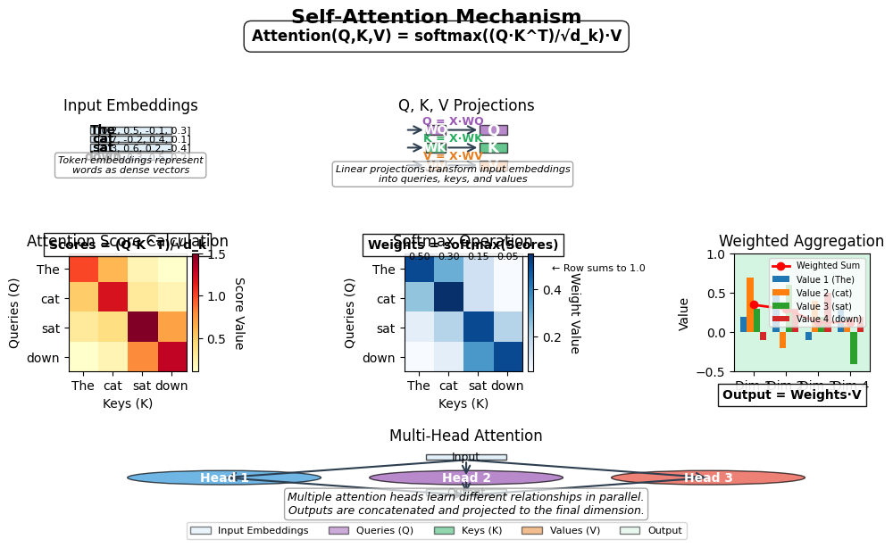

# 18. Transformers and Attention

## Introduction to Transformers

Transformers have revolutionized machine learning since their introduction in the 2017 paper "Attention Is All You Need" by Vaswani et al. These models have become the foundation for state-of-the-art systems across a wide range of domains, from natural language processing to computer vision and beyond.

### Brief History and Motivation

Prior to transformers, recurrent neural networks (RNNs) and their variants like LSTMs and GRUs dominated sequence modeling tasks. While effective, these architectures had significant limitations:

1. **Sequential processing**: RNNs process inputs one element at a time, making them difficult to parallelize
2. **Vanishing/exploding gradients**: Despite improvements from LSTMs and GRUs, long sequences remained challenging
3. **Limited context window**: Practical constraints made it difficult for RNNs to maintain information over very long sequences

Transformers were designed to address these limitations by replacing recurrence with attention mechanisms, allowing for fully parallel processing and more effective modeling of long-range dependencies.

### Key Innovations and Advantages

Transformers introduced several key innovations:

1. **Self-attention mechanism**: Allows direct modeling of relationships between all positions in a sequence
2. **Parallelization**: Enables efficient training on modern hardware
3. **Multi-head attention**: Captures different types of relationships simultaneously
4. **Positional encodings**: Maintains sequence order information without recurrence
5. **Residual connections and layer normalization**: Facilitates training of deep networks

These innovations have led to transformers outperforming previous architectures across numerous tasks, including:

- Machine translation
- Text summarization
- Question answering
- Image generation
- Speech recognition
- Protein structure prediction

### Overview of the Transformer Architecture

At a high level, the transformer architecture consists of:

1. **Encoder**: Processes the input sequence in parallel
2. **Decoder**: Generates the output sequence
3. **Attention mechanisms**: Enable both components to focus on relevant parts of the input

The original transformer was an encoder-decoder model designed for machine translation, but subsequent variants have adapted the architecture for different tasks:

- **Encoder-only models** (like BERT): Ideal for understanding tasks like classification and named entity recognition
- **Decoder-only models** (like GPT): Suited for generative tasks like text completion
- **Encoder-decoder models** (like T5): Effective for sequence-to-sequence tasks like translation

In the following sections, we'll explore the core components of transformers, starting with the attention mechanism that forms their foundation.

## The Attention Mechanism

Self-attention is the cornerstone of transformer models, allowing them to weigh the importance of different elements within a sequence when processing each element. Unlike RNNs that build representations sequentially, self-attention can directly model relationships between all positions in a sequence, regardless of their distance from each other.

The key insight behind self-attention is that it allows each position in a sequence to attend to all positions, enabling the model to capture long-range dependencies more effectively than previous architectures.

## Self-Attention Architecture

### Basic Concept

At its core, self-attention computes a weighted sum of all elements in a sequence for each element. The weights, or attention scores, determine how much focus to place on each element when processing the current element.

The basic self-attention mechanism involves the following steps:

1. **Projection**: Transform the input sequence into three different representations: queries, keys, and values
2. **Score Calculation**: Compute compatibility scores between queries and keys
3. **Weight Calculation**: Apply softmax to the scores to get attention weights
4. **Context Creation**: Compute a weighted sum of values using the attention weights
5. **Output Projection**: Transform the context vectors to the desired output representation



*Figure: Self-Attention Mechanism. The visualization shows the complete flow from input embeddings through query, key, and value projections, followed by attention score calculation, softmax operation to obtain attention weights, and finally the weighted aggregation of values to produce the output. The bottom section illustrates how multiple attention heads work in parallel in multi-head attention.*

### Mathematical Formulation

Given an input sequence \\( X = (x_1, x_2, ..., x_n) \\) (X = (x_1, x_2, ..., x_n))), self-attention computes:

$$
\begin{align}
Q &= XW_q \quad \text{# Queries} \\
K &= XW_k \quad \text{# Keys} \\
V &= XW_v \quad \text{# Values} \\
\\
\text{Attention}(Q, K, V) &= \text{softmax}\left(\frac{QK^T}{\sqrt{d_k}}\right)V
\end{align}
$$
Q &= XW_q \quad \text# Queries \\
K &= XW_k \quad \text# Keys \\
V &= XW_v \quad \text# Values \\
\\
Attention(Q, K, V) &= softmax\left((QK^T)/(\sqrtd_k)\right)V
\endalign

Where:
- \\( W_q \\) (W_q), \\( W_k \\) (W_k), \\( W_v \\) (W_v) are learnable parameter matrices
- \\( d_k \\) (d_k) is the dimension of the keys (used for scaling)
- \\( QK^T \\) (QK^T) represents the dot product between queries and keys
- \\( softmax \\) (softmax) normalizes the scores to create attention weights

### Implementation in Rust with Candle

Let's look at how self-attention is implemented in our Rust code using the Candle library:

```rust
struct SelfAttention {
    query_proj: candle_nn::Linear,
    key_proj: candle_nn::Linear,
    value_proj: candle_nn::Linear,
    output_proj: candle_nn::Linear,
}

impl SelfAttention {
    fn new(hidden_size: usize, vb: VarBuilder) -> Result<Self> {
        let query_proj = candle_nn::linear(hidden_size, hidden_size, vb.pp("query_proj"))?;
        let key_proj = candle_nn::linear(hidden_size, hidden_size, vb.pp("key_proj"))?;
        let value_proj = candle_nn::linear(hidden_size, hidden_size, vb.pp("value_proj"))?;
        let output_proj = candle_nn::linear(hidden_size, hidden_size, vb.pp("output_proj"))?;

        Ok(Self {
            query_proj,
            key_proj,
            value_proj,
            output_proj,
        })
    }

    fn forward(&self, x: &Tensor) -> Result<Tensor> {
        // Input shape: [batch_size, seq_length, hidden_size]
        let batch_size = x.dim(0)?;
        let seq_length = x.dim(1)?;
        let hidden_size = x.dim(2)?;

        // Reshape for projection
        let x_reshaped = x.reshape((batch_size * seq_length, hidden_size))?;

        // Project to queries, keys, and values
        let queries = self.query_proj.forward(&x_reshaped)?;
        let keys = self.key_proj.forward(&x_reshaped)?;
        let values = self.value_proj.forward(&x_reshaped)?;

        // Reshape back to [batch_size, seq_length, hidden_size]
        let queries = queries.reshape((batch_size, seq_length, hidden_size))?;
        let keys = keys.reshape((batch_size, seq_length, hidden_size))?;
        let values = values.reshape((batch_size, seq_length, hidden_size))?;

        // Calculate attention scores
        // [batch_size, seq_length, hidden_size] x [batch_size, hidden_size, seq_length]
        // = [batch_size, seq_length, seq_length]
        let scores = queries.matmul(&keys.transpose(1, 2)?)?;

        // Apply scaling (commented out for debugging)
        // let scores = scores.div_scalar(f64::sqrt(hidden_size as f64))?;

        // Apply softmax to get attention weights
        let weights = candle_nn::ops::softmax(&scores, 2)?; // [batch_size, seq_length, seq_length]

        // Apply attention weights to values
        // [batch_size, seq_length, seq_length] x [batch_size, seq_length, hidden_size]
        // = [batch_size, seq_length, hidden_size]
        let context = weights.matmul(&values)?;

        // Apply output projection
        let context_reshaped = context.reshape((batch_size * seq_length, hidden_size))?;
        let output = self.output_proj.forward(&context_reshaped)?;
        let output = output.reshape((batch_size, seq_length, hidden_size))?;

        Ok(output)
    }
}
```

This implementation follows the standard self-attention mechanism, with linear projections for queries, keys, and values, followed by attention score calculation, softmax normalization, and weighted aggregation.

### Self-Attention Layer with Residual Connections

In practice, self-attention is often used within a layer that includes residual connections and layer normalization:

```rust
struct SelfAttentionLayer {
    self_attention: SelfAttention,
    layer_norm1: candle_nn::LayerNorm,
    feed_forward: candle_nn::Linear,
    layer_norm2: candle_nn::LayerNorm,
}

impl SelfAttentionLayer {
    fn forward(&self, x: &Tensor) -> Result<Tensor> {
        // Self-attention with residual connection and layer normalization
        let attention_output = self.self_attention.forward(x)?;
        let x = x.add(&attention_output)?; // Residual connection
        let x = self.layer_norm1.forward(&x)?;

        // Feed-forward with residual connection and layer normalization
        let batch_size = x.dim(0)?;
        let seq_length = x.dim(1)?;
        let hidden_size = x.dim(2)?;

        let x_reshaped = x.reshape((batch_size * seq_length, hidden_size))?;
        let ff_output = self.feed_forward.forward(&x_reshaped)?;
        let ff_output = ff_output.reshape((batch_size, seq_length, hidden_size))?;

        let x = x.add(&ff_output)?; // Residual connection
        let x = self.layer_norm2.forward(&x)?;

        Ok(x)
    }
}
```

The residual connections help with gradient flow during training, while layer normalization stabilizes the learning process.

## Positional Encoding: Why It's Needed

### The Problem of Position Information

One limitation of the basic self-attention mechanism is that it's permutation invariant—it doesn't inherently consider the order of elements in the sequence. This is because the attention operation treats the input as a set rather than a sequence.

For many tasks, especially those involving language or time series, the position of elements is crucial information. For example, the sentences "dog bites man" and "man bites dog" have very different meanings despite containing the same words.

To address this limitation, we need to inject position information into the model. This is where positional encoding comes in.

### Positional Encoding Implementation

Positional encoding adds position-dependent signals to the input embeddings, allowing the model to learn position-dependent patterns. The most common approach uses sine and cosine functions of different frequencies:

```rust
struct PositionalEncoding {
    encoding: Tensor,
}

impl PositionalEncoding {
    fn new(seq_length: usize, hidden_size: usize, device: &Device) -> Result<Self> {
        // Create positional encoding matrix
        let mut encoding = vec![0.0; seq_length * hidden_size];

        for pos in 0..seq_length {
            for i in 0..hidden_size {
                let div_term = 10000.0_f32.powf(2.0 * (i / 2) as f32 / hidden_size as f32);
                if i % 2 == 0 {
                    encoding[pos * hidden_size + i] = (pos as f32 / div_term).sin();
                } else {
                    encoding[pos * hidden_size + i] = (pos as f32 / div_term).cos();
                }
            }
        }

        let encoding = Tensor::from_slice(&encoding, (seq_length, hidden_size), device)?;

        Ok(Self { encoding })
    }

    fn forward(&self, x: &Tensor) -> Result<Tensor> {
        // Input shape: [batch_size, seq_length, hidden_size]
        let batch_size = x.dim(0)?;

        // Expand positional encoding to match batch size
        let encoding = self.encoding.unsqueeze(0)?.expand((batch_size, SEQ_LENGTH, HIDDEN_SIZE))?;

        // Add positional encoding to input
        let output = x.add(&encoding)?;

        Ok(output)
    }
}
```

### Properties of Sinusoidal Positional Encoding

The sinusoidal positional encoding has several desirable properties:

1. **Uniqueness**: Each position gets a unique encoding
2. **Bounded**: The values are bounded between -1 and 1
3. **Deterministic**: No need to learn the encodings
4. **Extrapolation**: The model can potentially generalize to sequence lengths not seen during training
5. **Relative Position Information**: The encoding allows the model to easily compute relative positions through linear transformations

By adding these position-dependent signals to the input embeddings, the self-attention mechanism can learn to use position information when computing attention scores.

## The Role of Query, Key, and Value

The query, key, and value projections are fundamental components of the self-attention mechanism, each serving a specific purpose:

### Query (Q)

The query represents the "question" being asked by the current position. It's used to determine which other positions to attend to. In the context of self-attention:

- Each position generates a query vector
- The query is used to compute compatibility scores with keys from all positions
- It determines what information the current position is looking for

### Key (K)

The key represents the "searchable content" of each position. It's used to determine if a position is relevant to a given query:

- Each position generates a key vector
- Keys are matched against queries to compute attention scores
- They act as the "index" that queries search against

### Value (V)

The value represents the actual content that is aggregated based on attention scores:

- Each position generates a value vector
- Values are weighted by attention scores to create the output
- They contain the actual information that is being extracted

### The Attention Mechanism

The interaction between queries, keys, and values works as follows:

1. For each position i, its query vector \\( q_i \\) (q_i) is compared with the key vectors \\( k_j \\) (k_j) of all positions j
2. The compatibility score between \\( q_i \\) (q_i) and \\( k_j \\) (k_j) is computed as their dot product: \\( score_{ij} = q_i \cdot k_j \\) (score_ij = q_i \cdot k_j)
3. These scores are normalized using softmax to get attention weights: \\( weight_{ij} = softmax(score_{ij}) \\) (weight_ij = softmax(score_ij)))
4. The output for position i is a weighted sum of all value vectors: \\( output_i = \sum_j weight_{ij} \cdot v_j \\) (output_i = \sum_j weight_ij \cdot v_j)

This mechanism allows each position to selectively gather information from all other positions, with the attention weights determining how much information to take from each position.

## Multi-Head Attention

### Concept and Motivation

While the basic self-attention mechanism is powerful, it has a limitation: each attention operation can only capture one type of relationship between tokens. In practice, we often want to capture multiple types of relationships simultaneously. For example, in language, we might want to capture:

- Syntactic relationships (subject-verb agreement)
- Semantic relationships (word meanings)
- Coreference relationships (pronouns and their antecedents)
- Logical relationships (premises and conclusions)

Multi-head attention addresses this limitation by running multiple attention operations in parallel, each with its own set of learned parameters. This allows the model to jointly attend to information from different representation subspaces.

### Mathematical Formulation

Multi-head attention extends the basic attention mechanism as follows:

$$
\begin{align}
\text{MultiHead}(Q, K, V) &= \text{Concat}(\text{head}_1, \text{head}_2, \ldots, \text{head}_h)W^O \\
\text{where } \text{head}_i &= \text{Attention}(QW_i^Q, KW_i^K, VW_i^V)
\end{align}
$$
MultiHead(Q, K, V) &= Concat(head_1, head_2, \ldots, head_h)W^O \\
\textwhere  head_i &= Attention(QW_i^Q, KW_i^K, VW_i^V)
\endalign

Where:
- h is the number of attention heads
- W_i^Q, W_i^K, W_i^V are parameter matrices for the i-th head
- W^O is the output projection matrix
- Concat represents concatenation along the feature dimension

Each head projects the input into a lower-dimensional space, performs attention, and then the results from all heads are concatenated and projected back to the original dimension.

### Implementation Considerations

Implementing multi-head attention involves:

1. Creating multiple sets of query, key, and value projections
2. Computing attention outputs for each head independently
3. Concatenating the outputs and projecting to the desired dimension

Here's a simplified implementation in Rust with Candle:

```rust
pub struct MultiHeadAttention {
    num_heads: usize,
    head_dim: usize,
    query_proj: Linear,
    key_proj: Linear,
    value_proj: Linear,
    output_proj: Linear,
    scale: f64,
}

impl MultiHeadAttention {
    pub fn new(
        hidden_size: usize,
        num_heads: usize,
        vb: VarBuilder,
    ) -> Result<Self> {
        let head_dim = hidden_size / num_heads;

        // Create projections
        let query_proj = candle_nn::linear(hidden_size, hidden_size, vb.pp("query_proj"))?;
        let key_proj = candle_nn::linear(hidden_size, hidden_size, vb.pp("key_proj"))?;
        let value_proj = candle_nn::linear(hidden_size, hidden_size, vb.pp("value_proj"))?;
        let output_proj = candle_nn::linear(hidden_size, hidden_size, vb.pp("output_proj"))?;

        // Scale factor for dot product attention
        let scale = 1.0 / (head_dim as f64).sqrt();

        Ok(Self {
            num_heads,
            head_dim,
            query_proj,
            key_proj,
            value_proj,
            output_proj,
            scale,
        })
    }

    pub fn forward(&self, x: &Tensor, mask: Option<&Tensor>) -> Result<Tensor> {
        let batch_size = x.dim(0)?;
        let seq_len = x.dim(1)?;
        let hidden_size = x.dim(2)?;

        // Project inputs to queries, keys, and values
        let queries = self.query_proj.forward(x)?;
        let keys = self.key_proj.forward(x)?;
        let values = self.value_proj.forward(x)?;

        // Reshape for multi-head attention
        // [batch_size, seq_len, hidden_size] -> [batch_size, seq_len, num_heads, head_dim]
        let queries = queries.reshape((batch_size, seq_len, self.num_heads, self.head_dim))?;
        let keys = keys.reshape((batch_size, seq_len, self.num_heads, self.head_dim))?;
        let values = values.reshape((batch_size, seq_len, self.num_heads, self.head_dim))?;

        // Transpose to [batch_size, num_heads, seq_len, head_dim]
        let queries = queries.transpose(1, 2)?;
        let keys = keys.transpose(1, 2)?;
        let values = values.transpose(1, 2)?;

        // Compute attention scores
        // [batch_size, num_heads, seq_len, head_dim] x [batch_size, num_heads, head_dim, seq_len]
        // = [batch_size, num_heads, seq_len, seq_len]
        let scores = queries.matmul(&keys.transpose(2, 3)?)?;
        let scores = scores.mul_scalar(self.scale)?;

        // Apply mask if provided
        let scores = if let Some(mask) = mask {
            scores.add(mask)?
        } else {
            scores
        };

        // Apply softmax to get attention weights
        let attention_weights = candle_nn::ops::softmax(&scores, -1)?;

        // Apply attention weights to values
        // [batch_size, num_heads, seq_len, seq_len] x [batch_size, num_heads, seq_len, head_dim]
        // = [batch_size, num_heads, seq_len, head_dim]
        let context = attention_weights.matmul(&values)?;

        // Transpose and reshape back
        // [batch_size, num_heads, seq_len, head_dim] -> [batch_size, seq_len, num_heads, head_dim]
        let context = context.transpose(1, 2)?;

        // [batch_size, seq_len, num_heads, head_dim] -> [batch_size, seq_len, hidden_size]
        let context = context.reshape((batch_size, seq_len, hidden_size))?;

        // Apply output projection
        let output = self.output_proj.forward(&context)?;

        Ok(output)
    }
}
```

### Visualizing Multi-Head Attention

One of the advantages of multi-head attention is that it can be visualized to understand what the model is focusing on. Each head produces attention weights that show which parts of the input are being attended to.

In practice, different heads often specialize in different types of relationships:
- Some heads might focus on local relationships (adjacent tokens)
- Others might capture long-range dependencies
- Some might attend to specific syntactic or semantic patterns

This specialization emerges naturally during training and contributes to the model's overall effectiveness.

## The Complete Transformer Architecture

Now that we understand the attention mechanism, let's explore how it fits into the complete transformer architecture. The original transformer model consists of an encoder and a decoder, each containing multiple layers of attention and feed-forward networks.

### Encoder Structure

The encoder processes the input sequence and creates a representation that captures its meaning. Each encoder layer contains:

1. **Multi-head self-attention**: Allows each position to attend to all positions in the input sequence
2. **Feed-forward network**: A simple neural network applied to each position independently
3. **Residual connections**: Around each sub-layer to facilitate gradient flow
4. **Layer normalization**: Applied after each sub-layer to stabilize training

Here's a simplified diagram of a single encoder layer:

```
Input
  |
  v
Layer Norm
  |
  v
Multi-Head Attention <---- Residual Connection
  |                            |
  v                            |
Add <----------------------------
  |
  v
Layer Norm
  |
  v
Feed-Forward Network <---- Residual Connection
  |                           |
  v                           |
Add <---------------------------
  |
  v
Output
```

The complete encoder stacks multiple identical layers, allowing the model to build increasingly complex representations of the input.

### Decoder Structure

The decoder generates the output sequence one element at a time. Each decoder layer contains:

1. **Masked multi-head self-attention**: Prevents positions from attending to future positions
2. **Multi-head cross-attention**: Attends to the encoder's output
3. **Feed-forward network**: Applied to each position independently
4. **Residual connections and layer normalization**: Similar to the encoder

Here's a simplified diagram of a single decoder layer:

```
Input
  |
  v
Layer Norm
  |
  v
Masked Multi-Head Attention <---- Residual Connection
  |                                  |
  v                                  |
Add <----------------------------------
  |
  v
Layer Norm
  |
  v
Multi-Head Cross-Attention <---- Residual Connection
  |                                |
  v                                |
Add <--------------------------------
  |
  v
Layer Norm
  |
  v
Feed-Forward Network <---- Residual Connection
  |                           |
  v                           |
Add <---------------------------
  |
  v
Output
```

The key difference in the decoder is the masked self-attention, which ensures that predictions for a given position can only depend on known outputs at previous positions.

### Encoder-Decoder Interaction

In the original transformer, the encoder and decoder interact through the cross-attention mechanism:

1. The encoder processes the entire input sequence
2. The decoder uses self-attention to process the output generated so far
3. The decoder's cross-attention layers attend to the encoder's output
4. This allows the decoder to focus on relevant parts of the input when generating each output element

This architecture is particularly well-suited for sequence-to-sequence tasks like translation, where the input and output sequences may have different lengths and complex relationships.

### Key Components

Let's examine some of the other key components that make transformers work:

#### Feed-Forward Networks

Each position in the sequence is processed by a simple feed-forward network:

$$
\text{FFN}(x) = \max(0, xW_1 + b_1)W_2 + b_2
$$

This is essentially a two-layer neural network with a ReLU activation function. The feed-forward network is applied to each position independently, allowing the model to transform the representations at each position.

#### Layer Normalization

Layer normalization helps stabilize the training of deep networks by normalizing the activations within each layer:

$$
\text{LayerNorm}(x) = \gamma \cdot \frac{x - \mu}{\sigma + \varepsilon} + \beta
$$

Where:
- \\( \mu \\) (\mu) and \\( \sigma \\) (\sigma) are the mean and standard deviation of the activations
- \\( \gamma \\) (\gamma) and \\( \beta \\) (\beta) are learnable parameters
- \\( \varepsilon \\) (\varepsilon) is a small constant for numerical stability

#### Residual Connections

Residual connections help with gradient flow during training by providing a direct path for gradients to flow backward:

$$
\text{output} = \text{LayerNorm}(x + \text{Sublayer}(x))
$$

This "add & norm" pattern is used around each sub-layer in both the encoder and decoder.

#### Positional Information

Since the attention mechanism is permutation-invariant (it doesn't consider the order of elements), transformers need a way to incorporate positional information. This is typically done through positional encodings added to the input embeddings.

For a detailed discussion of positional encodings, see Chapter 20 on Token Embeddings.

## Transformer Variants

Since the original transformer paper, many variants have been developed for different tasks and domains:

### Encoder-Only Models

Encoder-only models like BERT (Bidirectional Encoder Representations from Transformers) use only the encoder part of the transformer. These models are pre-trained on tasks like masked language modeling and are fine-tuned for:

- Text classification
- Named entity recognition
- Question answering
- Sentiment analysis

BERT's key innovation was bidirectional training, allowing it to consider context from both directions when encoding each token.

### Decoder-Only Models

Decoder-only models like GPT (Generative Pre-trained Transformer) use only the decoder part of the transformer, with modifications. These models excel at generative tasks:

- Text completion
- Story generation
- Dialogue systems
- Code generation

GPT models are trained autoregressively, predicting the next token given the previous tokens, and have grown increasingly powerful with each iteration (GPT, GPT-2, GPT-3, GPT-4).

### Encoder-Decoder Models

Encoder-decoder models like T5 (Text-to-Text Transfer Transformer) maintain the original transformer architecture and are suited for sequence-to-sequence tasks:

- Machine translation
- Summarization
- Question answering
- Text simplification

T5's innovation was framing all NLP tasks as text-to-text problems, allowing a single model to handle multiple tasks.

### Vision Transformers

Vision Transformers (ViT) adapt the transformer architecture to image processing:

- Images are split into patches and treated as a sequence
- Each patch is linearly embedded
- Positional embeddings are added
- The sequence is processed by a standard transformer encoder

This approach has achieved state-of-the-art results on image classification tasks, challenging the dominance of convolutional neural networks.

## Applications and Benefits of Transformers

### Key Benefits

Transformers offer several advantages over traditional neural network architectures:

1. **Parallelization**: Unlike RNNs, transformers process all positions in parallel, leading to faster training and inference
2. **Long-Range Dependencies**: The attention mechanism can directly model relationships between any positions, regardless of distance
3. **Scalability**: Transformers scale effectively with more data, compute, and parameters
4. **Interpretability**: Attention weights can be visualized to understand model behavior
5. **Transfer Learning**: Pre-trained transformers can be fine-tuned for specific tasks with relatively little data
6. **Flexibility**: The architecture can be adapted for various data types and tasks

### Applications

Transformers have revolutionized numerous fields:

1. **Natural Language Processing**:
   - Machine translation (Google Translate)
   - Text summarization (BART, T5)
   - Question answering (BERT, RoBERTa)
   - Sentiment analysis
   - Named entity recognition
   - Text generation (GPT models)
   - Code generation (Codex, GitHub Copilot)

2. **Computer Vision**:
   - Image classification (Vision Transformer)
   - Object detection (DETR)
   - Image generation (DALL-E, Stable Diffusion)
   - Video understanding
   - Image captioning

3. **Speech Processing**:
   - Speech recognition (Whisper)
   - Text-to-speech synthesis (FastSpeech)
   - Voice conversion
   - Speaker identification

4. **Multimodal Learning**:
   - Image-text understanding (CLIP)
   - Visual question answering
   - Text-to-image generation (DALL-E, Midjourney)
   - Video-text alignment

5. **Biological Sequence Analysis**:
   - Protein structure prediction (AlphaFold)
   - DNA sequence analysis
   - Drug discovery
   - Molecular property prediction

### Transformer Scaling

One of the most remarkable aspects of transformers is how they scale with:

1. **Model Size**: Larger models (more parameters) generally perform better
2. **Data Size**: More training data improves performance
3. **Compute**: More computation during training leads to better results

This scaling behavior has led to increasingly powerful models, from the original transformer with 65 million parameters to models like GPT-4 with hundreds of billions of parameters.

### Limitations and Challenges

Despite their success, transformers face several challenges:

1. **Computational Efficiency**: The self-attention mechanism has quadratic complexity with sequence length
2. **Context Window Limitations**: Most transformers have a fixed maximum sequence length
3. **Data Hunger**: They typically require large amounts of training data
4. **Interpretability**: While attention weights provide some insight, understanding large models remains challenging
5. **Hallucinations**: Large language models can generate plausible but incorrect information

Researchers are actively addressing these limitations through techniques like sparse attention, efficient transformers, and better training methods.

## Conclusion

Transformers have revolutionized machine learning by introducing a new paradigm for processing sequential data. At their core, the self-attention mechanism allows direct modeling of relationships between all positions in a sequence, overcoming many limitations of traditional recurrent architectures.

In this chapter, we've explored:

1. **The transformer architecture**: From its basic building blocks to complete encoder-decoder systems
2. **Self-attention mechanism**: How queries, keys, and values work together to create contextual representations
3. **Multi-head attention**: How parallel attention heads capture different types of relationships
4. **Key components**: Feed-forward networks, layer normalization, and residual connections
5. **Transformer variants**: From encoder-only BERT to decoder-only GPT and beyond
6. **Applications and scaling properties**: How transformers have transformed multiple domains

The transformer architecture represents one of the most significant advances in deep learning in recent years. Its ability to capture long-range dependencies while enabling parallel processing has made it the foundation for state-of-the-art models across numerous domains.

As we've seen, transformers can be effectively implemented in Rust using the Candle library. In the next chapter, we'll explore a practical application of transformers with our Shakespeare character-level language model, which demonstrates how these concepts come together in a complete system.

The principles we've covered in this chapter apply across the spectrum of transformer applications, from small models running on edge devices to massive language models with hundreds of billions of parameters. Understanding these foundations is essential for working with modern deep learning systems and developing the next generation of AI applications.
