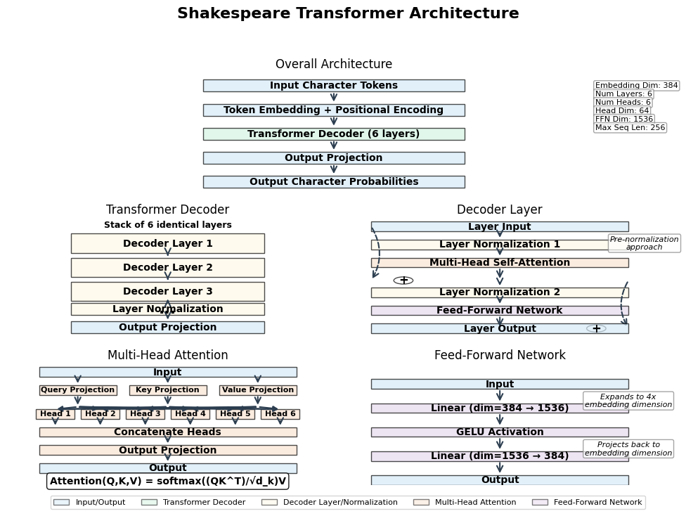

# 20. Large Language Model

In this chapter, we'll explore how to build a character-level language model using a Transformer architecture. We'll implement a model inspired by GPT (Generative Pre-trained Transformer) to generate Shakespeare-like text. This project combines several key concepts from deep learning and natural language processing:

1. Character-level tokenization
2. Token embeddings with positional encoding
3. Multi-head self-attention
4. Transformer decoder architecture
5. Training and inference pipelines

We'll examine each component in detail, understanding their role in the overall system and how they work together to create a powerful text generation model.

## Project Overview

The Shakespeare Transformer is a character-level language model that learns to predict the next character in a sequence based on the previous characters. After training on Shakespeare's works, it can generate new text in a similar style.

The model is structured as follows:

```
ShakespeareTransformer
├── Tokenizer (character-level)
├── TokenEmbedding (with positional encoding)
└── TransformerDecoder
    ├── Multiple TransformerDecoderLayers
    │   ├── MultiHeadAttention
    │   └── FeedForward
    └── Output projection
```



*Figure: Shakespeare Transformer Architecture. This visualization shows the overall architecture (top), the transformer decoder with stacked layers (middle-left), a single decoder layer with self-attention and feed-forward components (middle-right), the multi-head attention mechanism (bottom-left), and the feed-forward network (bottom-right). The architecture uses 6 transformer layers, 6 attention heads, and an embedding dimension of 384.*

Let's explore each component in detail.

## Tokenizer

The tokenizer is responsible for converting text to and from numerical tokens that the model can process. Since we're building a character-level model, each token represents a single character.

### Key Features

- Character-level tokenization (each character is a token)
- Simple vocabulary creation from unique characters in the text
- Bidirectional conversion between text and token indices
- Persistence (save/load) functionality

### Implementation

```rust
pub struct Tokenizer {
    char_to_idx: HashMap<char, usize>,
    idx_to_char: HashMap<usize, char>,
    vocab_size: usize,
}

impl Tokenizer {
    /// Create a new tokenizer from the given text
    pub fn new(text: &str) -> Self {
        let mut chars = text.chars().collect::<Vec<_>>();
        chars.sort();
        chars.dedup();
        
        let mut char_to_idx = HashMap::new();
        let mut idx_to_char = HashMap::new();
        
        for (i, &c) in chars.iter().enumerate() {
            char_to_idx.insert(c, i);
            idx_to_char.insert(i, c);
        }
        
        let vocab_size = chars.len();
        
        Self {
            char_to_idx,
            idx_to_char,
            vocab_size,
        }
    }
    
    /// Encode a string to token indices
    pub fn encode(&self, text: &str) -> Vec<usize> {
        text.chars()
            .filter_map(|c| self.char_to_idx.get(&c).copied())
            .collect()
    }
    
    /// Decode token indices to a string
    pub fn decode(&self, indices: &[usize]) -> String {
        indices
            .iter()
            .filter_map(|&idx| self.idx_to_char.get(&idx))
            .collect()
    }
}
```

The tokenizer is simple yet effective for character-level modeling. It creates a vocabulary from the unique characters in the input text and provides methods to convert between text and token indices.

## Token Embedding

The token embedding layer converts token indices into dense vector representations and adds positional information.

### Key Features

- Token embedding (converts token indices to vectors)
- Positional encoding (adds position information to embeddings)
- Handles variable sequence lengths up to a maximum

### Implementation

```rust
pub struct TokenEmbedding {
    embedding: Embedding,
    positional_encoding: Tensor,
    embedding_dim: usize,
    max_seq_len: usize,
}

impl TokenEmbedding {
    /// Create a new token embedding
    pub fn new(
        vocab_size: usize,
        embedding_dim: usize,
        max_seq_len: usize,
        device: &Device,
        vb: VarBuilder,
    ) -> Result<Self> {
        // Create token embedding
        let embedding = candle_nn::embedding(vocab_size, embedding_dim, vb)?;

        // Create positional encoding
        let positional_encoding = Self::create_positional_encoding(max_seq_len, embedding_dim, device)?;

        Ok(Self {
            embedding,
            positional_encoding,
            embedding_dim,
            max_seq_len,
        })
    }

    /// Forward pass: convert token indices to embeddings with positional encoding
    pub fn forward(&self, x: &Tensor) -> Result<Tensor> {
        // Convert token indices to embeddings
        let x_i64 = x.to_dtype(DType::I64)?;
        let embeddings = self.embedding.forward(&x_i64)?;
        
        // Get positional encoding for the current sequence length
        let seq_len = x.dim(1)?;
        let pos_encoding = self.positional_encoding.narrow(0, 0, seq_len)?;
        
        // Add positional encoding to embeddings
        let batch_size = x.dim(0)?;
        let pos_encoding = pos_encoding
            .unsqueeze(0)?
            .expand((batch_size, seq_len, self.embedding_dim))?;
        
        let embeddings_with_pos = embeddings.add(&pos_encoding)?;
        
        Ok(embeddings_with_pos)
    }
}
```

The token embedding layer consists of two main components:

1. **Token Embedding**: Converts token indices to dense vectors using a lookup table
2. **Positional Encoding**: Adds information about the position of each token in the sequence using sine and cosine functions

The positional encoding is crucial for the Transformer architecture since it doesn't have any inherent notion of sequence order like RNNs do.

## Transformer Decoder

The transformer decoder is the core of our model, implementing the self-attention mechanism that allows the model to focus on relevant parts of the input sequence.

### Key Components

1. **MultiHeadAttention**: Allows the model to focus on different parts of the input sequence
2. **FeedForward**: Processes the attention output through a simple neural network
3. **LayerNorm**: Normalizes the outputs for stable training
4. **Residual Connections**: Helps with gradient flow during training

### Multi-Head Attention

```rust
pub struct MultiHeadAttention {
    num_heads: usize,
    head_dim: usize,
    query_proj: Linear,
    key_proj: Linear,
    value_proj: Linear,
    output_proj: Linear,
    scale: f64,
}

impl MultiHeadAttention {
    pub fn forward(&self, x: &Tensor, mask: Option<&Tensor>) -> Result<Tensor> {
        // Project inputs to queries, keys, and values
        let queries = self.query_proj.forward(x)?;
        let keys = self.key_proj.forward(x)?;
        let values = self.value_proj.forward(x)?;
        
        // Reshape for multi-head attention
        let queries = queries.reshape((batch_size, seq_len, self.num_heads, self.head_dim))?;
        let keys = keys.reshape((batch_size, seq_len, self.num_heads, self.head_dim))?;
        let values = values.reshape((batch_size, seq_len, self.num_heads, self.head_dim))?;
        
        // Transpose to [batch_size, num_heads, seq_len, head_dim]
        let queries = queries.transpose(1, 2)?;
        let keys = keys.transpose(1, 2)?;
        let values = values.transpose(1, 2)?;
        
        // Compute attention scores and apply mask
        let scores = queries.matmul(&keys.transpose(2, 3)?)?;
        let scores = scores.mul(&scale_tensor)?;
        
        // Apply softmax to get attention weights
        let attention_weights = candle_nn::ops::softmax(&scores, 3)?;
        
        // Apply attention weights to values
        let context = attention_weights.matmul(&values)?;
        
        // Reshape back and project to output dimension
        let context = context.transpose(1, 2)?;
        let context = context.reshape((batch_size, seq_len, embed_dim))?;
        let output = self.output_proj.forward(&context)?;
        
        Ok(output)
    }
}
```

The multi-head attention mechanism is the heart of the Transformer architecture. It allows the model to focus on different parts of the input sequence simultaneously, capturing various types of relationships between tokens.

### Transformer Decoder Layer

```rust
pub struct TransformerDecoderLayer {
    self_attn: MultiHeadAttention,
    norm1: LayerNorm,
    ff: FeedForward,
    norm2: LayerNorm,
}

impl TransformerDecoderLayer {
    pub fn forward(&self, x: &Tensor, mask: Option<&Tensor>) -> Result<Tensor> {
        // Self-attention block with residual connection and layer normalization
        let residual = x;
        let x = self.norm1.forward(x)?;
        let x = self.self_attn.forward(&x, mask)?;
        let x = x.add(residual)?;
        
        // Feed-forward block with residual connection and layer normalization
        let residual = &x;
        let x = self.norm2.forward(&x)?;
        let x = self.ff.forward(&x)?;
        let x = x.add(residual)?;
        
        Ok(x)
    }
}
```

Each transformer decoder layer consists of:
1. A self-attention block with pre-normalization and residual connection
2. A feed-forward block with pre-normalization and residual connection

The pre-normalization approach (applying layer normalization before the sub-layers) has been shown to improve training stability.

### Complete Transformer Decoder

```rust
pub struct TransformerDecoder {
    token_embedding_dim: usize,
    layers: Vec<TransformerDecoderLayer>,
    norm: LayerNorm,
    output_proj: Linear,
    vocab_size: usize,
}

impl TransformerDecoder {
    pub fn forward(&self, x: &Tensor, use_causal_mask: bool) -> Result<Tensor> {
        // Create causal mask if needed
        let mask = if use_causal_mask {
            Some(Self::create_causal_mask(seq_len, &x.device())?)
        } else {
            None
        };
        
        // Apply transformer layers
        let mut x = x.clone();
        for layer in &self.layers {
            x = layer.forward(&x, mask.as_ref())?;
        }
        
        // Apply final normalization
        let x = self.norm.forward(&x)?;
        
        // Project to vocabulary
        let logits = self.output_proj.forward(&x)?;
        
        Ok(logits)
    }
}
```

The complete transformer decoder stacks multiple decoder layers, applies a final layer normalization, and projects the output to vocabulary logits. The causal mask ensures that the model can only attend to previous positions in the sequence during training, which is essential for autoregressive language modeling.

## Training Pipeline

The training pipeline ties everything together, handling data preparation, model creation, and the training loop.

### Key Components

1. **Data Preparation**: Tokenizing text and creating batches
2. **Model Configuration**: Setting hyperparameters
3. **Training Loop**: Forward pass, loss calculation, and optimization
4. **Evaluation**: Calculating accuracy and generating samples

### Data Preparation

```rust
fn prepare_batches(
    text: &str,
    tokenizer: &Tokenizer,
    config: &TransformerConfig,
    device: &Device,
    rng: &mut StdRng,
) -> Result<Vec<(Tensor, Tensor)>> {
    // Tokenize the entire text
    let tokens = tokenizer.encode(text);
    
    // Create chunks of size config.max_seq_len + 1 (input + target)
    let chunk_size = config.max_seq_len + 1;
    let num_chunks = tokens.len() / chunk_size;
    
    // Create and shuffle chunks
    let mut chunks = Vec::with_capacity(num_chunks);
    for i in 0..num_chunks {
        let start = i * chunk_size;
        let end = start + chunk_size;
        if end <= tokens.len() {
            chunks.push(tokens[start..end].to_vec());
        }
    }
    chunks.shuffle(rng);
    
    // Create batches with input and target tensors
    let num_batches = chunks.len() / config.batch_size;
    let mut batches = Vec::with_capacity(num_batches);
    
    for i in 0..num_batches {
        let batch_chunks = &chunks[i * config.batch_size..(i + 1) * config.batch_size];
        
        // Prepare input and target tensors
        let mut input_data = vec![0u32; config.batch_size * config.max_seq_len];
        let mut target_data = vec![0u32; config.batch_size * config.max_seq_len];
        
        for (b, chunk) in batch_chunks.iter().enumerate() {
            for s in 0..config.max_seq_len {
                input_data[b * config.max_seq_len + s] = chunk[s] as u32;
                target_data[b * config.max_seq_len + s] = chunk[s + 1] as u32;
            }
        }
        
        // Create tensors
        let input_tensor = Tensor::from_slice(
            &input_data,
            (config.batch_size, config.max_seq_len),
            device,
        )?;
        
        let target_data_i64: Vec<i64> = target_data.iter().map(|&x| x as i64).collect();
        let target_tensor = Tensor::from_slice(
            &target_data_i64,
            (config.batch_size * config.max_seq_len,),
            device,
        )?;
        
        batches.push((input_tensor, target_tensor));
    }
    
    Ok(batches)
}
```

The data preparation process:
1. Tokenizes the entire text
2. Creates overlapping chunks of tokens
3. Shuffles the chunks for better training
4. Creates batches with input sequences and their corresponding target sequences (shifted by one position)

### Training Loop

```rust
pub fn train_transformer() -> Result<()> {
    // Set up device, tokenizer, and configuration
    let device = Device::Cpu;
    let text = download_shakespeare()?;
    let tokenizer = Tokenizer::new(&text);
    
    let mut config = TransformerConfig::default();
    config.vocab_size = tokenizer.vocab_size();
    
    // Prepare batches
    let batches = prepare_batches(&text, &tokenizer, &config, &device, &mut rng)?;
    
    // Create model
    let mut varmap = VarMap::new();
    let vb = VarBuilder::from_varmap(&varmap, DType::F32, &device);
    let model = ShakespeareTransformer::new(config.clone(), &device, vb)?;
    
    // Set up optimizer
    let mut optimizer = candle_nn::AdamW::new_lr(
        varmap.all_vars(),
        config.learning_rate,
    )?;
    
    // Training loop with comprehensive saving
    let mut step = 0;
    for epoch in 0..config.num_epochs {
        let mut epoch_loss = 0.0;
        let mut epoch_accuracy = 0.0;
        
        for (batch_idx, (input_ids, targets)) in tqdm(batches.iter().enumerate()) {
            // Forward pass
            let logits = model.forward(input_ids)?;
            
            // Calculate loss
            let loss = calculate_loss(&logits, &targets)?;
            
            // Backward pass and optimize
            optimizer.backward_step(&loss)?;
            
            // Calculate accuracy
            let accuracy = calculate_accuracy(&logits, &targets)?;
            
            // Update metrics
            epoch_loss += loss.to_scalar::<f32>()?;
            epoch_accuracy += accuracy;
            step += 1;
            
            // Periodic saving during training
            if step % config.save_every == 0 {
                let model_path = format!("models/shakespeare_transformer_step_{}.safetensors", step);
                varmap.save(model_path)?;
                println!("Model saved at step {}", step);
            }
        }
        
        // Print epoch metrics
        println!(
            "Epoch {}: Loss = {:.4}, Accuracy = {:.4}",
            epoch, epoch_loss / batches.len() as f32, epoch_accuracy / batches.len() as f32
        );
        
        // Save model after each epoch
        let model_path = format!("models/shakespeare_transformer_epoch_{}.safetensors", epoch);
        varmap.save(model_path)?;
        println!("Model saved after epoch {}", epoch);
    }
    
    // Save final model
    varmap.save("models/shakespeare_transformer_final.safetensors")?;
    println!("Final model saved");
    
    Ok(())
}
```

The training loop includes comprehensive model saving:
1. **Periodic Saving**: Models are saved every `save_every` steps during training to prevent loss of progress
2. **Epoch Saving**: Models are saved after each complete epoch for easy checkpoint recovery
3. **Final Model**: A final model is saved at the end of training for inference use
4. **Progress Tracking**: Step counting and detailed logging help monitor training progress
5. **Safetensors Format**: All models are saved in the efficient SafeTensors format

### Model Loading

The training module also provides functionality to load previously saved models:

```rust
/// Load a trained model
pub fn load_model(model_path: impl AsRef<Path>, mut config: TransformerConfig) -> Result<(ShakespeareTransformer, Tokenizer)> {
    // Load tokenizer
    let tokenizer = Tokenizer::load("models/shakespeare_tokenizer.txt")?;

    // Update config with tokenizer vocab size
    config.vocab_size = tokenizer.vocab_size();

    // Load model
    let mut varmap = VarMap::new();
    varmap.load(model_path)?;

    // Create a device for inference
    let device = Device::Cpu; // Use CPU for inference

    let vb = VarBuilder::from_varmap(&varmap, DType::F32, &device);
    let model = ShakespeareTransformer::new(config, &device, vb)?;

    Ok((model, tokenizer))
}
```

The `load_model` function:
1. Loads the saved tokenizer to ensure vocabulary consistency
2. Updates the model configuration with the correct vocabulary size
3. Loads the model weights from the SafeTensors file
4. Reconstructs the model architecture with the loaded weights
5. Returns both the model and tokenizer ready for inference

## Inference Pipeline

The inference pipeline handles text generation using the trained model with sophisticated sampling strategies and multiple generation modes.

### Key Components

1. **Model Loading**: Loading the trained model and tokenizer
2. **Advanced Sampling**: Multiple sampling strategies for controlling text generation
3. **Interactive Mode**: Real-time text generation with user prompts
4. **Batch Generation**: Processing multiple prompts from files

### Sampling Parameters

The inference system uses a comprehensive set of sampling parameters to control text generation quality and diversity:

```rust
/// Sampling parameters for text generation
pub struct SamplingParams {
    pub temperature: f32,        // Controls randomness (0.0 = deterministic, higher = more random)
    pub top_k: Option<usize>,    // Keep only top-k most likely tokens
    pub top_p: Option<f32>,      // Nucleus sampling - keep tokens with cumulative probability <= p
    pub repetition_penalty: f32, // Penalty for repeating tokens (1.0 = no penalty, higher = more penalty)
    pub max_length: usize,       // Maximum number of tokens to generate
}

impl Default for SamplingParams {
    fn default() -> Self {
        Self {
            temperature: 0.8,        // Slightly creative
            top_k: Some(40),         // Consider top 40 tokens
            top_p: None,             // No nucleus sampling by default
            repetition_penalty: 1.1, // Slight penalty for repetition
            max_length: 100,         // Generate up to 100 tokens
        }
    }
}
```

#### Sampling Strategy Details

1. **Temperature Scaling**: Controls the randomness of predictions
   - `temperature = 0.0`: Deterministic (always pick most likely token)
   - `temperature = 1.0`: Use raw model probabilities
   - `temperature > 1.0`: More random/creative output
   - `temperature < 1.0`: More focused/conservative output

2. **Top-K Sampling**: Limits consideration to the K most likely tokens
   - Helps prevent generation of very unlikely tokens
   - Typical values: 20-50

3. **Top-P (Nucleus) Sampling**: Dynamically selects tokens based on cumulative probability
   - More adaptive than top-k
   - Typical values: 0.8-0.95

4. **Repetition Penalty**: Reduces likelihood of repeating recently used tokens
   - Values > 1.0 discourage repetition
   - Values < 1.0 encourage repetition

### Advanced Text Generation

```rust
pub fn generate_text(
    model: &ShakespeareTransformer,
    tokenizer: &Tokenizer,
    prompt: &str,
    params: &SamplingParams,
    rng: &mut StdRng,
) -> Result<String> {
    // Tokenize the prompt
    let mut tokens = tokenizer.encode(prompt);
    
    // Ensure we don't exceed the model's maximum sequence length
    if tokens.len() >= params.max_length {
        tokens = tokens[tokens.len() - params.max_length + 1..].to_vec();
    }
    
    // Convert tokens to tensor
    let device = Device::Cpu;
    let mut input_tensor = Tensor::from_slice(
        &tokens.iter().map(|&t| t as u32).collect::<Vec<_>>(),
        (1, tokens.len()),
        &device,
    )?;
    
    // Generate tokens with advanced sampling
    for _ in 0..params.max_length {
        // Forward pass
        let logits = model.forward(&input_tensor)?;
        
        // Get the logits for the last token
        let last_token_logits = logits.i((0, logits.dim(1)? - 1))?;
        
        // Apply sampling parameters in sequence
        let mut next_token_logits = last_token_logits.clone();
        
        // 1. Apply temperature scaling
        next_token_logits = apply_temperature(&next_token_logits, params.temperature)?;
        
        // 2. Apply repetition penalty
        next_token_logits = apply_repetition_penalty(&next_token_logits, &tokens, params.repetition_penalty)?;
        
        // 3. Apply top-k sampling
        if let Some(k) = params.top_k {
            next_token_logits = apply_top_k(&next_token_logits, k)?;
        }
        
        // 4. Apply top-p sampling
        if let Some(p) = params.top_p {
            next_token_logits = apply_top_p(&next_token_logits, p)?;
        }
        
        // Convert to probabilities and sample
        let probs = candle_nn::ops::softmax(&next_token_logits, 0)?;
        let probs_vec = probs.to_vec1::<f32>()?;
        let next_token = sample_from_distribution(&probs_vec, rng)?;
        
        // Add the new token to the sequence
        tokens.push(next_token);
        
        // Update input tensor for next iteration
        let next_token_tensor = Tensor::from_slice(&[next_token as u32], (1, 1), &device)?;
        input_tensor = Tensor::cat(&[input_tensor, next_token_tensor], 1)?;
    }
    
    // Convert tokens back to text
    let generated_text = tokenizer.decode(&tokens);
    
    Ok(generated_text)
}
```

The advanced text generation process:
1. **Prompt Processing**: Tokenizes and truncates the input prompt if necessary
2. **Iterative Generation**: For each new token:
   - Runs forward pass through the model
   - Applies temperature scaling to control randomness
   - Applies repetition penalty to avoid repetitive text
   - Applies top-k filtering to remove unlikely tokens
   - Applies top-p (nucleus) sampling for dynamic token selection
   - Samples from the resulting probability distribution
3. **Sequence Building**: Continuously extends the input sequence with generated tokens

### Interactive Generation Mode

The inference system provides an interactive mode for real-time text generation with user prompts:

```rust
/// Interactive text generation
pub fn interactive_generation() -> Result<()> {
    // Load model
    println!("Loading model...");
    let config = TransformerConfig::default();
    
    // Check if model file exists
    let model_path = "models/shakespeare_transformer_final.safetensors";
    if !std::path::Path::new(model_path).exists() {
        println!("Model file not found: {}", model_path);
        println!("Please train the model first using the 'train' command.");
        return Ok(());
    }
    
    let (model, tokenizer) = load_model(model_path, config)?;
    
    // Set up RNG and sampling parameters
    let mut rng = StdRng::seed_from_u64(42);
    let params = SamplingParams::default();
    
    println!("Model loaded! Enter a prompt to generate text (or 'exit' to quit):");
    
    loop {
        print!("> ");
        io::stdout().flush()?;
        
        let mut input = String::new();
        io::stdin().read_line(&mut input)?;
        
        let input = input.trim();
        if input.to_lowercase() == "exit" {
            break;
        }
        
        // Generate text
        let generated_text = generate_text(&model, &tokenizer, input, &params, &mut rng)?;
        
        println!("\nGenerated text:\n{}\n", generated_text);
    }
    
    Ok(())
}
```

Interactive mode features:
1. **Model Validation**: Checks for model existence and provides helpful error messages
2. **Real-time Generation**: Processes user prompts immediately
3. **Continuous Loop**: Allows multiple generations in a single session
4. **Easy Exit**: Simple 'exit' command to quit the session

### Batch Generation Mode

For processing multiple prompts efficiently, the system supports batch generation from files:

```rust
/// Generate text from a file of prompts
pub fn generate_from_file(prompt_file: &str, output_file: &str) -> Result<()> {
    // Load model
    println!("Loading model...");
    let config = TransformerConfig::default();
    
    let model_path = "models/shakespeare_transformer_final.safetensors";
    if !std::path::Path::new(model_path).exists() {
        println!("Model file not found: {}", model_path);
        println!("Please train the model first using the 'train' command.");
        return Ok(());
    }
    
    let (model, tokenizer) = load_model(model_path, config)?;
    
    // Set up RNG and sampling parameters
    let mut rng = StdRng::seed_from_u64(42);
    let params = SamplingParams::default();
    
    // Read prompts from file
    let prompts = std::fs::read_to_string(prompt_file)?;
    let prompts: Vec<&str> = prompts.lines().collect();
    
    // Generate text for each prompt
    let mut output = String::new();
    
    for (i, prompt) in prompts.iter().enumerate() {
        println!("Generating text for prompt {}/{}...", i + 1, prompts.len());
        
        let generated_text = generate_text(&model, &tokenizer, prompt, &params, &mut rng)?;
        
        output.push_str(&format!("Prompt: {}\n\nGenerated text:\n{}\n\n---\n\n", prompt, generated_text));
    }
    
    // Write output to file
    std::fs::write(output_file, output)?;
    println!("Generated text written to {}", output_file);
    
    Ok(())
}
```

Batch generation features:
1. **File Input**: Reads prompts from a text file (one prompt per line)
2. **Progress Tracking**: Shows progress through the prompt list
3. **Formatted Output**: Creates well-formatted output with clear separators
4. **File Output**: Saves all generated text to a specified output file

### Main Inference Entry Point

The main inference function provides a simple entry point for text generation:

```rust
/// Main function for inference
pub fn main_inference() -> Result<()> {
    // Default to interactive mode
    println!("Starting interactive text generation...");
    interactive_generation()?;
    
    Ok(())
}
```

This function can be easily extended to support command-line arguments for choosing between interactive and batch modes, or for customizing sampling parameters.

## Putting It All Together

The Shakespeare Transformer combines all these components into a complete system for character-level language modeling:

```rust
pub struct ShakespeareTransformer {
    token_embedding: TokenEmbedding,
    transformer_decoder: TransformerDecoder,
    config: TransformerConfig,
}

impl ShakespeareTransformer {
    pub fn forward(&self, input_ids: &Tensor) -> Result<Tensor> {
        // Ensure input_ids has the correct data type
        let input_ids = if input_ids.dtype() != DType::U32 {
            input_ids.to_dtype(DType::U32)?
        } else {
            input_ids.clone()
        };
        
        // Convert token indices to embeddings with positional encoding
        let embeddings = self.token_embedding.forward(&input_ids)?;
        
        // Apply transformer decoder with causal mask
        let logits = self.transformer_decoder.forward(&embeddings, true)?;
        
        Ok(logits)
    }
}
```

The complete model:
1. Takes token indices as input
2. Converts them to embeddings with positional encoding
3. Processes them through the transformer decoder
4. Returns logits for the next token prediction

## Conclusion

The Shakespeare Transformer demonstrates how to implement a complete character-level language model using the Transformer architecture with comprehensive training and inference capabilities. By breaking down the model into its component parts and implementing robust saving and generation systems, we can understand how each piece contributes to the overall system.

Key takeaways:
1. **Character-level tokenization** provides a simple yet effective approach to text modeling
2. **Token embeddings with positional encoding** capture both semantic and positional information
3. **Multi-head self-attention** allows the model to focus on different parts of the input sequence
4. **Transformer decoder architecture** enables efficient parallel processing of sequences
5. **Comprehensive model saving** with periodic checkpoints, epoch saves, and final models ensures training progress is preserved
6. **Advanced sampling strategies** (temperature, top-k, top-p, repetition penalty) provide fine-grained control over text generation quality
7. **Multiple inference modes** (interactive and batch) support different use cases and workflows
8. **Robust error handling** and model validation ensure reliable operation

### Advanced Features Implemented

The complete implementation includes several advanced features:

- **Sophisticated Sampling**: Multiple sampling strategies can be combined for optimal text generation
- **Interactive Generation**: Real-time text generation with user prompts for experimentation
- **Batch Processing**: Efficient processing of multiple prompts from files for production use
- **Model Persistence**: Comprehensive saving and loading with SafeTensors format
- **Progress Tracking**: Detailed logging and progress indicators during training and inference
- **Error Recovery**: Graceful handling of missing models and invalid inputs

### Extensibility

This model serves as a foundation for more complex language models and can be extended in various ways:

- **Scaling**: Add more layers, increase embedding dimensions, or use larger vocabularies
- **Tokenization**: Switch to subword tokenization (BPE, SentencePiece) for better handling of rare words
- **Architecture**: Incorporate modern improvements like RMSNorm, SwiGLU activations, or rotary positional embeddings
- **Training**: Add techniques like gradient clipping, learning rate scheduling, or mixed precision training
- **Inference**: Implement beam search, nucleus sampling variants, or guided generation techniques
- **Deployment**: Add support for GPU inference, model quantization, or distributed generation

The modular design makes it easy to experiment with different components while maintaining a solid foundation for text generation tasks.