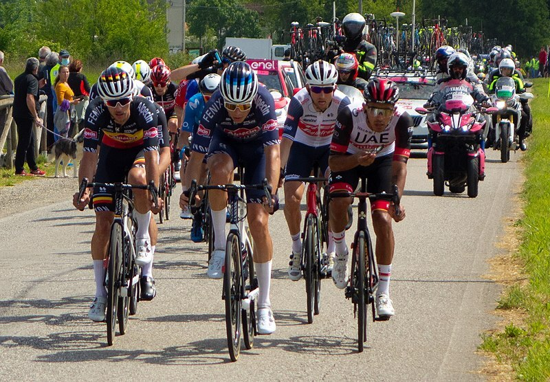

# candle-blip2

[BLIP-2: Bootstrapping Language-Image Pre-training with Frozen Image Encoders and Large Language Models](https://arxiv.org/abs/2301.12597) by Salesforce Research.

BLIP-2 introduces a Q-Former module that bridges frozen image encoders and frozen
large language models for efficient vision-language pre-training. The Q-Former
uses a set of learnable query tokens to extract visual features most relevant to
text generation.

## Running on an example

Extract Q-Former visual features from an image:

```bash
cargo run --example blip2 --release -- --image candle-examples/examples/yolo-v8/assets/bike.jpg
```

```
BLIP-2 config: vision_hidden_size=1408, qformer_hidden_size=768, num_query_tokens=32
Extracting Q-Former features from image...
Q-Former output shape: [1, 32, 768]
Language projection output shape: [1, 32, 2560]
```


