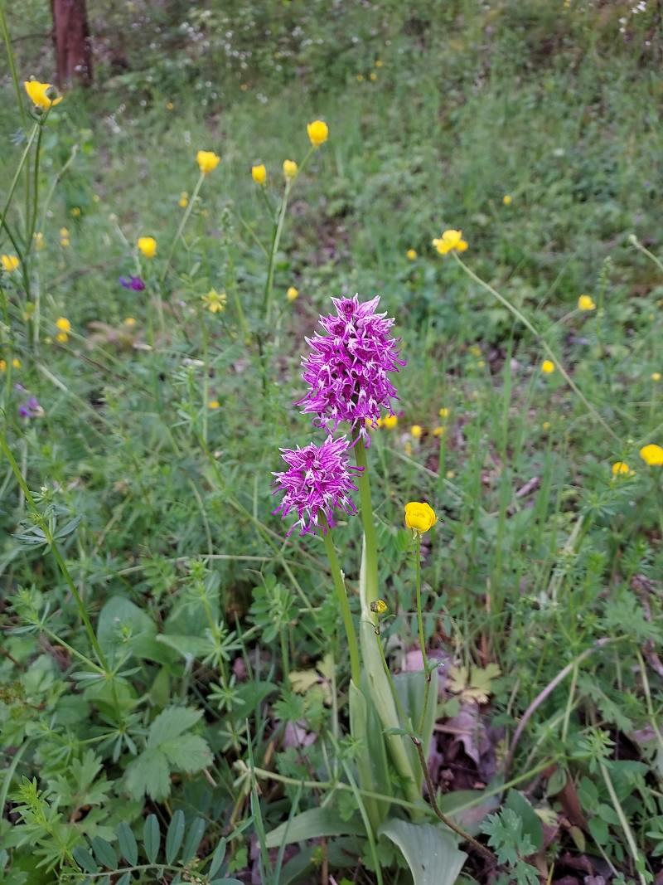

# candle-dinov2-reg4

[DINOv2-reg4](https://arxiv.org/abs/2309.16588) is the lastest version of DINOv2 with registers.
In this example, it is used as an plant species classifier: the model returns the
probability for the image to belong to each of the 7806 PlantCLEF2024 categories.

## Running some example

```bash
cargo run --example dinov2-reg4 --release -- --image candle-examples/examples/dinov2-reg4/bd2d3830ac3270218ba82fd24e2290becd01317c.jpg

> Orchis simia Lam.       : 44.14%
> Orchis italica Poir.    : 12.88%
> Orchis × bergonii Nanteuil: 7.79%
> Orchis × angusticruris Franch.: 2.49%
> Orchis militaris L.     : 2.26%

```

