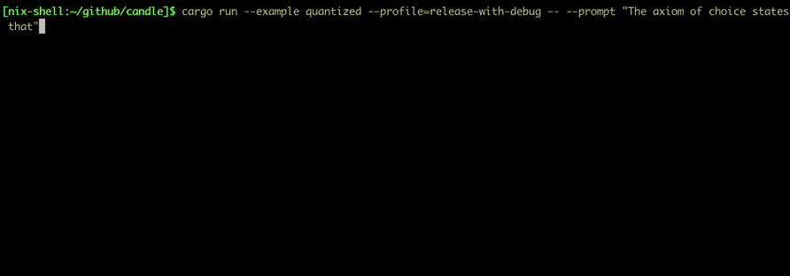

# candle-quantized-llama: Fast Inference of quantized LLaMA models

This example provides a quantized LLaMA model similar to
[llama.cpp](https://github.com/ggerganov/llama.cpp). This is based on candle
built-in quantization methods. Supported features include:

- 2-bit, 3-bit, 4-bit, 5-bit, 6-bit and 8-bit integer quantization support.
- SIMD optimizations on Apple Silicon and x86.
- Support using the `gguf` and `ggml` file formats.

The weights are automatically downloaded for you from the [HuggingFace
Hub](https://huggingface.co/) on the first run. There are various command line
flags to use local files instead, run with `--help` to learn about them.



## Running some example.

```bash
cargo run --example quantized --release -- --prompt "The best thing about coding in rust is "

> avx: true, neon: false, simd128: false, f16c: true
> temp: 0.80 repeat-penalty: 1.10 repeat-last-n: 64
> loaded 291 tensors (3.79GB) in 2.17s
> params: HParams { n_vocab: 32000, n_embd: 4096, n_mult: 256, n_head: 32, n_layer: 32, n_rot: 128, ftype: 2 }
> The best thing about coding in rust is 1.) that I don’t need to worry about memory leaks, 2.) speed and 3.) my program will compile even on old machines.
```

Using the mixtral sparse mixture of expert model:
```bash

$ cargo run --example quantized --release -- --which mixtral --prompt "Lebesgue's integral is superior to Riemann's because "
> avx: true, neon: false, simd128: false, f16c: true
> temp: 0.80 repeat-penalty: 1.10 repeat-last-n: 64
> loaded 995 tensors (26.44GB) in 0.03s
Lebesgue's integral is superior to Riemann's because 1. it is defined for a wider class of functions, those which are absolutely integrable; 2. the definition does not involve limits in two variables---one being computed before the other (which makes some computations more difficult); and 3. interchange of order of integration is easier to establish than with Riemann's integral. On the other hand, Lebesgue's integral applies only for bounded functions defined on finite intervals; it does not provide numerical values for improper integrals. The latter are best evaluated using Cauchy's limit definition.

The reason $f(x) = x^2$ is discontinuous at the ends of its interval of definition, and Riemann's integral requires continuity on the whole of an open interval containing it (see our earlier post), sine no such function exists with this property, is that the endpoints are infinite in measure for Lebesgue's integral.
 ```


## Command-line flags

Run with `--help` to see all options.

- `--which`: specify the model to use, e.g. `7b`, `13-chat`, `7b-code`.
- `--prompt interactive`: interactive mode where multiple prompts can be
  entered.
- `--model mymodelfile.gguf`: use a local model file rather than getting one
  from the hub.
