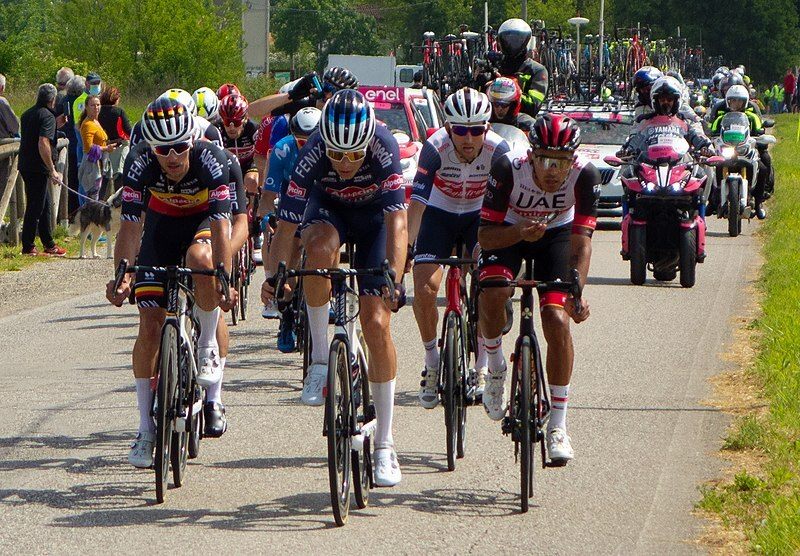
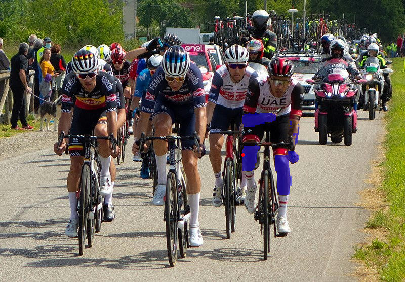

# candle-segment-anything: Segment-Anything Model

This example is based on Meta AI [Segment-Anything
Model](https://github.com/facebookresearch/segment-anything). This model
provides a robust and fast image segmentation pipeline that can be tweaked via
some prompting (requesting some points to be in the target mask, requesting some
points to be part of the background so _not_ in the target mask, specifying some
bounding box).

The default backbone can be replaced by the smaller and faster TinyViT model
based on [MobileSAM](https://github.com/ChaoningZhang/MobileSAM).

## Running some example.

```bash
cargo run --example segment-anything --release -- \
    --image candle-examples/examples/yolo-v8/assets/bike.jpg
    --use-tiny
    --point 0.6,0.6 --point 0.6,0.55
```

Running this command generates a `sam_merged.jpg` file containing the original
image with a blue overlay of the selected mask. The red dots represent the prompt
specified by `--point 0.6,0.6 --point 0.6,0.55`, this prompt is assumed to be part
of the target mask.

The values used for `--point` should be a comma delimited pair of float values.
They are proportional to the image dimension, i.e. use 0.5 for the image center.

Original image:


Segment results by prompting with a single point `--point 0.6,0.55`:


Segment results by prompting with multiple points `--point 0.6,0.6 --point 0.6,0.55`:


### Command-line flags
- `--use-tiny`: use the TinyViT based MobileSAM backbone rather than the default
  one.
- `--point`: specifies the location of the target points.
- `--threshold`: sets the threshold value to be part of the mask, a negative
  value results in a larger mask and can be specified via `--threshold=-1.2`.
